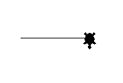
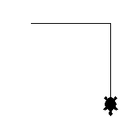
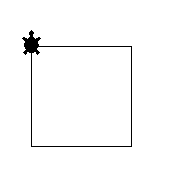
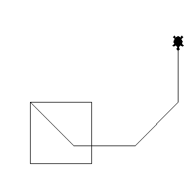
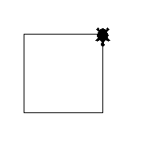
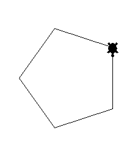
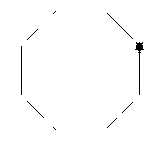
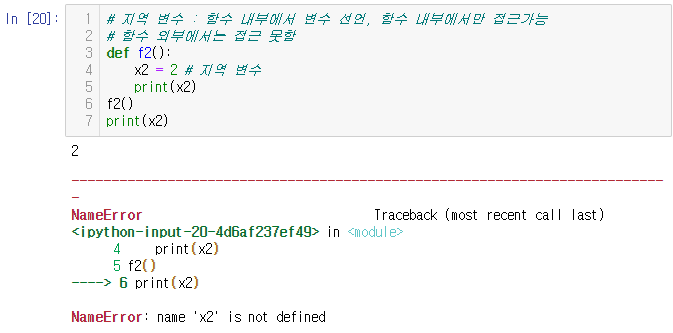
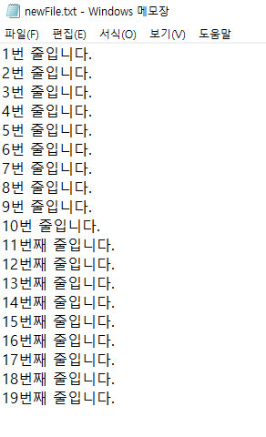
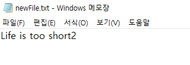

[toc]

# Day5 딥러닝을 위한 빅데이터 기초 - 파이썬 기본 문법 (5)

- 갯수를 셀 때 for if 문 뿐만 아니라 count 함수도 생각해볼 것.

# 사용자 정의 함수

- y = 2x + 3

- def 함수명(매개변수) :
  - cf ) 매개변수가 없을 수도 있고, 여러 개 일수도 있다.
  - 수행문장1
  - 수행문자2
  - ...
  - return 리턴할 변수

```python
def add(a, b) :
    return a + b
a = 3
b = 4
s = add(a, b)
print(s)
# > 7
```

- 매개변수가 필요없는 경우

```python
def say() :
    return 'bye'
say()
# > 'bye'
```

- return 값이 필요없는 경우

```python
def add(a, b) :
    print("%d과 %d 합은 %d 입니다" % (a, b, a+b))
add(3, 4)
# > 3과 4 합은 7 입니다
```

- 결과값이 필요한 경우에는 return 값이 필요하다.
- return 값이 없을 경우 None이 나타난다.

```python
print(add(3, 4))
# > 3과 4 합은 7 입니다
# > None
```

- 매개변수 지정

```python
def add(a, b) :
    return a+b
res = add(b=3, a=7)
print(res)
# > 10
```


## 여러 개의 입력값을 전달 받는 함수

### \* 하나인 경우

- def 함수명(*매개변수) : 
  - 수행문장

```python
def add_many(*args) : 
    print(type(args))
    # 수행문장

add_many(1,2,3)
# > <class 'tuple'>
```

- tuple로 입력받음

```python
def add_many(*args) : 
    res = 0
    for i in args :
        res += i
    return res

res = add_many(1,2,3)
print(res)
# > 6

res = add_many(1,2,3,4,5,6)
print(res)
# > 21
```

- 첫번째 인수는 ch에, 그 이후에는 모두 args로 입력

```python
def add_mul(ch, *args) :
    if ch == 'add' :
        res = 0
        for i in args :
            res += i
    elif ch == 'mul' :
        res = 1
        for i in args :
            res *= i
        
    return res
    
print(add_mul('add', 2,3,4)) # 2,3,4에 대한 덧셈
# > 9

print(add_mul('mul', 2,3,4)) # 2,3,4에 대한 곱셈
# > 24
```

### \*\* 두개인 경우

```python
def dict_args(**args) :
    print(args)

dict_args(height = 180)
# > {'height': 180}
```

- 딕셔너리로 입력받음

```python
def dict_args(**args) :
    print(args) # 딕셔너리 변수
    print(type(args))
dict_args(height = 180, weight = 70)
# > {'height': 180, 'weight': 70}
# > <class 'dict'>
```


## return


- 일반적으로 return 값은 하나만 가능하다.

```python
def a_and_m(a, b) :
    return a+b, a*b
res = a_and_m(1,2)
print(res) # 결과 값이 튜플 하나로 나온다. Error를 줄이기 위하여 내부적으로 변함
# > (3, 2)
```

- 튜플로 받고 싶지 않을 경우, 받는 변수를 return 수에 맞게 받아 주면 된다.

```python
res_add, res_mul = a_and_m(1,2)
print(res_add, ',', res_mul)
# > 3 , 2
```

- return 문이 2개일 경우

```python
def a_and_m(a, b) :
    return a+b # return을 만날경우 함수가 완료됬다고 인식 됨
    return a*b # 따라서 수행하지 않음
res = a_and_m(1,2)
print(res)
# > 3
```

- return : 함수를 호출한 위치로 되돌아 가라

```python
def sn(nick) :
    if nick == '바보' :
        return # 함수를 호출한 위치로 되돌아 가라
    print('별명은 %s 입니다.' % nick)
sn('천재')
# > 별명은 천재 입니다.

sn('바보') # 결과값 없음
```


## default를 줄 경우

```python
def test(name, old, man=True) :
    print(name, old, man)
test('홍길동', 20)
# > 홍길동 20 True

test('홍길순', 20 , False)
# > 홍길순 20 False
```

- default값이 있는 변수는 뒤쪽으로 배치하는 것을 추천함

```python
def test(name, man=True, old) : # old 값을 알 수 없어 Error 발생
    print(name, old, man)
test('홍길동', 20)
# > Error 발생
```


## 함수 내부에 함수 정의

- 거의 사용하지 않음
- 가독성이 좋지 않음
- def 함수1() :
  - 문장
  - 문장
  - def 함수2() :
    - 문장
    - return
  - return

```python
def outer():
    msg = 'hello'
    def inner():
        print(msg)
    inner()
    
outer()
# > hello

def f5() :
    x = 10 # 지역변수
    def f6() :
        x = 20 # 지역 - 지역변수
    f6()
    print(x)

f5()
# > 10
```


-----

# 쉬어가는 타임

- 거북이로 그리기

```python
import turtle as t
t.shape('turtle')
```


```python
t.forward(100) # pixel 단위
```


```python
t.right(90) # 오른쪽으로 90도 만큼 돎
```



```python
t.forward(100)
```



```python
t.right(90)
t.forward(100)
t.right(90)
t.forward(100)
```



```python
t.left(45)
t.backward(100)
t.left(45)
t.backward(100)
t.left(45)
t.backward(100)
t.left(45)
t.backward(100)
```



```python
# 그린 것들이 지워짐
t.clear()
```


```python
# 사각형
for i in range(4):
    t.forward(100)
    t.right(90)
```



```python
t.clear()
# 오각형
for i in range(5):
    t.forward(100)
    t.right(360/5)
```



```python
t.clear()
n = int(input())
for i in range(n):
    t.forward(100)
    t.right(360/n)
# > 8
```



- 끝내기

```python
t.done()
# > 거북이 그리기가 꺼짐
```


----

# lambda 함수

- lambda 함수 : 익명 함수 => lambda 표현식
- 사용자 정의 함수를 작성하기 편하게 하기 위하여 만들어진 함수
- lambda 함수 형식 => lambda 매개변수들: 식

```python
def p_ten(x) :
    return x+10
print(p_ten(5))
# > 15

# lambda 표현식을 바꾸면
p_ten2 = lambda x: x+10
print(p_ten2(4))
# > 14
```

- (lambda 매개변수들 : 식)(5)

```python
print((lambda x: x+10)(5))
# > 15
```

- 주의할 점
- lambda 표현식 내부에는 변수를 선언할 수 없다.

```python
print((lambda x: y=2; x+y)(5))
# > Error 발생
```


- 변수 선언을 밖에서 하면 사용 가능하다.

```python
y = 2
print((lambda x: x+y)(5))
# > 7
```


## map 함수

- map(함수, 자료) ; 자료에 대해 함수를 수행한 결과가 출력

```python
print(list(map(int, [3.14])))
# > [3]
```

- map의 함수 자리에 lambda를 사용하는 경우가 많음

```python
def pten(x) :
    print(x)
    for i in range(len(x)) :
        x[i] = x[i]+10
    return x

data = [1,2,3]
pten(data)
# > [1, 2, 3]
# > 13
```

```python
def pten(x) :
    return x+10

res = map(pten, [1,2,3])
print(res)
# > <map object at 0x0000029DCC332788>

res = list(map(pten, [1,2,3]))
print(res)
# > [11, 12, 13]
```

- lambda 함수를 사용하여 코드 축소하기

```python
list(map(lambda x: x+10, [1,2,3]))
# > [11, 12, 13]
```

- 매개변수 없는 lambda 함수 작성

```python
(lambda x: x+1)(5)
# > 6

# 전달 인수가 없으며 1을 출력하라
print((lambda : 1)()) 
# > 1

x = 5
print((lambda : x)())
# > 5
```


## def로 선언한 함수 lambda 표현식으로 바꾸기

```python
def add(x,y) : 
    return x+y
res = add(2,3)
print(res)
# > 5

# 위의 add 함수 lambda 표현식으로 바꾸기
print((lambda x, y : x+y)(2,3))
# > 5

# lambda 표현식으로 정의한 add 함수
add2 = lambda x, y : x+y
res = add2(2, 3)
print(res)
# > 5
```


## lambda 표현식에 조건부 표현식 적용

```python
# a에 저장된 요소 값들 중에서 3의 배수는 100을 더해서 출력
# [1, 2, 103, 4, 5, 106, 7, 8, 109, 10]
a = list(range(1, 11))

for i in range(len(a)) :
    if a[i]%3 == 0 : 
        a[i] += 100
print(a)
# > [1, 2, 103, 4, 5, 106, 7, 8, 109, 10]
```

```python
for i in range(len(a)) :
    if a[i]%3 == 0 : 
        a[i] = str(a[i])
print(a)
# > [1, 2, '3', 4, 5, '6', 7, 8, '9', 10]

# 위 코드를 lambda 표현식으로 바꾸기
a = list(range(1, 11))
# map(람다표현식, a)
# lambda 매개변수 : 식1(if 참) if 조건식 else 식2(if 거짓)
print(list(map(lambda x : str(x) if x%3 == 0 else x,a)))
# > [1, 2, '3', 4, 5, '6', 7, 8, '9', 10]
```

- lambda 식에서 if 문을 사용할 경우, 무조건 else 문이 있어야 한다.


- lambda 식에는 elif 사용 못함.

  -  if 조건식1 :
  - 식1
  - elif 조건식2 :
  - 식2
  - else :
  - 식3
  - ==
  - 식1 if 조건식1 else 식2 if 조건식 else 식3


- a에 저장되어 있는 데이터에 대해, 1은 문자열로 변환,
- 2는 실수로 변환, 나머지 3이상은 모두 10을 더해서 출력

```python
a = list(range(1, 11))

for i in range(len(a)) :
    if a[i] == 1:
        a[i] = str(a[i])
    elif a[i] == 2:
        a[i] = float(a[i])
    else :
        a[i] += 10

print(a)
# > ['1', 2.0, 13, 14, 15, 16, 17, 18, 19, 20]
```

```python
a = list(range(1, 11))

def fun(x) :
    if x == 1 :
        return str(x)
    elif x == 2 :
        return float(x)
    else : 
        return x+10
    
print(list(map(fun, a)))
# > ['1', 2.0, 13, 14, 15, 16, 17, 18, 19, 20]
```

```python
a = list(range(1, 11))

res = list(map(lambda x: str(x) if x == 1 else 
               float(x) if x == 2 else x+10, a))

print(res)
# > ['1', 2.0, 13, 14, 15, 16, 17, 18, 19, 20]
```

```python
a = list(range(1, 11))

fun2 = lambda x: str(x) if x == 1 else float(x) if x == 2 else x+10

print(list(map(fun2, a)))
# > ['1', 2.0, 13, 14, 15, 16, 17, 18, 19, 20]
```


## 매개변수가 여러 개인 경우

- 람다함수의 매개변수가 여러 개인 경우

- a*b ; 요소끼리의 곱 = [6. 14. 24. 36. 50]

```python
a = [1,2,3,4,5]
b = [6,7,8,9,10]
list(map(lambda x, y: x*y, a,b))
# > [6, 14, 24, 36, 50]
```


## filter 함수

```python
a = [7,3,1,4,9,6,2]

def fun2(x) :
    return x > 3 and x < 10

print(list(map(fun2, a))) # 출력 결과가 불린형으로 나옴
# > [True, False, False, True, True, True, False]
```

- filter는 조건에 만족하는 데이터만 추출
- 즉, filter로 지정한 함수의 리턴 값이 True일 때만 해당 요소를 추출

```python
print(list(filter(fun2, a)))
# > [7, 4, 9, 6]
```


## reduce 함수

- reduce는 각 요소를 함수로 처리한 다음,
- 이전 결과와 누적해서 변환하는 함수
- 차원 축소의 의미로 함수이름으로 reduce를 사용함

```python
from functools import reduce

def fun3(x, y): #1,2 ; 3,3 ; 6,4 ; 10,5
    return x+y # 3  ;  6  ;  10 ;  15

a = [1,2,3,4,5]
print(reduce(fun3, a)) # list a의 누적 합 출력
# > 15
```

- 위의 식을 람다식으로 변환

```python
print(reduce(lambda x,y: x+y, a))
# > 15
```

- 위 구문을 풀어 쓰면

```python
a = [1,2,3,4,5]
x = a[0]
for i in range(len(a)-1) :
    x += a[i+1]
print(x)
# > 15
```

# 변수 정의

## 전역 변수

- 함수 바깥에 선언된 변수
- 함수 내/외부에서 접근 가능한 변수

```python
x = 1 # 전역 변수

def f() : # 함수 정의
    print(x)

f() # 함수 호출
print(x)
# > 1
# > 1
```

## 지역 변수

- 함수 내부에서 변수 선언
- 함수 내부에서만 접근가능
- 함수 외부에서는 접근 못함

```python
def f2():
    x2 = 2 # 지역 변수
    print(x2)
f2()
print(x2)
# > 2
# > Error 발생
```



```python
x = 10 # 전역변수

def f3():
    x = 20 # 지역변수
    print(x) # 지역변수 값 출력

f3()
print(x) # 전역변수 값 출력
# > 20
# > 10
```

## global

- 함수 내부에서 전역변수 값을 변경하고자 하는 경우
- global 뒤에 전역 변수 이름을 지칭

```python
x = 10 # 전역변수

def f3():
    global x
    x = 20 # 전역변수
    print(x) # 전역변수 값 출력

f3()
print(x) # 전역변수 값 출력
# > 20
# > 20
```

```python
def f4():
    x4 = 20
    print(x4)
f4()
# > 20

print(x4)
# > Error 발생
```


```python
def f4():
    global x4 # x4를 전역변수로 선언
    x4 = 20
    print(x4)
f4()
print(x4) # 전역변수 x4 실행
# > 20
# > 20
```


# 파일 불러오기

- 열기 모드(쓰기(w)/읽기(r))
- 파일을 쓰기 모드로 열게 되면, 이미 파일이 존재한 경우 기존 내용이 사라짐

```python
f = open('newFile.txt','w')
# 파일 내용 작성
f.close()
```

- 경로 지정하여 파일 열기

```python
f = open('c:/da/newFile.txt','w')
```

- 파일 닫기

```python
f.close()
```

- 파일 작성

```python
f = open('c:/da/newFile.txt', 'w')
for i in range(1,11):
    data = "%d번 줄입니다.\n" %i
    f.write(data)
f.close()
```


## readline 함수

- 파일을 읽건 쓰건 상관없이 먼저 열어야 한다.

```python
f = open('c:/da/newFile.txt', 'r')
line = f.readline()
print(line)
f.close()
# > 1번 줄입니다.
```

- 전체 줄을 읽어서 출력

```python
f = open('c:/da/newFile.txt', 'r')
while True :
    line = f.readline() # 더 이상 읽어들인 줄이 없으면 None을 출력함
    if not line : break
    print(line)
f.close()
# > 1번 줄입니다.
# > 
# > 2번 줄입니다.
# > 
# > 3번 줄입니다.
# > 
# > 4번 줄입니다.
# > 
# > 5번 줄입니다.
# > 
# > 6번 줄입니다.
# > 
# > 7번 줄입니다.
# > 
# > 8번 줄입니다.
# > 
# > 9번 줄입니다.
# > 
# > 10번 줄입니다.
```

- readlines 함수
  - 전체 줄을 읽고싶을 때 사용

```python
f = open('c:/da/newFile.txt', 'r')
lines = f.readlines()
print(lines)
# > ['1번 줄입니다.\n', '2번 줄입니다.\n', '3번 줄입니다.\n', '4번 줄입니다.\n', '5번 줄입니다.\n', '6번 줄입니다.\n', '7번 줄입니다.\n', '8번 줄입니다.\n', '9번 줄입니다.\n', '10번 줄입니다.\n']
```

```python
data = f.read()
print(data)
f.close()
```

- 파일에 새로운 내용 추가 - 추가모드(append)

```python
f = open('c:/da/newFile.txt', 'a')
for i in range(11, 20):
    data = '%d번째 줄입니다.\n' % i
    f.write(data)
f.close()
```



## with 함수

- 파일을 닫기 위한 구문 없이 생성

```python
with open('c:/da/newFile.txt', 'w') as f:
    f.write('Life is too short')
    f.close()
```


- with 구문은 함수를 벗어났을 때 자동으로 close를 해줌

```python
with open('c:/da/newFile.txt', 'w') as f:
    f.write('Life is too short2')
```




# Day5 연습문제


## 1. 회문 판별하기

- 단어 입력: level(입력)
- True
- 단어 입력: hello(입력)
- False

```python
# 1.
word = list(input()) # 판별할 단어 받기

def disc(test) : # 판별함수 생성
    for i in range(len(test)//2) :
        if test[i] != test[len(test)-1 -i] : 
            # 맨 앞과 맨 뒤부터 서로 비교
            return False
    return True

print(disc(word))
# > level
# > True

# > hello
# > False

# > love
# > False
```


## 2. n-gram 만들기

- 입력 : hello
- he
- el
- ll
- lo

```python
# 2.
word = list(input('단어 : ')) # 단어 입력
num = int(input('n : ')) # n 입력

def n_gram(test, n) : # n-gram 함수 생성
    for i in range(len(test)-n+1) : 
        # 0~(len(test)-n)d의 인덱스 생성
        print(''.join(test[i:i+n]))
        # index부터 n개의 단어 출력

n_gram(word, num)
# > 단어 : hello
# > n : 2
# > he
# > el
# > ll
# > lo

# > 단어 : understand
# > n : 4
# > unde
# > nder
# > ders
# > erst
# > rsta
# > stan
# > tand
```


## 3. 파일명 포매팅

- 입력
  - 1.jpg 10.jpg 2.jpg
- 출력
  - ['001.jpg', '010.jpg', '002.jpg']

```python
# 3. 
file_name = input().split(' ')
# 파일명을 ' '로 구분하여 리스트로 받기

def formating(name) : # 파일명 포매팅
    res = list(map(lambda x: '00'+x if len(x) == 5 else
                   '0'+x if len(x) == 6 else x, name))
    # 파일 글자수에 따라 앞에 '0' 넣어주기
    return res
    
print(formating(file_name))
# > 1.jpg 10.jpg 2.jpg
# > ['001.jpg', '010.jpg', '002.jpg']
```


## 4.

- 약 2,000년 전에는 전쟁에서 병사들이 적들에 의해 동굴에 갇히게 되는 경우가 종종 있었다고 한다.

- 그들은 포로가 되는것을 방지하기 위해 동그랗게 서서 마지막 한 사람이 남을 때 까지 순서대로 돌아가며 세번째에 해당되는 사람을 죽여 나갔다고 한다.

- 마지막으로 남게되는 사람은 자살하기로 약속되어 있었지만 보통 적들에게 항복을 하는 경우가 많았다고 한다.

- 여러분이 풀어야 할 문제는 총 인원수(N)와 간격(K)이 주어졌을 때 가장 마지막에 살아남는 병사의 위치(the safe position)를 알아내는 것이다.

- 예를 들어 병사수가 총 10명이고 돌아가며 세번째에 해당되는 병사를 제거하는 경우는 다음과 같다:

- N = 10, K = 3

- 위의 경우 다음과 같은 순서로 병사들이 제거된다. (괄호는 제거되는 병사를 의미한다)

- | 1st round | 1    | 2    | (3)  | 4    | 5    | (6)  | 7    | 8    | (9)  | 10   |      |      |      |      |      |      |      |      |      |      |      |      |      |      |      |      |                                                            |
  | --------- | ---- | ---- | ---- | ---- | ---- | ---- | ---- | ---- | ---- | ---- | ---- | ---- | ---- | ---- | ---- | ---- | ---- | ---- | ---- | ---- | ---- | ---- | ---- | ---- | ---- | ---- | ---------------------------------------------------------- |
  | 2nd round |      |      |      |      |      |      |      |      |      |      | 1    | (2)  | 4    | 5    | (7)  | 8    | 10   |      |      |      |      |      |      |      |      |      |                                                            |
  | 3rd round |      |      |      |      |      |      |      |      |      |      |      |      |      |      |      |      |      | (1)  | 4    | 5    | (8)  | 10   |      |      |      |      |                                                            |
  | 4th round |      |      |      |      |      |      |      |      |      |      |      |      |      |      |      |      |      |      |      |      |      |      | 4    | (5)  | 10   |      |                                                            |
  | 5th round |      |      |      |      |      |      |      |      |      |      |      |      |      |      |      |      |      |      |      |      |      |      |      |      |      | 4    | (10) |

- 위 예에서 끝가지 살아남는 병사는 4, 즉 4번째 병사이다.

- 입력 데이터는 총 병사수 N과 간격 K이다.

- 출력 데이터는 마지막까지 살아남는 병사의 위치이다.

- (단, 최초 시작은 1번 병사부터이다.)

- 입출력 예는 다음과 같다:

- initial data: 10 3

- answer: 4

```python
# 4.
N, K = input('N K : ').split(' ') # N, K 입력받기
N = int(N) # 숫자로 변환
K = int(K)

def survival(n, k) : # 최후 생존자를 구하기 위한 함수
    sur = list(range(1, n+1)) # 생존자들 list 생성
    i = 0 # 시작할 사람 초기화

    while len(sur) > 1 : # kill 시작
        i = i+k-1 # 죽을 사람의 index
        while i >= len(sur) : 
            i = i-len(sur) 
            # index 범위가 넘어갈 경우 돌아오도록
        sur.pop(i) # 죽을 사람 제거
    
    return sur # 최후 생존자 return

print(survival(N, K))
# > N K : 10 3
# > [4]

# > N K : 13 5
# > [6]
```

