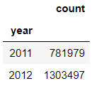
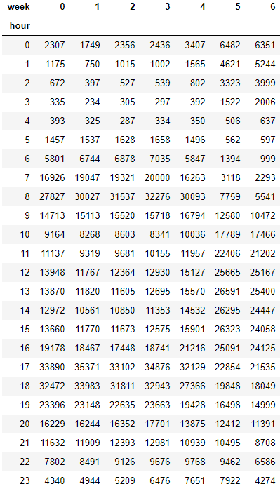
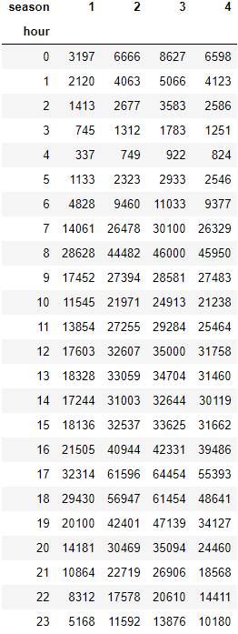
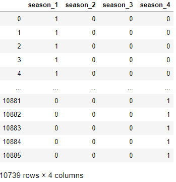

[toc]

# Day22 미니프로젝트(3)

# Kaggle : Bike Sharing Demand

1. bike data 불러오기
   - 각 데이터 확인(shape, info, ...)
2. 중복 확인
   - 훈련 데이터, 테스트 데이터 중복 값 있는지 확인
   - 훈련 데이터, 테스트 데이터 null 값 확인
3. datetime에서 년,월,일,시,분,초를 추출하여 각각의 column으로 구성
   - ex) df['year]=df['datetime'].dt.year
   - 년,월,일,시 에 따른 평균 대여량 구하기
   - => 분석 결과 reporting (ex. 여름에 대여량이 많다)
4. 근무일 유무/요일/시즌/날씨에 따른 시간대별 자전거 대여량 구하기
5. 연도별 월별 자전거 대여량 구하기
6. 아웃라이어제거
   - 정상범위 데이터 : count열값-count열값평균 < 3*(count.std)
7. 시즌컬럼 원핫 인코딩
   - season_1, ... season_4
   - 0 0 0 1
   - ...
   - 기존 데이터 프레임에 원핫인코딩 결과열 결합
8. 데이터 보정
   - 풍속 등 각 필드에 0으로 저장되어 있는 값을 근사값으로 보정
9. 바이크 대여수 예상되는 값 출력
   - 조건문 기반 작성
10. 제출

----

## date 형식으로 데이터 불러오기

```python
import pandas as pd

train = pd.read_csv('../bike-sharing-demand/train.csv')
train.head()
```


```python
train.info() # datetime 형식이 object
# > <class 'pandas.core.frame.DataFrame'>
# > RangeIndex: 10886 entries, 0 to 10885
# > Data columns (total 12 columns):
# > datetime      10886 non-null object
# > season        10886 non-null int64
# > holiday       10886 non-null int64
# > workingday    10886 non-null int64
# > weather       10886 non-null int64
# > temp          10886 non-null float64
# > atemp         10886 non-null float64
# > humidity      10886 non-null int64
# > windspeed     10886 non-null float64
# > casual        10886 non-null int64
# > registered    10886 non-null int64
# > count         10886 non-null int64
# > dtypes: float64(3), int64(8), object(1)
# > memory usage: 1020.7+ KB
```

- date 형식으로 불러오기

```python
# date 형식으로 불러오기
train = pd.read_csv('../bike-sharing-demand/train.csv', parse_dates=['datetime'])
train.info()
# > <class 'pandas.core.frame.DataFrame'>
# > RangeIndex: 10886 entries, 0 to 10885
# > Data columns (total 12 columns):
# > datetime      10886 non-null datetime64[ns]
# > season        10886 non-null int64
# > holiday       10886 non-null int64
# > workingday    10886 non-null int64
# > weather       10886 non-null int64
# > temp          10886 non-null float64
# > atemp         10886 non-null float64
# > humidity      10886 non-null int64
# > windspeed     10886 non-null float64
# > casual        10886 non-null int64
# > registered    10886 non-null int64
# > count         10886 non-null int64
# > dtypes: float64(3), int64(8), object(1)
# > memory usage: 1020.7+ KB
```

```python
train['datetime'].head()
# > 0   2011-01-01 00:00:00
# > 1   2011-01-01 01:00:00
# > 2   2011-01-01 02:00:00
# > 3   2011-01-01 03:00:00
# > 4   2011-01-01 04:00:00
# > Name: datetime, dtype: datetime64[ns]

train['datetime'].dt # DatetimeProperties
# > <pandas.core.indexes.accessors.DatetimeProperties object at 0x0000024362D6CAC8>
```
```python
train['datetime'].dt.year
# > 0        2011
# > 1        2011
# > 2        2011
# > 3        2011
# > 4        2011
# >          ... 
# > 10881    2012
# > 10882    2012
# > 10883    2012
# > 10884    2012
# > 10885    2012
# > Name: datetime, Length: 10886, dtype: int64

train['datetime'].dt.month
# > 0         1
# > 1         1
# > 2         1
# > 3         1
# > 4         1
# >          ..
# > 10881    12
# > 10882    12
# > 10883    12
# > 10884    12
# > 10885    12
# > Name: datetime, Length: 10886, dtype: int64

train['datetime'].dt.day
# > 0         1
# > 1         1
# > 2         1
# > 3         1
# > 4         1
# >          ..
# > 10881    19
# > 10882    19
# > 10883    19
# > 10884    19
# > 10885    19
# > Name: datetime, Length: 10886, dtype: int64

train['datetime'].dt.hour
# > 0         0
# > 1         1
# > 2         2
# > 3         3
# > 4         4
# >          ..
# > 10881    19
# > 10882    20
# > 10883    21
# > 10884    22
# > 10885    23
# > Name: datetime, Length: 10886, dtype: int64

train['datetime'].dt.minute
# > 0        0
# > 1        0
# > 2        0
# > 3        0
# > 4        0
# >         ..
# > 10881    0
# > 10882    0
# > 10883    0
# > 10884    0
# > 10885    0
# > Name: datetime, Length: 10886, dtype: int64

train['datetime'].dt.second
# > 0        0
# > 1        0
# > 2        0
# > 3        0
# > 4        0
# >         ..
# > 10881    0
# > 10882    0
# > 10883    0
# > 10884    0
# > 10885    0
# > Name: datetime, Length: 10886, dtype: int64

train['datetime'].dt.dayofweek
# 월요일:0 ~ 일요일:6 으로 출력
# > 0        5
# > 1        5
# > 2        5
# > 3        5
# > 4        5
# >         ..
# > 10881    2
# > 10882    2
# > 10883    2
# > 10884    2
# > 10885    2
# > Name: datetime, Length: 10886, dtype: int64
```

- 문자열일 경우 date로 변환하기

```python
import datetime

today = "2020-01-17"
datetime.datetime.strptime(today, "%Y-%m-%d")
# > datetime.datetime(2020, 1, 17, 0, 0)

today = "20200117"
datetime.datetime.strptime(today, "%Y%m%d")
# > datetime.datetime(2020, 1, 17, 0, 0)

today = "2020-01-17 10:18:20.123"
datetime.datetime.strptime(today, "%Y-%m-%d %H:%M:%S.%f")
# > datetime.datetime(2020, 1, 17, 10, 18, 20, 123000)
```

- 컴퓨터 현재시각

```python
datetime.datetime.today() # 현재시각
# > datetime.datetime(2020, 1, 17, 10, 17, 4, 237123)

datetime.datetime.today().strftime("%Y")
# > '2020'

datetime.datetime.today().strftime("%m")
# > '01'

datetime.datetime.today().strftime("%d")
# > '17'
```

----

## 1.  bike data 불러오기

- 각 데이터 확인(shape, info, ...)

```python
# 1.
import pandas as pd

train = pd.read_csv('../bike-sharing-demand/train.csv', parse_dates=['datetime'])
test = pd.read_csv('../bike-sharing-demand/test.csv', parse_dates=['datetime'])

trainCopy = train.copy()
testCopy = test.copy()

print(trainCopy.shape, testCopy.shape)
# > (10886, 12) (6493, 9)

trainCopy.info()
# > <class 'pandas.core.frame.DataFrame'>
# > RangeIndex: 10886 entries, 0 to 10885
# > Data columns (total 12 columns):
# > datetime      10886 non-null datetime64[ns]
# > season        10886 non-null int64
# > holiday       10886 non-null int64
# > workingday    10886 non-null int64
# > weather       10886 non-null int64
# > temp          10886 non-null float64
# > atemp         10886 non-null float64
# > humidity      10886 non-null int64
# > windspeed     10886 non-null float64
# > casual        10886 non-null int64
# > registered    10886 non-null int64
# > count         10886 non-null int64
# > dtypes: datetime64[ns](1), float64(3), int64(8)
# > memory usage: 1020.7 KB

testCopy.info()
# > <class 'pandas.core.frame.DataFrame'>
# > RangeIndex: 6493 entries, 0 to 6492
# > Data columns (total 9 columns):
# > datetime      6493 non-null datetime64[ns]
# > season        6493 non-null int64
# > holiday       6493 non-null int64
# > workingday    6493 non-null int64
# > weather       6493 non-null int64
# > temp          6493 non-null float64
# > atemp         6493 non-null float64
# > humidity      6493 non-null int64
# > windspeed     6493 non-null float64
# > dtypes: datetime64[ns](1), float64(3), int64(5)
# > memory usage: 456.7 KB

trainCopy.columns
# > Index(['datetime', 'season', 'holiday', 'workingday', 'weather', 'temp',
# >        'atemp', 'humidity', 'windspeed', 'casual', 'registered', 'count'],
# >       dtype='object')

testCopy.columns
# > Index(['datetime', 'season', 'holiday', 'workingday', 'weather', 'temp',
# >        'atemp', 'humidity', 'windspeed'],
# >       dtype='object')

trainCopy.describe()
```


```python
testCopy.describe()
```


## 2. 중복 확인

- 훈련 데이터, 테스트 데이터 중복 값 있는지 확인

- 훈련 데이터, 테스트 데이터 null 값 확인

```python
# 2.
len(trainCopy.datetime.unique())
# > 10886

len(testCopy.datetime.unique())
# > 6493

trainCopy[trainCopy.isnull().any(axis=1)]
```


```python
testCopy[testCopy.isnull().any(axis=1)]
```


## 3. datetime에서 년,월,일,시,분,초를 추출하여 각각의 column으로 구성

- ex) df['year]=df['datetime'].dt.year

- 년,월,일,시 에 따른 평균 대여량 구하기

- => 분석 결과 reporting (ex. 여름에 대여량이 많다)

```python
# 3.
# season 1=spring(1,2,3월), 2=summer(4,5,6)
# 3=fall(7,8,9) 4=winter(10,11,12)
trainCopy['year'] = trainCopy['datetime'].dt.year
trainCopy['month'] = trainCopy['datetime'].dt.month
trainCopy['day'] = trainCopy['datetime'].dt.day
trainCopy['hour'] = trainCopy['datetime'].dt.hour
trainCopy['minute'] = trainCopy['datetime'].dt.minute
trainCopy['second'] = trainCopy['datetime'].dt.second
trainCopy['week'] = trainCopy['datetime'].dt.dayofweek

testCopy['year'] = testCopy['datetime'].dt.year
testCopy['month'] = testCopy['datetime'].dt.month
testCopy['day'] = testCopy['datetime'].dt.day
testCopy['hour'] = testCopy['datetime'].dt.hour
testCopy['minute'] = testCopy['datetime'].dt.minute
testCopy['second'] = testCopy['datetime'].dt.second
testCopy['week'] = testCopy['datetime'].dt.dayofweek

trainCopy.head()
```


```python
testCopy.head()
```


```python
# 년 평균 대여량
trainCopy['count'].sum() / len(trainCopy['year'].value_counts())
# > 1042738.0

# 년 대여량
trainCopy.groupby(['year'])[['count']].sum()
# 2011년 보다 2012년의 대여량이 더 많았다.
```



```python
# 월 평균 대여량
trainCopy.groupby(['month'])[['count']].sum()/len(trainCopy['year'].value_counts())
# 5~10월 사이 즉, 여름, 가을에 대여량이 많다.
```


```python
# 일 평균 대여량
trainCopy.groupby(['day'])[['count']].sum()/(len(trainCopy['year'].value_counts()) * len(trainCopy['month'].value_counts()))
# 17일에 가장 많은 평균 대여량을 보였다.
```


```python
# 시간에 따른 평균 대여량
trainCopy.groupby(['hour'])[['count']].mean()
# 오후 4~7시의 평균 대여량이 다른 시간들 보다 높았다.
```


## 4. 근무일 유무/요일/시즌/날씨에 따른 시간대별 자전거 대여량 구하기

```python
# 4.
# 근무일 유무에 따른 시간대별 자전거 대여량 구하기
pd.set_option("max_columns", 24) # 열 생략없이 출력하기
trainCopy.pivot_table(values='count', index='hour', 
                      columns='workingday', aggfunc=np.sum)
```


```python
# 요일에 따른 시간대별 자전거 대여량 구하기
# week =0(월) ~ 6(일)
trainCopy.pivot_table(values='count', index='hour', 
                      columns='week', aggfunc=np.sum)
```



```python
# 시즌에 따른 시간대별 자전거 대여량 구하기
# season =1(봄) ~ 4(겨울)
trainCopy.pivot_table(values='count', index='hour', 
                      columns='season', aggfunc=np.sum)
```



```python
# 날씨에 따른 시간대별 자전거 대여량 구하기
# weather =1(Clear), 2(Mist), 3(Light Snow, Rain), 4(Heavy Snow, Rain)
trainCopy.pivot_table(values='count', index='hour', 
                      columns='weather', aggfunc=np.sum)
```


## 5. 연도별 월별 자전거 대여량 구하기

```python
# 5.
# 연도별 자전거 대여량
trainCopy.pivot_table(values='count', columns='year', aggfunc=np.sum)
```


```python
# 월별 자전거 대여량
trainCopy.pivot_table(values='count', index='month', aggfunc=np.sum)
```


## 6. 아웃라이어제거

- 정상범위 데이터 : count열값-count열값평균 < 3*(count.std)

```python
# 6.
trainCopy['count'].mean()
# > 191.57413191254824

trainCopy['count'].std()
# > 181.14445383028496

trainCopy['count'].max()
# > 977

trainCopy['count'].mean() + 3*trainCopy['count'].std()
# > 735.007493403403

trainCopyOut = trainCopy[trainCopy['count'] < trainCopy['count'].mean() + 3*trainCopy['count'].std()]
```


## 7. 시즌컬럼 원핫 인코딩

- season_1, ... season_4
- 0 0 0 1
- ... 
- 기존 데이터 프레임에 원핫인코딩 결과열 결합

```python
# 7.
pd.get_dummies(trainCopyOut['season'], prefix='season')
```



```python
trainCODummy = pd.concat([trainCopyOut, pd.get_dummies(trainCopyOut['season'], prefix='season')], axis=1)
# trainCODummy = trainCODummy.drop('season', axis=1)
trainCODummy.head()
```


## 8. 데이터 보정

- 풍속 등 각 필드에 0으로 저장되어 있는 값을 근사값으로 보정

```python
# 8.
# 풍속 값을 구하기 위한 knr 방법 사용
from sklearn.neighbors import KNeighborsRegressor

# knr에 사용할 변수
var = ['weather', 'season','temp', 'atemp', 'humidity', 'hour']

# knr을 위한 데이터 프레임 생성
x_train = trainCODummy.loc[trainCODummy['windspeed'] != 0, var]
y_train = trainCODummy.loc[trainCODummy['windspeed'] != 0, "windspeed"]

x_test = trainCODummy.loc[trainCODummy['windspeed'] == 0, var]

# k=3인 모델의 객체 생성(3은 임의로 설정함)
reg = KNeighborsRegressor(n_neighbors=3)
# 훈련 데이터와 타깃을 사용하여 모델 학습
reg.fit(x_train, y_train)

# 테스트 데이터를 이용하여 windspeed 예측
y_test = pd.Series(reg.predict(x_test).reshape(-1))

y_test.index = x_test.index
trainCODummy.loc[trainCODummy['windspeed'] == 0, "windspeed"] = y_test
```


## 9. 바이크 대여수 예상되는 값 출력

- 조건문 기반 작성

```python
# 9.
# SVR
from sklearn import svm

#  풍속 값을 구하기 위한 knr 방법 사용
# knr에 사용할 변수 var = ['weather', 'season','temp', 'atemp', 'humidity', 'hour']

# knr을 위한 데이터 프레임 생성
x_test = testCopy.loc[testCopy['windspeed'] == 0, var]

# k=3인 모델의 객체 생성(3은 임의로 설정함)
# reg = KNeighborsRegressor(n_neighbors=3)
# 훈련 데이터와 타깃을 사용하여 모델 학습
# reg.fit(x_train, y_train)

# 테스트 데이터를 이용하여 windspeed 예측
y_test = pd.Series(reg.predict(x_test).reshape(-1))

# 예측된 windseep로 0값 대체
y_test.index = x_test.index
testCopy.loc[testCopy['windspeed'] == 0, "windspeed"] = y_test

# svr 데이터 프레임 생성
svr_train_x = trainCODummy.copy()
svr_train_x = svr_train_x.drop(["casual", "registered", "count", "datetime", "year", "minute", "second", "season_1", "season_2", "season_3", "season_4"], axis=1)
svr_train_y = trainCODummy[["count"]]

svr_test_x = testCopy.copy()
svr_test_x = svr_test_x.drop(["datetime", "year", "minute", "second"], axis=1)


# fitting SVM
clf = svm.SVR(kernel = 'rbf')
clf.fit(svr_train_x, svr_train_y)
pred_y = clf.predict(svr_test_x)

result = testCopy[['datetime']]
result["count"] = pred_y
result
result.to_csv('../bike-sharing-demand/submission.csv', index=False)
```

