# Day30 미니프로젝트(4)

# 1. 신생아 이름 데이터를 이용한 분석

- 유명인, 성서에 등장하는 이름 등 외부 이름을 이용하여 이름 유행을 분석
- 각 연도별 가장 인기 있는 이름을 분석
- 다음 이름의 연도별 순위 조사(john, sophia, michael, daniel, carter)
- 각 연도별, 성별 상위 50% 이름을 구성하는 알파벳 문자 중, 자음과 모음의 비율 분석
- 가장 긴 이름과 가장 짧은 이름을 출력
- 시각화도 함께 ...

```python
import pandas as pd
import numpy as np
import matplotlib.pyplot as plt
```

```python
tmp = []
for year in range(1880, 2011) :
    path = '../names/names/yob%d.txt' % year
    df = pd.read_csv(path, sep=',', 
                      names=['name', 'sex', 'births'])
    df['year'] = year
    df['l_name'] = df.name.map(lambda x: x.lower())
    tmp.append(df)
    
names = pd.concat(tmp, ignore_index=True)
names
```

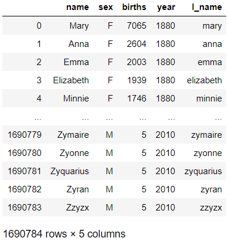

## 성서에 등장하는 이름을 이용하여 이름 유행 분석

```python
bible = ['Benjamin', 'Daniel', 'Danielle', 'Joseph', 'Joshua',
         'Matthew', 'Michael', 'Michelle', 'Samuel', 'Thomas',
         'Sarah', 'Rebecca', 'Rachel', 'Esther', 'Elizabeth', 
         'Aaron', 'Andrew', 'James', 'John', 'Paul',
         'Stephen', 'Steve', 'Uriah']

sex_name = names.pivot_table(values='births', index='year',
                              columns='name', aggfunc=sum)
sex_name
```

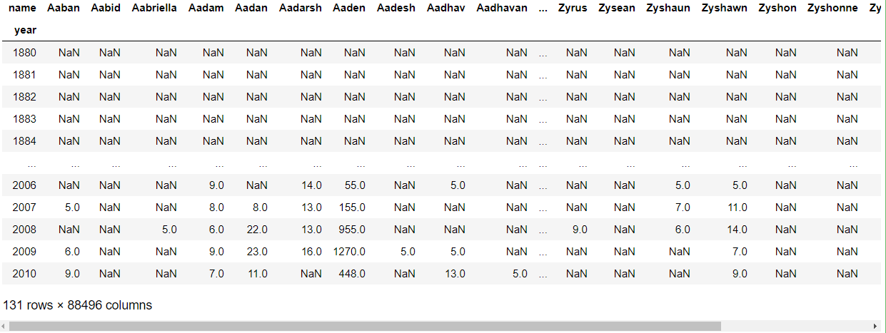

```python
bible_set = sex_name[bible]
bible_set
```

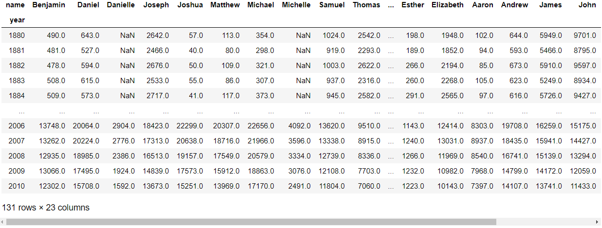

```python
grouped = [[] for _ in range(4)]
grouped
for name in bible :
    stand = bible_set[name].max()
    if stand <= 20000 : 
        if bible_set[name][2010] < 5000 : grouped[0].append(name)
        else : grouped[1].append(name)
    elif stand <= 40000 : grouped[2].append(name)
    else : grouped[3].append(name)

print(grouped)
# > [['Danielle', 'Rebecca', 'Rachel', 'Esther', 'Steve', 'Uriah'], ['Benjamin', 'Samuel', 'Aaron'], ['Daniel', 'Joseph', 'Michelle', 'Sarah', 'Elizabeth', 'Andrew', 'Paul', 'Stephen'], ['Joshua', 'Matthew', 'Michael', 'Thomas', 'James', 'John']]
```

```python
fig, axes = plt.subplots(4, 1, figsize=(15, 20))

for i in range(4) :
    bible_set[grouped[i]].plot(
        ax=axes[i], 
        ylim=(0, bible_set[grouped[i]].max().max()+2000))
    axes[i].legend(loc='center left', bbox_to_anchor=(1,0.5))
```

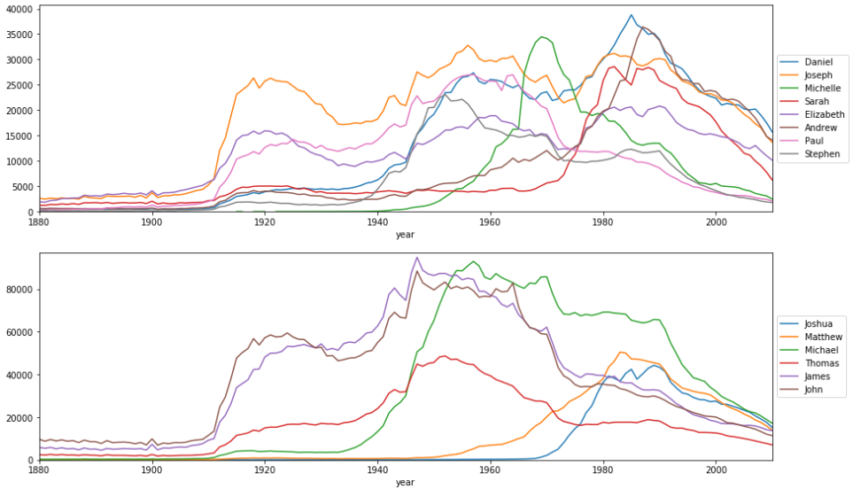

- 첫번째 그래프
  - Danielle : Daniel의 여성명사로, 1960년부터 증가하여 1990년 쯤 최고치를 찍고 감소하였다.
  - Rebecca(리브가) : 1940년부터 증가하여 감소와 증가를 반복하다가 1990년대 후반부터는 감소하였다.
  - Rachel(라헬) : 1910년대에 약간 증가하여 유지되다가 1965년 쯤 부터 급격히 증가하였다. 그 이후 1990년 후반부터 사용량이 감소하였다.
  - Esther : 1890년부터 사용량이 증가하다 1920년쯤 최고점을 찍고 감소세를 보이다 유지되고 있다.
  - Steve : Stephen의 애칭으로, 1910년대에 약간 증가하여 유지되다가 1940년대부터 증가하였다. 1960년쯤 최고점을 찍고 하락세를 보이고 있다.
  - Uriah : 거의 사용이 되지 않다가 1970년쯤 부터 사용이 되고 있으나 적은 숫자인 것을 알 수 있다.
- 두번째 그래프
  - Benjamin(베냐민) : 1910년대부터 사용량이 증가하여 유지되다가 1960년대 후반부터 사용량이 급격히 증가하였다.
  - Samuel : 1910년대에 사용량이 증가하여 어느정도 유지되다가 1980년대 중반부터 사용량이 증가하였다.
  - Aaron : 1910년대에 사용량이 약간 증가하여 유지되다가 1960년대부터 사용량이 증가하였고, 1990년대 부터 감소하였다.
- 세번째 그래프
  - Daniel : 1910년대부터 증가하다가 1940년대에 한번 급격히 증가하고, 1970년대에 한번 더 급격히 증가하여 최고점을 찍고 감소하고 있다.
  - Joseph(요셉) : 1910년대에 급격히 증가하여 감소와 증가를 반복하다 현재는 감소하는 추세이다.
  - Michelle : Michael의 여성명사로, 1950년대에 사용량이 증가하다 1970년쯤 최고치를 찍고 사용량이 감소하는 추세이다.
  - Sarah : 1910년대에 사용량이 증가하여 유지되다가 1970년대에 급격히 증가하다 1990년대부터 감소하는 추세이다.
  - Elizabeth(이사벨) : 1880년부터 사용량이 조금씩 증가하다 1910년대에 급격히 증강하여 감소와 증가를 반복하다 현재는 감소하는 추세이다.
  - Andrew(안드레) : 1910년대에 사용량이 증가하여 유지되다가 1970년대부터 사용량이 증가하다가 1980년대 후반에 최고점을 찍고 감소하는 추세이다.
  - Paul(바울) : 1910년대부터 사용량이 증가하는 추세를 보이다가 1960년대부터 감소하고 있다.
  - Stephen(스데반) : 1910년대에 사용량이 증가하여 유지되다가 1940년대에 급격히 증가하여 1950년쯤 최고치를 찍고 감소하는 추세를 보이고 있다.
- 네번째 그래프
  - Joshua(여호수아) : 1970년대에 사용량이 급격히 증가하여 1990년쯤 최고치를 찍고 감소하고 있다.
  - Matthew(마태) : 1950년대부터 사용량이 증가하다가 1980년대에 최고치를 찍은 후 감소하고 있다.
  - Michael(미가엘) : 1910년대에 증가하여 유지되다가 1940년대에 급격한 증가를 보이다가 1950년대에 최고치를 찍은 후 서서히 감소하는 추세를 보이고 있다.
  - Thomas(도마) : 1910년대에 증가하기 시작하여 1950년대에 최고치를 찍고 감소하고 있다.
  - James(야보고) : 1910년대부터 급격한 증가량을 보이다가 1940년대에 최고치를 찍었다. 그 이후 서서히 감소하다 1960년대 급격한 감소를 보인 후 다시 완만하게 감소하고 있다.
  - John(요한) : James와 비슷한 모양으로 변하고 있다.

## 각 연도별 가장 인기 있는 이름 분석

```python
names
```


```python
year_name = names.pivot_table(index=['year', 'name'], 
                              values='births', aggfunc=sum)
year_name
```

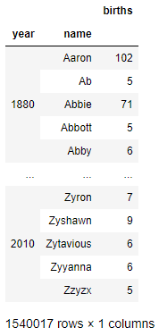

```python
trend = []
for y in range(1880, 2011) :
    subset = year_name.loc[y]
    name = subset.sort_values(by='births').index[-1]
    trend.append(name)

year_list = list(range(1880, 2011))
for i in range(len(trend)//5+1) :
    if i == len(trend)//5 :
        print(year_list[-1])
        print(trend[-1])
    else :
        print("{}\t{}\t{}\t{}\t{}".format(*year_list[i*5:i*5+5]))
        print('\t'.join(trend[i*5:i*5+5]))
# > 1880	1881	1882	1883	1884
# > John	John	John	John	John
# > 1885	1886	1887	1888	1889
# > Mary	Mary	Mary	Mary	Mary
# > 1890	1891	1892	1893	1894
# > Mary	Mary	Mary	Mary	Mary
# > 1895	1896	1897	1898	1899
# > Mary	Mary	Mary	Mary	Mary
# > 1900	1901	1902	1903	1904
# > Mary	Mary	Mary	Mary	Mary
# > 1905	1906	1907	1908	1909
# > Mary	Mary	Mary	Mary	Mary
# > 1910	1911	1912	1913	1914
# > Mary	Mary	Mary	Mary	Mary
# > 1915	1916	1917	1918	1919
# > Mary	Mary	Mary	Mary	Mary
# > 1920	1921	1922	1923	1924
# > Mary	Mary	Mary	Mary	Mary
# > 1925	1926	1927	1928	1929
# > Mary	Mary	Mary	Mary	Mary
# > 1930	1931	1932	1933	1934
# > Mary	Robert	Mary	Mary	Mary
# > 1935	1936	1937	1938	1939
# > Robert	Robert	Robert	Robert	James
# > 1940	1941	1942	1943	1944
# > James	James	James	James	James
# > 1945	1946	1947	1948	1949
# > James	James	Linda	Linda	Linda
# > 1950	1951	1952	1953	1954
# > James	James	James	Robert	Michael
# > 1955	1956	1957	1958	1959
# > Michael	Michael	Michael	Michael	Michael
# > 1960	1961	1962	1963	1964
# > David	Michael	Michael	Michael	Michael
# > 1965	1966	1967	1968	1969
# > Michael	Michael	Michael	Michael	Michael
# > 1970	1971	1972	1973	1974
# > Michael	Michael	Michael	Michael	Michael
# > 1975	1976	1977	1978	1979
# > Michael	Michael	Michael	Michael	Michael
# > 1980	1981	1982	1983	1984
# > Michael	Michael	Michael	Michael	Michael
# > 1985	1986	1987	1988	1989
# > Michael	Michael	Michael	Michael	Michael
# > 1990	1991	1992	1993	1994
# > Michael	Michael	Michael	Michael	Michael
# > 1995	1996	1997	1998	1999
# > Michael	Michael	Michael	Michael	Jacob
# > 2000	2001	2002	2003	2004
# > Jacob	Jacob	Jacob	Jacob	Jacob
# > 2005	2006	2007	2008	2009
# > Jacob	Jacob	Jacob	Jacob	Isabella
# > 2010
# > Isabella
```

## 다음 이름의 연도별 순위 조사

- john, sophia, michael, daniel, carter

```python
rank_by_year = year_name.groupby(['year'])['births'].rank(method='min', ascending=False)
rank_by_year
# > year  name     
# > 1880  Aaron          273.0
# >       Ab            1656.0
# >       Abbie          355.0
# >       Abbott        1656.0
# >       Abby          1486.0
# >                     ...   
# > 2010  Zyron        21547.0
# >       Zyshawn      18207.0
# >       Zytavious    23858.0
# >       Zyyanna      23858.0
# >       Zzyzx        27001.0
# > Name: births, Length: 1540017, dtype: float64

year_name[rank_by_year==1]
```

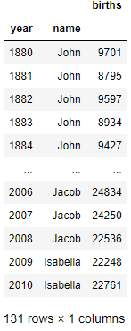

```python
rank_by_year_df = rank_by_year.unstack()
rank_by_year_df
```

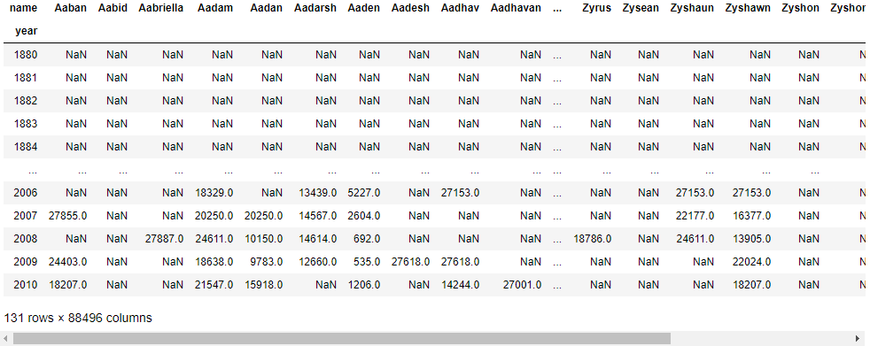

```python
search = ['John', 'Sophia', 'Michael', 'Daniel', 'Carter']
rank_by_year_df[search]
```

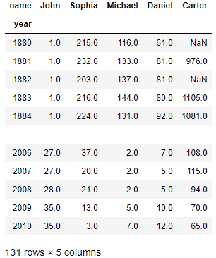

```python
rank_by_year_df[search].plot(figsize=(20,10)).legend(loc='center left', bbox_to_anchor=(1,0.5))
```

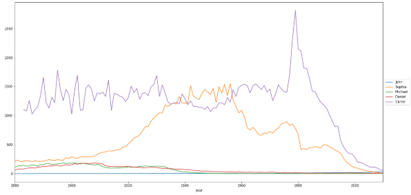

- John은 시간이 지남에 따라 큰 변화 없이 최상위권을 차지하고 있다.
- Sophia는 1880년대 부터 순위가 천천히 떨어지다가 1920년부터 급격히 떨어져 1500등까지 갔다. 그 이후 등수가 많이 올랐다.
- Michael은 1880년에 100등 대로 시작했다가 시간이 지남에 따라 올라가고 있다.
- Daniel은 1880년에 100등 이하로 시작하여 조금씩 떨어지다가 1910년대부터 점차적으로 오르고 있다.
- Carter는 1880년부터 1970년까지 1000등에서 2000등 사이의 등수를 차지했다. 그 이후 등수가 급격히 떨어졌다가 급격히 오르고 있다.

## 각 연도별, 성별 상위 50% 이름을 구성하는 알파벳 문자 중, 자음과 모음의 비율 분석

```python
names
```


```python
def add_prop(group) :
    group['prop'] = group['births'] / group['births'].sum()
    return group

name_prop = names.groupby(['year','sex']).apply(add_prop)
name_prop
```

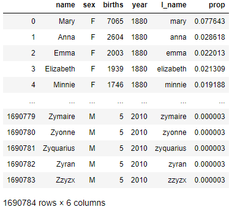

```python
girls = name_prop[names.sex == 'F']
boys = name_prop[names.sex == 'M']

girl_Q1, boy_Q1 = [], []
for y in range(1880, 2011) :
    g_df = girls[girls.year == y]
    g_df_sort = g_df.sort_values(by='prop', ascending=False)
    g_pr_cumsum = g_df_sort.prop.cumsum()
    g_q1_ind = g_pr_cumsum.values.searchsorted(0.5)
    value = g_df_sort[:g_q1_ind+1].l_name.values
    girl_Q1.append(value.tolist())
    
    b_df = boys[boys.year == y]
    b_df_sort = b_df.sort_values(by='prop', ascending=False)
    b_pr_cumsum = b_df_sort.prop.cumsum()
    b_q1_ind = b_pr_cumsum.values.searchsorted(0.5)
    value = b_df_sort[:b_q1_ind+1].l_name.values
    boy_Q1.append(value.tolist())

print(girl_Q1)
```

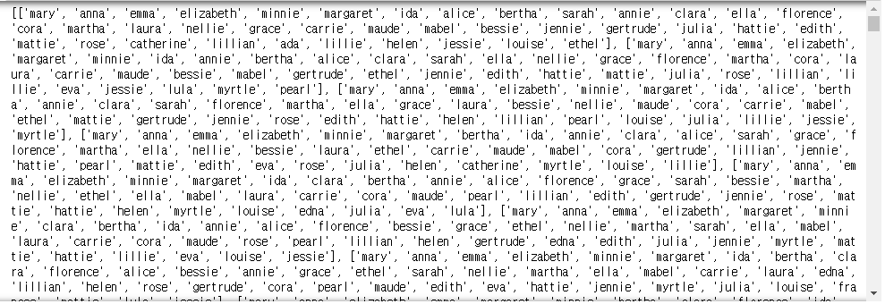

```python
print(boy_Q1)
```

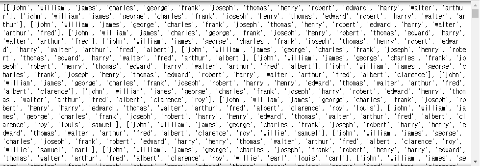

```python
period = list(range(1880, 2011))
period_length = len(period)

girl_count = [[0]*2 for _ in period]
for i in range(period_length) :
    for each_name in girl_Q1[i] :
        for s in each_name :
            if s in ['a', 'e', 'i', 'o', 'u'] :
                girl_count[i][0] += 1
            else : girl_count[i][1] += 1

boy_count = [[0]*2 for _ in period]
for i in range(period_length) :
    for each_name in boy_Q1[i] :
        for s in each_name :
            if s in ['a', 'e', 'i', 'o', 'u'] :
                boy_count[i][0] += 1
            else : boy_count[i][1] += 1
```

```python
print(girl_count)
# > [[99, 112], [94, 112], [96, 114], [99, 117], [96, 113], [100, 117], [101, 121], [102, 122], [106, 126], [109, 128], [111, 132], [109, 131], [108, 132], [107, 133], [110, 135], [111, 143], [110, 145], [110, 145], [114, 150], [114, 150], [120, 155], [118, 155], [119, 156], [119, 158], [120, 161], [121, 163], [118, 161], [122, 165], [119, 163], [120, 162], [123, 165], [123, 160], [122, 165], [124, 164], [125, 166], [121, 161], [123, 165], [124, 167], [127, 169], [125, 167], [126, 171], [127, 173], [126, 174], [128, 176], [130, 177], [133, 179], [131, 178], [132, 183], [132, 187], [127, 182], [123, 179], [118, 171], [118, 174], [118, 175], [117, 172], [116, 172], [117, 174], [119, 180], [113, 174], [106, 168], [101, 164], [93, 154], [90, 149], [87, 146], [88, 150], [88, 150], [88, 151], [88, 151], [94, 157], [96, 162], [98, 164], [96, 163], [100, 164], [104, 168], [110, 175], [115, 178], [118, 181], [122, 191], [126, 202], [131, 204], [137, 209], [142, 215], [145, 218], [148, 222], [150, 227], [148, 225], [147, 225], [155, 236], [159, 246], [168, 255], [176, 269], [184, 281], [184, 285], [194, 298], [195, 298], [198, 297], [195, 289], [200, 303], [202, 306], [201, 307], [195, 292], [199, 288], [198, 282], [187, 273], [185, 276], [187, 282], [195, 290], [195, 294], [204, 306], [213, 323], [236, 343], [251, 363], [275, 391], [290, 410], [304, 429], [314, 440], [336, 461], [360, 483], [380, 509], [398, 537], [417, 571], [444, 589], [459, 604], [481, 628], [512, 677], [531, 696], [566, 722], [602, 775], [636, 798], [655, 821], [667, 837]]

print(boy_count)
# > [[26, 54], [26, 54], [27, 57], [27, 57], [29, 61], [29, 61], [29, 61], [32, 66], [32, 66], [33, 68], [36, 70], [39, 73], [39, 74], [41, 76], [42, 78], [43, 77], [45, 81], [45, 84], [45, 88], [47, 88], [49, 92], [48, 89], [50, 93], [52, 95], [52, 100], [52, 100], [53, 101], [56, 106], [56, 107], [56, 107], [58, 111], [59, 110], [61, 117], [62, 122], [62, 122], [62, 122], [62, 122], [61, 120], [61, 119], [60, 117], [62, 114], [59, 113], [60, 112], [57, 109], [57, 109], [54, 105], [54, 105], [54, 105], [52, 107], [52, 107], [52, 103], [53, 106], [53, 106], [53, 103], [52, 103], [52, 103], [48, 101], [50, 102], [48, 100], [48, 100], [48, 97], [46, 93], [47, 93], [44, 89], [44, 88], [44, 88], [43, 83], [45, 88], [46, 88], [46, 88], [46, 87], [46, 87], [46, 87], [46, 87], [48, 92], [49, 99], [51, 102], [53, 106], [54, 110], [59, 118], [60, 122], [60, 122], [59, 118], [59, 118], [57, 117], [56, 112], [56, 112], [57, 114], [56, 113], [58, 116], [60, 120], [62, 127], [64, 129], [68, 134], [69, 132], [74, 142], [74, 138], [73, 134], [74, 134], [75, 136], [75, 136], [75, 136], [75, 136], [73, 133], [75, 138], [77, 141], [79, 143], [84, 155], [86, 157], [92, 170], [97, 176], [102, 189], [109, 198], [116, 208], [122, 216], [129, 221], [138, 235], [148, 243], [154, 251], [159, 256], [167, 272], [178, 286], [185, 290], [194, 296], [205, 316], [218, 331], [227, 345], [235, 358], [247, 377], [254, 389], [265, 400]]
```

```python
girl_vowel_prop = list(map(lambda x: x[0]/sum(x), girl_count))
boy_vowel_prop = list(map(lambda x: x[0]/sum(x), boy_count))
```

```python
plt.figure(figsize=(15, 10))
plt.title("Vowel ratio that make up a name")
plt.plot(period, girl_vowel_prop, label='girl')
plt.plot(period, boy_vowel_prop, label='boy')
plt.legend()
plt.show()
```

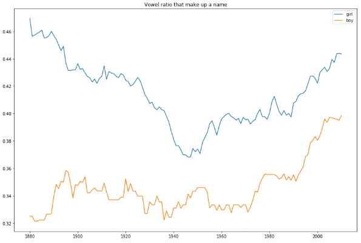

## 가장 긴 이름과 가장 짧은 이름을 출력

```python
ysn = names[['year', 'sex', 'name']]
ysn['name_len'] = ysn.name.map(len)
ysn
```

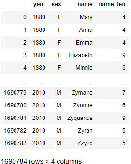

```python
ysn_f = ysn[ysn.sex == 'F']
f_max_name = set(
    ysn_f.name[ysn_f.name_len == ysn_f.name_len.max()] )
f_min_name = set(
    ysn_f.name[ysn_f.name_len == ysn_f.name_len.min()] )

ysn_m = ysn[ysn.sex == 'M']
m_max_name = set(
    ysn_m.name[ysn_m.name_len == ysn_m.name_len.max()] )
m_min_name = set(
    ysn_m.name[ysn_m.name_len == ysn_m.name_len.min()] )

print("여자아이의 최장이름들 :", sorted(list(f_max_name)),
      end='\n\n')
print("여자아이의 최단이름들 :", sorted(list(f_min_name)),
      end='\n\n')
print("남자아이의 최장이름들 :", sorted(list(m_max_name)),
      end='\n\n')
print("남자아이의 최단이름들 :", sorted(list(m_min_name)))
# > 여자아이의 최장이름들 : ['Ashleyelizabeth', 'Hannahelizabeth', 'Laurenelizabeth', 'Mariadelosangel', 'Mariadelrosario']
# > 
# > 여자아이의 최단이름들 : ['Ah', 'Ai', 'Aj', 'Al', 'An', 'Bg', 'Bj', 'Bo', 'Cj', 'Cy', 'Da', 'De', 'Di', 'Dj', 'Ea', 'Ed', 'Eh', 'El', 'Fe', 'Ge', 'Gi', 'Ha', 'Ia', 'In', 'Io', 'Ja', 'Jc', 'Jd', 'Ji', 'Jo', 'Ju', 'Ka', 'Kc', 'Kd', 'Ki', 'Ko', 'Kt', 'Ky', 'La', 'Le', 'Li', 'Lo', 'Lu', 'Ly', 'Ma', 'Mc', 'Me', 'Mi', 'My', 'Na', 'Ni', 'No', 'Ny', 'Ok', 'Pa', 'Ra', 'Sa', 'Se', 'Si', 'So', 'Su', 'Ta', 'Te', 'Ti', 'Tj', 'Tu', 'Ty', 'Un', 'Vi', 'Vy', 'Wm', 'Ya', 'Ye', 'Yi', 'Yo', 'Yu', 'Zi', 'Zo']
# > 
# > 남자아이의 최장이름들 : ['Christianalexan', 'Christiananthon', 'Christiandaniel', 'Christianjoseph', 'Christianjoshua', 'Christianmichae', 'Christopheranth', 'Christopherdavi', 'Christopherjame', 'Christopherjohn', 'Christopherjose', 'Christophermich', 'Christopherpaul', 'Christopherryan', 'Franciscojavier', 'Jaydenalexander', 'Johnchristopher', 'Jonathanmichael', 'Jordanalexander', 'Jordanchristoph', 'Joshuaalexander', 'Kevinchristophe', 'Markchristopher', 'Matthewalexande', 'Michaelchristop', 'Ryanchristopher', 'Seanchristopher']
# > 
# > 남자아이의 최단이름들 : ['Ab', 'Ac', 'Ad', 'Ah', 'Ai', 'Aj', 'Al', 'An', 'Av', 'Bb', 'Be', 'Bj', 'Bo', 'Cj', 'Cy', 'Da', 'De', 'Di', 'Dj', 'Do', 'Du', 'Eb', 'Ed', 'Eh', 'Ej', 'El', 'Fu', 'Ge', 'Gy', 'Ha', 'Ho', 'Hu', 'Hy', 'Ii', 'In', 'Ja', 'Jb', 'Jc', 'Jd', 'Je', 'Ji', 'Jj', 'Jl', 'Jm', 'Jo', 'Jp', 'Jr', 'Jt', 'Ju', 'Jw', 'Ka', 'Kc', 'Ke', 'Ki', 'Kj', 'Ko', 'Ku', 'Ky', 'La', 'Lb', 'Lc', 'Ld', 'Le', 'Lg', 'Li', 'Lj', 'Lo', 'Lu', 'Ly', 'Mc', 'Md', 'Mj', 'Mr', 'My', 'Na', 'Ng', 'No', 'Oc', 'Od', 'Om', 'Or', 'Oz', 'Pa', 'Pj', 'Po', 'Qi', 'Ra', 'Rb', 'Rc', 'Rd', 'Rj', 'Rl', 'Ry', 'Sa', 'Se', 'Si', 'St', 'Su', 'Sy', 'Ta', 'Tc', 'Ti', 'Tj', 'Tu', 'Ty', 'Un', 'Va', 'Vi', 'Vu', 'Vy', 'Wa', 'Wc', 'Wm', 'Xu', 'Ya', 'Ye', 'Yi', 'Yu', 'Ze', 'Zi', 'Zo', 'Zy']
```

```python
ysn.pivot_table(columns='sex', index='year', values='name_len'
                , aggfunc=[max, min]).plot(figsize=(15,10))
```


- 1880년과 1882년의 여자아이를 제외한 모든 조사기간에서 여자아이와 남자아이의 최단 이름의 길이는 2가 나왔다.
- 시간이 지남에 따라 여자아이와 남자아이의 최장이름의 길이는 증가하는 추세이다.

# 2. 영화 평점 데이터를 이용하여 영화 추천 시스템을 작성하시오

  - 입/출력 예시
    - 당신의 아이디를 입력하시오? 1
    - 당신과 가장 비슷한 영화를 본 고객 아이디는 7번 입니다.
    - 당신과 가장 비슷한 장르를 가지고 있는 고객 아이디는 10번 입니다
    - 당신에게 추천하는 영화는 xxxxx 입니다.
  - 조건
    - 비슷한 영화를 본 고객 아이디는 '공통적으로 본 영화'가 가장 많은 사람의 아이디입니다.
    - 비슷한 장르를 가지고 있는 고객 아이디는 
      1. 최소 2편 이상의 영화를 공통적으로 본 경우
      2. 1)번 조건을 만족하는 모든 고객 중 가장 유사하게 평점을 부여한 고객으로 찾습니다.
    - 당신에게 추천하는(아직 본적 없는) 영화는 2)번 조건을 만족하는 고객이 가장 높게 평점을 준 영화입니다.

```python
path = '../dataset/movielens/'
users = pd.read_csv(path+'users.dat', sep='::', 
                    names=['user_id', 'gender', 'age',
                           'occupation', 'zip'])
users
```

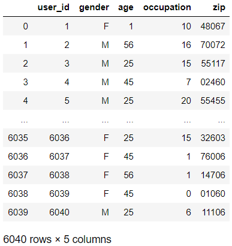

```python
ratings = pd.read_csv(path+'ratings.dat', sep='::', 
                      names=['user_id', 'movie_id', 'ratings',
                             'timestamp'])
movies = pd.read_csv(path+'movies.dat', sep='::', 
                     names=['movie_id', 'title', 'genres'])
```

```python
data = pd.merge(pd.merge(ratings, users), movies)
data
```

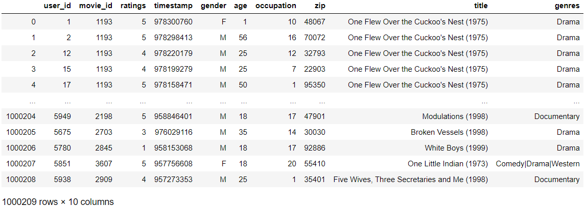

## 아이디 입력

```python
id = int(input("당신의 아이디를 입력하시오 "))
# > 당신의 아이디를 입력하시오 1
```

## 비슷한 영화를 본 고객 아이디

```python
user_movie = data.pivot_table(
    index='user_id', columns='movie_id', 
    values="ratings").apply(pd.to_numeric)
user_movie
```

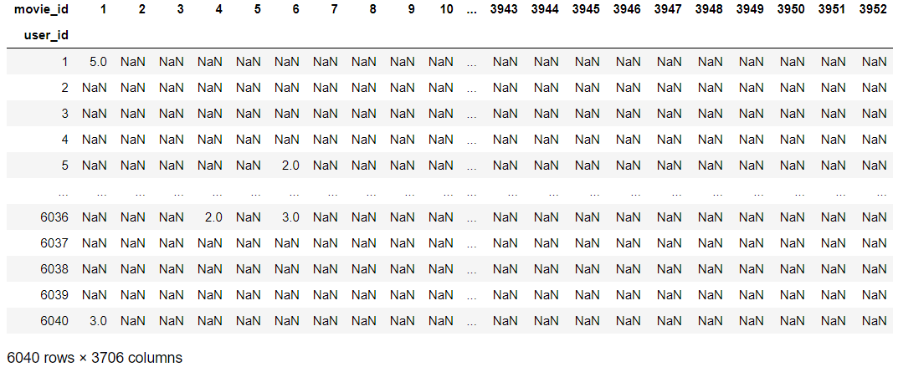

```python
user_movie_check = user_movie.notna()
user_movie_check
```

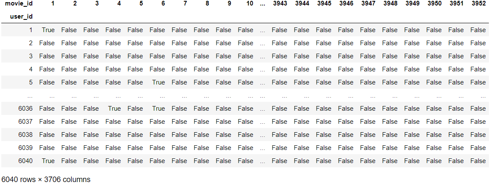

```python
for i in user_movie_check.columns :
    user_movie_check[i] = user_movie_check[i].map(int)
user_movie_check
```

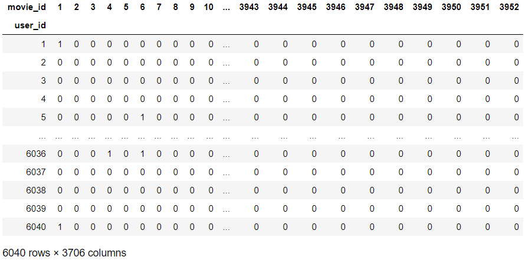

```python
id_data = user_movie_check.loc[id]
id_data
# > movie_id
# > 1       1
# > 2       0
# > 3       0
# > 4       0
# > 5       0
# >        ..
# > 3948    0
# > 3949    0
# > 3950    0
# > 3951    0
# > 3952    0
# > Name: 1, Length: 3706, dtype: int64

compare = user_movie_check.loc[user_movie.index.difference([id])]
compare
```

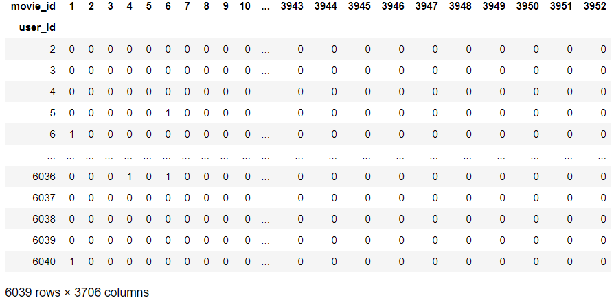

```python
compare_result = compare @ id_data
similar_movie = compare_result[
    compare_result == compare_result.max() ].index.values
print("당신과 가장 비슷한 영화를 본 고객 아이디는 {} 입니다.".format(similar_movie))
# > 당신과 가장 비슷한 영화를 본 고객 아이디는 [1088 5643] 입니다.
```

## 비슷한 평점을 준 고객 아이디

```python
common_movie = compare_result[
    compare_result >= 2 ].index.values

user_movie.loc[common_movie]
```

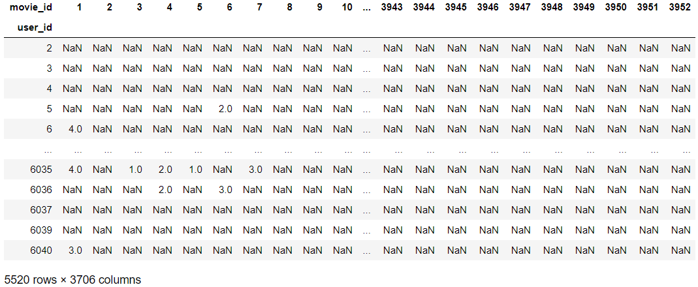

```python
user_movie.loc[id]
# > movie_id
# > 1       5.0
# > 2       NaN
# > 3       NaN
# > 4       NaN
# > 5       NaN
# >        ... 
# > 3948    NaN
# > 3949    NaN
# > 3950    NaN
# > 3951    NaN
# > 3952    NaN
# > Name: 1, Length: 3706, dtype: float64

(user_movie.loc[common_movie] - user_movie.loc[id])
```

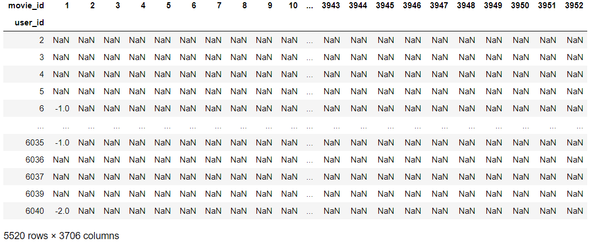

```python
euclidean_compute = ((user_movie.loc[common_movie] - user_movie.loc[id])**2).sum(axis=1)
euclidean_compute
# > user_id
# > 2        4.0
# > 3       11.0
# > 4        2.0
# > 5       38.0
# > 6        8.0
# >         ... 
# > 6035    10.0
# > 6036    43.0
# > 6037    11.0
# > 6039    15.0
# > 6040    18.0
# > Length: 5520, dtype: float64

euclidean_compute[euclidean_compute == euclidean_compute.min()]
# > user_id
# > 171     0.0
# > 282     0.0
# > 448     0.0
# > 526     0.0
# > 548     0.0
# >        ... 
# > 5435    0.0
# > 5476    0.0
# > 5590    0.0
# > 5910    0.0
# > 6033    0.0
# > Length: 105, dtype: float64
```
```python
similar_genre = euclidean_compute[
    euclidean_compute == euclidean_compute.min() ].index.values
similar_genre
# > array([ 171,  282,  448,  526,  548,  562,  565,  568,  663,  686,  693,
# >         709,  906,  978,  994, 1020, 1024, 1076, 1178, 1309, 1371, 1454,
# >        1455, 1478, 1801, 1886, 2099, 2128, 2269, 2275, 2295, 2416, 2426,
# >        2511, 2538, 2558, 2582, 2614, 2719, 2733, 2894, 3009, 3016, 3107,
# >        3133, 3176, 3198, 3223, 3287, 3289, 3325, 3326, 3372, 3584, 3619,
# >        3634, 3635, 3640, 3668, 3725, 3738, 3744, 3803, 3818, 3876, 3906,
# >        3969, 4019, 4035, 4111, 4159, 4249, 4301, 4431, 4469, 4487, 4537,
# >        4594, 4628, 4649, 4664, 4710, 4758, 4776, 4812, 4838, 4839, 4941,
# >        4944, 4949, 4965, 4986, 4991, 4997, 5030, 5040, 5168, 5174, 5297,
# >        5351, 5435, 5476, 5590, 5910, 6033], dtype=int64)

print("당신과 가장 비슷한 평점을 준 고객 아이디는 {} 입니다.".format(similar_genre))
# > 당신과 가장 비슷한 평점을 준 고객 아이디는 [ 171  282  448  526  548  562  565  568  663  686  693  709  906  978
# >   994 1020 1024 1076 1178 1309 1371 1454 1455 1478 1801 1886 2099 2128
# >  2269 2275 2295 2416 2426 2511 2538 2558 2582 2614 2719 2733 2894 3009
# >  3016 3107 3133 3176 3198 3223 3287 3289 3325 3326 3372 3584 3619 3634
# >  3635 3640 3668 3725 3738 3744 3803 3818 3876 3906 3969 4019 4035 4111
# >  4159 4249 4301 4431 4469 4487 4537 4594 4628 4649 4664 4710 4758 4776
# >  4812 4838 4839 4941 4944 4949 4965 4986 4991 4997 5030 5040 5168 5174
# >  5297 5351 5435 5476 5590 5910 6033] 입니다.
```

## 추천 영화

```python
user_movie_check.loc[similar_genre]
```

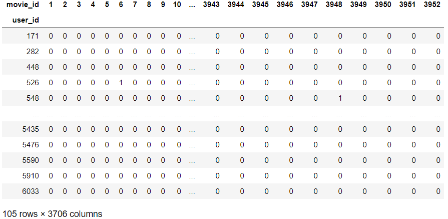

```python
user_movie_check.loc[similar_genre] - id_data
```

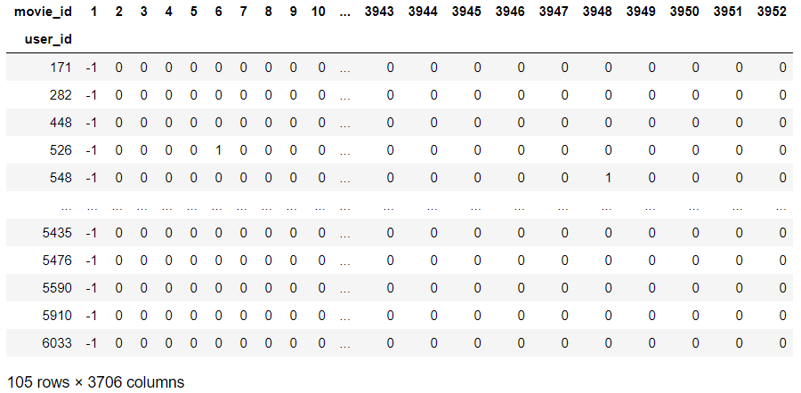

```python
candidate = []
for i in similar_genre :
    ind = user_movie_check.loc[i][(user_movie_check.loc[171] - id_data) > 0].index.values
    for j in ind :
        candidate.append([i, j])
candidate
```


```python
grade_max = 0
grade_ind = []
for a, b in candidate:
    tmp_v = user_movie.loc[a, b]
    if grade_max == tmp_v :
        grade_ind.append(b)
    if grade_max < tmp_v :
        grade_max = tmp_v
        grade_ind = [b]
grade_max
# > 5.0

print(grade_ind)
# > [1073, 1111, 1649, 2677, 858, 1617, 3578, 246, 858, 3578, 858, 1617, 1617, 858, 1617, 1230, 3753, 1230, 162, 858, 858, 858, 3578, 3753, 858, 1544, 246, 1230, 1073, 1230, 162, 246, 858, 1111, 1649, 1834, 2966, 3578, 3578, 3753, 1073, 1230, 3578, 3753, 1230, 1617, 3753, 1230, 1230, 3578, 246, 858, 3578, 3753, 858, 3578, 3753, 3578, 1617, 3578, 3578, 858, 3007, 3578, 1230, 162, 246, 1111]
```

```python
count_max = 0
movie_num = 0
for n in set(grade_ind) :
    if count_max < grade_ind.count(n) :
        count_max = grade_ind.count(n)
        movie_num = n
movie_num
# > 3578

movie_name = movies[movies.movie_id == movie_num]['title'].values
movie_name
# > array(['Gladiator (2000)'], dtype=object)

print("당신에게 추천하는 영화는 {}입니다.".format(movie_name))
# > 당신에게 추천하는 영화는 ['Gladiator (2000)']입니다.
```


