# Day32 딥러닝을 위한 빅데이터 기초 - R(2)

## 어제 수업 복습

```R
exam = read.csv("r데이터분석_Data/Data/csv_exam.csv")
head(exam)
##   id class math english science
## 1  1     1   50      98      50
## 2  2     1   60      97      60
## 3  3     1   45      86      78
## 4  4     1   30      98      58
## 5  5     2   25      80      65
## 6  6     2   50      89      98
```

```R
library(dplyr)
```

- 파이프를 이용한 summarise

```R
exam %>% summarise(mean_math = mean(math))
##   mean_math
## 1     57.45
```

```R
exam %>% 
  group_by(class) %>% 
  summarise(mean_math = mean(math))
## # A tibble: 5 x 2
##   class mean_math
##   <int>     <dbl>
## 1     1      46.2
## 2     2      61.2
## 3     3      45  
## 4     4      56.8
## 5     5      78
```

```R
exam %>% 
  group_by(class) %>% 
  summarise(mm = mean(math), sm = sum(math),
            md = median(math), cnt = n())
## # A tibble: 5 x 5
##   class    mm    sm    md   cnt
##   <int> <dbl> <int> <dbl> <int>
## 1     1  46.2   185  47.5     4
## 2     2  61.2   245  65       4
## 3     3  45     180  47.5     4
## 4     4  56.8   227  53       4
## 5     5  78     312  79       4
```

- n() : 데이터의 갯수를 세는 함수

```R
library(ggplot2)
head(mpg)
## # A tibble: 6 x 11
##   manufacturer model displ  year   cyl trans      drv     cty   hwy fl    class 
##   <chr>        <chr> <dbl> <int> <int> <chr>      <chr> <int> <int> <chr> <chr> 
## 1 audi         a4      1.8  1999     4 auto(l5)   f        18    29 p     compa~
## 2 audi         a4      1.8  1999     4 manual(m5) f        21    29 p     compa~
## 3 audi         a4      2    2008     4 manual(m6) f        20    31 p     compa~
## 4 audi         a4      2    2008     4 auto(av)   f        21    30 p     compa~
## 5 audi         a4      2.8  1999     6 auto(l5)   f        16    26 p     compa~
## 6 audi         a4      2.8  1999     6 manual(m5) f        18    26 p     compa~
```

# group_by

## 변수 하나로 group_by

```R
mpg %>% 
  group_by(manufacturer) %>% 
  summarise(mc = mean(cty)) %>% 
  head(10)
## # A tibble: 10 x 2
##    manufacturer    mc
##    <chr>        <dbl>
##  1 audi          17.6
##  2 chevrolet     15  
##  3 dodge         13.1
##  4 ford          14  
##  5 honda         24.4
##  6 hyundai       18.6
##  7 jeep          13.5
##  8 land rover    11.5
##  9 lincoln       11.3
## 10 mercury       13.2
```

## 변수 두개로 group_by

```R
mpg %>% 
  group_by(manufacturer, drv) %>% 
  summarise(mc = mean(cty)) %>% 
  head(10)
## # A tibble: 10 x 3
## # Groups:   manufacturer [5]
##    manufacturer drv      mc
##    <chr>        <chr> <dbl>
##  1 audi         4      16.8
##  2 audi         f      18.9
##  3 chevrolet    4      12.5
##  4 chevrolet    f      18.8
##  5 chevrolet    r      14.1
##  6 dodge        4      12  
##  7 dodge        f      15.8
##  8 ford         4      13.3
##  9 ford         r      14.8
## 10 honda        f      24.4
```

- mpg데이터를 회사 별로 그룹화

```R
mpg %>% 
  group_by(manufacturer)
## # A tibble: 234 x 11
## # Groups:   manufacturer [15]
##    manufacturer model    displ  year   cyl trans   drv     cty   hwy fl    class
##    <chr>        <chr>    <dbl> <int> <int> <chr>   <chr> <int> <int> <chr> <chr>
##  1 audi         a4         1.8  1999     4 auto(l~ f        18    29 p     comp~
##  2 audi         a4         1.8  1999     4 manual~ f        21    29 p     comp~
##  3 audi         a4         2    2008     4 manual~ f        20    31 p     comp~
##  4 audi         a4         2    2008     4 auto(a~ f        21    30 p     comp~
##  5 audi         a4         2.8  1999     6 auto(l~ f        16    26 p     comp~
##  6 audi         a4         2.8  1999     6 manual~ f        18    26 p     comp~
##  7 audi         a4         3.1  2008     6 auto(a~ f        18    27 p     comp~
##  8 audi         a4 quat~   1.8  1999     4 manual~ 4        18    26 p     comp~
##  9 audi         a4 quat~   1.8  1999     4 auto(l~ 4        16    25 p     comp~
## 10 audi         a4 quat~   2    2008     4 manual~ 4        20    28 p     comp~
## # ... with 224 more rows
```

- 위의 그룹화에서 class = "suv" 추출

```R
mpg %>% 
  group_by(manufacturer) %>% 
  filter(class == "suv")
## # A tibble: 62 x 11
## # Groups:   manufacturer [10]
##    manufacturer model      displ  year   cyl trans drv     cty   hwy fl    class
##    <chr>        <chr>      <dbl> <int> <int> <chr> <chr> <int> <int> <chr> <chr>
##  1 chevrolet    c1500 sub~   5.3  2008     8 auto~ r        14    20 r     suv  
##  2 chevrolet    c1500 sub~   5.3  2008     8 auto~ r        11    15 e     suv  
##  3 chevrolet    c1500 sub~   5.3  2008     8 auto~ r        14    20 r     suv  
##  4 chevrolet    c1500 sub~   5.7  1999     8 auto~ r        13    17 r     suv  
##  5 chevrolet    c1500 sub~   6    2008     8 auto~ r        12    17 r     suv  
##  6 chevrolet    k1500 tah~   5.3  2008     8 auto~ 4        14    19 r     suv  
##  7 chevrolet    k1500 tah~   5.3  2008     8 auto~ 4        11    14 e     suv  
##  8 chevrolet    k1500 tah~   5.7  1999     8 auto~ 4        11    15 r     suv  
##  9 chevrolet    k1500 tah~   6.5  1999     8 auto~ 4        14    17 d     suv  
## 10 dodge        durango 4~   3.9  1999     6 auto~ 4        13    17 r     suv  
## # ... with 52 more rows
```

- tot 열 추가(cyt와 hwy의 평균)

```R
mpg %>% 
  group_by(manufacturer) %>% 
  filter(class == "suv") %>% 
  mutate(tot = (cty+hwy)/2)
## # A tibble: 62 x 12
## # Groups:   manufacturer [10]
##    manufacturer model displ  year   cyl trans drv     cty   hwy fl    class
##    <chr>        <chr> <dbl> <int> <int> <chr> <chr> <int> <int> <chr> <chr>
##  1 chevrolet    c150~   5.3  2008     8 auto~ r        14    20 r     suv  
##  2 chevrolet    c150~   5.3  2008     8 auto~ r        11    15 e     suv  
##  3 chevrolet    c150~   5.3  2008     8 auto~ r        14    20 r     suv  
##  4 chevrolet    c150~   5.7  1999     8 auto~ r        13    17 r     suv  
##  5 chevrolet    c150~   6    2008     8 auto~ r        12    17 r     suv  
##  6 chevrolet    k150~   5.3  2008     8 auto~ 4        14    19 r     suv  
##  7 chevrolet    k150~   5.3  2008     8 auto~ 4        11    14 e     suv  
##  8 chevrolet    k150~   5.7  1999     8 auto~ 4        11    15 r     suv  
##  9 chevrolet    k150~   6.5  1999     8 auto~ 4        14    17 d     suv  
## 10 dodge        dura~   3.9  1999     6 auto~ 4        13    17 r     suv  
## # ... with 52 more rows, and 1 more variable: tot <dbl>
```

- mt = tot의 평균 구하기

```R
mpg %>% 
  group_by(manufacturer) %>% 
  filter(class == "suv") %>% 
  mutate(tot = (cty+hwy)/2) %>% 
  summarise(mt = mean(tot))
## # A tibble: 10 x 2
##    manufacturer    mt
##    <chr>        <dbl>
##  1 chevrolet     14.9
##  2 dodge         13.9
##  3 ford          15.3
##  4 jeep          15.6
##  5 land rover    14  
##  6 lincoln       14.2
##  7 mercury       15.6
##  8 nissan        15.9
##  9 subaru        21.9
## 10 toyota        16.3
```

- 위의 데이터를 mt를 기준으로 내림차순 정렬

```R
mpg %>% 
  group_by(manufacturer) %>% 
  filter(class == "suv") %>% 
  mutate(tot = (cty+hwy)/2) %>% 
  summarise(mt = mean(tot)) %>% 
  arrange(desc(mt))
## # A tibble: 10 x 2
##    manufacturer    mt
##    <chr>        <dbl>
##  1 subaru        21.9
##  2 toyota        16.3
##  3 nissan        15.9
##  4 mercury       15.6
##  5 jeep          15.6
##  6 ford          15.3
##  7 chevrolet     14.9
##  8 lincoln       14.2
##  9 land rover    14  
## 10 dodge         13.9
```

- 정렬한 데이터에서 상위 5개만 출력

```R
mpg %>% 
  group_by(manufacturer) %>% 
  filter(class == "suv") %>% 
  mutate(tot = (cty+hwy)/2) %>% 
  summarise(mt = mean(tot)) %>% 
  arrange(desc(mt)) %>% 
  head(5)
## # A tibble: 5 x 2
##   manufacturer    mt
##   <chr>        <dbl>
## 1 subaru        21.9
## 2 toyota        16.3
## 3 nissan        15.9
## 4 mercury       15.6
## 5 jeep          15.6
```

# 데이터 합치기

## join

- suv에 대하여 차량 연비가 높은 제조사 5개 출력
- 데이터 join

```R
test1 = data.frame(id = c(1:5),
                  midterm = c(60,80,70,90,55))
test2 = data.frame(id = c(1:5),
                   final = c(70,80,40,80,75))
test1
##   id midterm
## 1  1      60
## 2  2      80
## 3  3      70
## 4  4      90
## 5  5      55

test2
##   id final
## 1  1    70
## 2  2    80
## 3  3    40
## 4  4    80
## 5  5    75
```

```R
total = left_join(test1, test2, by="id")
total
##   id midterm final
## 1  1      60    70
## 2  2      80    80
## 3  3      70    40
## 4  4      90    80
## 5  5      55    75
```

- exam에 teacher 변수 추가

```R
name = data.frame(class = c(1:5),
                  teacher = c("kim", "lee", "park", "choi", "cho"))
exam_new = left_join(exam, name, by="class")
exam_new
##    id class math english science teacher
## 1   1     1   50      98      50     kim
## 2   2     1   60      97      60     kim
## 3   3     1   45      86      78     kim
## 4   4     1   30      98      58     kim
## 5   5     2   25      80      65     lee
## 6   6     2   50      89      98     lee
## 7   7     2   80      90      45     lee
## 8   8     2   90      78      25     lee
## 9   9     3   20      98      15    park
## 10 10     3   50      98      45    park
## 11 11     3   65      65      65    park
## 12 12     3   45      85      32    park
## 13 13     4   46      98      65    choi
## 14 14     4   48      87      12    choi
## 15 15     4   75      56      78    choi
## 16 16     4   58      98      65    choi
## 17 17     5   65      68      98     cho
## 18 18     5   80      78      90     cho
## 19 19     5   89      68      87     cho
## 20 20     5   78      83      58     cho
```

## bind

```R
test1 = data.frame(id = c(1:5),
                  midterm = c(60,80,70,90,55))
test2 = data.frame(id = c(6:10),
                   final = c(70,80,40,80,75))
test1
##   id midterm
## 1  1      60
## 2  2      80
## 3  3      70
## 4  4      90
## 5  5      55

test2
##   id final
## 1  6    70
## 2  7    80
## 3  8    40
## 4  9    80
## 5 10    75
```

```R
ta = bind_rows(test1, test2)
ta
##    id midterm final
## 1   1      60    NA
## 2   2      80    NA
## 3   3      70    NA
## 4   4      90    NA
## 5   5      55    NA
## 6   6      NA    70
## 7   7      NA    80
## 8   8      NA    40
## 9   9      NA    80
## 10 10      NA    75
```

```R
test1 = data.frame(id = c(1:5),
                  midterm = c(60,80,70,90,55))
test2 = data.frame(id = c(6:10),
                   midterm = c(70,80,40,80,75))
bind_rows(test1, test2)
##    id midterm
## 1   1      60
## 2   2      80
## 3   3      70
## 4   4      90
## 5   5      55
## 6   6      70
## 7   7      80
## 8   8      40
## 9   9      80
## 10 10      75
```

# 파이프

## filter() : 조건에 맞는 데이터 추출

```R
exam %>% filter(english >= 80)
##    id class math english science
## 1   1     1   50      98      50
## 2   2     1   60      97      60
## 3   3     1   45      86      78
## 4   4     1   30      98      58
## 5   5     2   25      80      65
## 6   6     2   50      89      98
## 7   7     2   80      90      45
## 8   9     3   20      98      15
## 9  10     3   50      98      45
## 10 12     3   45      85      32
## 11 13     4   46      98      65
## 12 14     4   48      87      12
## 13 16     4   58      98      65
## 14 20     5   78      83      58
```

```R
exam %>% filter(class == 1 & math >= 50)
##   id class math english science
## 1  1     1   50      98      50
## 2  2     1   60      97      60
```

## a %in% b : b에 속하는 a 추출 

```R
exam %>% filter(class %in% c(1,3,5))
##    id class math english science
## 1   1     1   50      98      50
## 2   2     1   60      97      60
## 3   3     1   45      86      78
## 4   4     1   30      98      58
## 5   9     3   20      98      15
## 6  10     3   50      98      45
## 7  11     3   65      65      65
## 8  12     3   45      85      32
## 9  17     5   65      68      98
## 10 18     5   80      78      90
## 11 19     5   89      68      87
## 12 20     5   78      83      58
```

## select() : 데이터에서  원하는 변수 선택

```R
exam %>% select(id, math)
##    id math
## 1   1   50
## 2   2   60
## 3   3   45
## 4   4   30
## 5   5   25
## 6   6   50
## 7   7   80
## 8   8   90
## 9   9   20
## 10 10   50
## 11 11   65
## 12 12   45
## 13 13   46
## 14 14   48
## 15 15   75
## 16 16   58
## 17 17   65
## 18 18   80
## 19 19   89
## 20 20   78
```

## mutate() : 조건에 맞는 변수 생성

- test 컬럼추가(test = if english >=60 then pass else fail)

```R
exam %>% 
  mutate(test = ifelse(english >= 60, "pass", "fail"))
##    id class math english science test
## 1   1     1   50      98      50 pass
## 2   2     1   60      97      60 pass
## 3   3     1   45      86      78 pass
## 4   4     1   30      98      58 pass
## 5   5     2   25      80      65 pass
## 6   6     2   50      89      98 pass
## 7   7     2   80      90      45 pass
## 8   8     2   90      78      25 pass
## 9   9     3   20      98      15 pass
## 10 10     3   50      98      45 pass
## 11 11     3   65      65      65 pass
## 12 12     3   45      85      32 pass
## 13 13     4   46      98      65 pass
## 14 14     4   48      87      12 pass
## 15 15     4   75      56      78 fail
## 16 16     4   58      98      65 pass
## 17 17     5   65      68      98 pass
## 18 18     5   80      78      90 pass
## 19 19     5   89      68      87 pass
## 20 20     5   78      83      58 pass
```

```R
exam %>% 
  mutate(test = ifelse(english >= 60, "pass", "fail")) %>% 
  arrange(test)
##    id class math english science test
## 1  15     4   75      56      78 fail
## 2   1     1   50      98      50 pass
## 3   2     1   60      97      60 pass
## 4   3     1   45      86      78 pass
## 5   4     1   30      98      58 pass
## 6   5     2   25      80      65 pass
## 7   6     2   50      89      98 pass
## 8   7     2   80      90      45 pass
## 9   8     2   90      78      25 pass
## 10  9     3   20      98      15 pass
## 11 10     3   50      98      45 pass
## 12 11     3   65      65      65 pass
## 13 12     3   45      85      32 pass
## 14 13     4   46      98      65 pass
## 15 14     4   48      87      12 pass
## 16 16     4   58      98      65 pass
## 17 17     5   65      68      98 pass
## 18 18     5   80      78      90 pass
## 19 19     5   89      68      87 pass
## 20 20     5   78      83      58 pass
```

```R
test1
##   id midterm
## 1  1      60
## 2  2      80
## 3  3      70
## 4  4      90
## 5  5      55

test2 = data.frame(id = c(1:5),
                   final = c(70,80,40,80,75))
test2
##   id final
## 1  1    70
## 2  2    80
## 3  3    40
## 4  4    80
## 5  5    75
```

- left_join

```R
left_join(test1, test2, by="id")
##   id midterm final
## 1  1      60    70
## 2  2      80    80
## 3  3      70    40
## 4  4      90    80
## 5  5      55    75
```

# 결측값 처리하기

```R
df = data.frame(sex = c("M", "F", NA, "M", "F"),
                score = c(5,4,3,5,NA))
df
##    sex score
## 1    M     5
## 2    F     4
## 3 <NA>     3
## 4    M     5
## 5    F    NA
```

- 결측치 확인하기

```R
is.na(df)
##        sex score
## [1,] FALSE FALSE
## [2,] FALSE FALSE
## [3,]  TRUE FALSE
## [4,] FALSE FALSE
## [5,] FALSE  TRUE
```

```R
table(is.na(df))
## 
## FALSE  TRUE 
##     8     2
```

```R
table(is.na(df$sex))
## 
## FALSE  TRUE 
##     4     1
```

```R
table(is.na(df$score))
## 
## FALSE  TRUE 
##     4     1
```

- NA가 포함되어있을 경우 연산시 NA 발생

```R
mean(df$score)
## [1] NA

sum(df$score)
## [1] NA
```

- score가 NA인 데이터만 출력

```R
df %>% filter(is.na(score))
##   sex score
## 1   F    NA
```

- score가 NA가 아닌 데이터만 출력

```R
df %>% filter(!is.na(score))
##    sex score
## 1    M     5
## 2    F     4
## 3 <NA>     3
## 4    M     5
```

```R
df_nomiss = df %>% filter(!is.na(score))
df_nomiss
##    sex score
## 1    M     5
## 2    F     4
## 3 <NA>     3
## 4    M     5
```

- score에 NA가 없으므로 연산가능

```R
mean(df_nomiss$score)
## [1] 4.25

sum(df_nomiss$score)
## [1] 17
```

- score, sex 컬럼에서 na가 아닌 데이터만 추출

```R
df %>% filter(!is.na(score) & !is.na(sex))
##   sex score
## 1   M     5
## 2   F     4
## 3   M     5
```

- or 함수 이용
- na.omit() : 결측치가 없는 데이터만 추출

```R
df_nomiss2 = na.omit(df)
df_nomiss2
##   sex score
## 1   M     5
## 2   F     4
## 4   M     5
```

- na.rm : 결측치 제외하고 연산하는 옵션

```R
mean(df$score, na.rm = T)
## [1] 4.25
```

## exam data

```R
exam = read.csv("r데이터분석_Data/Data/csv_exam.csv")
exam
##    id class math english science
## 1   1     1   50      98      50
## 2   2     1   60      97      60
## 3   3     1   45      86      78
## 4   4     1   30      98      58
## 5   5     2   25      80      65
## 6   6     2   50      89      98
## 7   7     2   80      90      45
## 8   8     2   90      78      25
## 9   9     3   20      98      15
## 10 10     3   50      98      45
## 11 11     3   65      65      65
## 12 12     3   45      85      32
## 13 13     4   46      98      65
## 14 14     4   48      87      12
## 15 15     4   75      56      78
## 16 16     4   58      98      65
## 17 17     5   65      68      98
## 18 18     5   80      78      90
## 19 19     5   89      68      87
## 20 20     5   78      83      58
```

```R
exam[,"math"]
##  [1] 50 60 45 30 25 50 80 90 20 50 65 45 46 48 75 58 65 80 89 78

exam[3, "math"]
## [1] 45

exam[c(3,8,15), "math"]
## [1] 45 90 75
```

- 임의로 NA 할당

```R
exam[c(3,8,15), "math"] = NA
exam
##    id class math english science
## 1   1     1   50      98      50
## 2   2     1   60      97      60
## 3   3     1   NA      86      78
## 4   4     1   30      98      58
## 5   5     2   25      80      65
## 6   6     2   50      89      98
## 7   7     2   80      90      45
## 8   8     2   NA      78      25
## 9   9     3   20      98      15
## 10 10     3   50      98      45
## 11 11     3   65      65      65
## 12 12     3   45      85      32
## 13 13     4   46      98      65
## 14 14     4   48      87      12
## 15 15     4   NA      56      78
## 16 16     4   58      98      65
## 17 17     5   65      68      98
## 18 18     5   80      78      90
## 19 19     5   89      68      87
## 20 20     5   78      83      58
```

- NA가 있으므로 연산 불가

```R
exam %>% summarise(mm = mean(math))
##   mm
## 1 NA
```

- na.rm 옵션을 이용해 연산

```R
exam %>% summarise(mm = mean(math, na.rm = T))
##         mm
## 1 55.23529

exam %>% summarise(mm = mean(math, na.rm = T),
                   sm = sum(math, na.rm = T),
                   med = median(math, na.rm = T))
##         mm  sm med
## 1 55.23529 939  50
```

### 대체하기

- math열 값이 NA이면 55 대입, 아니면 값 그대로 적용

```R
exam$math = ifelse(is.na(exam$math), 55, exam$math)
exam$math
##  [1] 50 60 55 30 25 50 80 55 20 50 65 45 46 48 55 58 65 80 89 78
```

```R
table(is.na(exam$math))
## 
## FALSE 
##    20
```

```R
mean(exam$math)
## [1] 55.2
```

# Outlier

```R
df = data.frame(sex = c(1,2,1,3,2,1),
                score = c(5,4,3,4,2,6))
```

- sex (1,2)가 아닌 경우, score c(1:5)가 아닌 경우 outlier

```R
table(df$sex)
## 
## 1 2 3 
## 3 2 1
```

```R
table(df$sex)
## 
## 1 2 3 
## 3 2 1
```

- outlier를 NA로 대체

```R
df$sex = ifelse(df$sex == 3, NA, df$sex)
df$score = ifelse(df$score > 5, NA, df$score)
df
##   sex score
## 1   1     5
## 2   2     4
## 3   1     3
## 4  NA     4
## 5   2     2
## 6   1    NA
```

- NA를 제외하고 연산

```R
df %>% filter(!is.na(sex) & !is.na(score))
##   sex score
## 1   1     5
## 2   2     4
## 3   1     3
## 4   2     2
```

```R
df %>% 
  filter(!is.na(sex) & !is.na(score)) %>% 
  group_by(sex)
## # A tibble: 4 x 2
## # Groups:   sex [2]
##     sex score
##   <dbl> <dbl>
## 1     1     5
## 2     2     4
## 3     1     3
## 4     2     2
```

```R
df %>% 
  filter(!is.na(sex) & !is.na(score)) %>% 
  group_by(sex) %>% 
  summarise(ms = mean(score))
## # A tibble: 2 x 2
##     sex    ms
##   <dbl> <dbl>
## 1     1     4
## 2     2     3
```

## boxplot

```R
boxplot(mpg$hwy)
```


```R
boxplot(mpg$hwy)$stats
```


```R
##      [,1]
## [1,]   12
## [2,]   18
## [3,]   24
## [4,]   27
## [5,]   37
## attr(,"class")
##         1 
## "integer"
```

- 1행 -> 5행 = (하위 IQR, 1사분위수, 2사분위수, 상위 IQR)

```R
mean(mpg$hwy)
## [1] 23.44017

median(mpg$hwy)
## [1] 24
```

- IQR을 넘어가는 값에 대하여 결측값 처리

```R
mpg$hwy = ifelse(mpg$hwy < 12 | mpg$hwy > 37, NA, mpg$hwy)

table(is.na(mpg$hwy))
## 
## FALSE  TRUE 
##   231     3
```

- drv를 기준으로 그룹화
- mean_hwy = hwy의 평균, 결측값은 제외

```R
mpg %>% group_by(drv) %>% 
  summarise(mean_hwy = mean(hwy, na.rm = T))
## # A tibble: 3 x 2
##   drv   mean_hwy
##   <chr>    <dbl>
## 1 4         19.2
## 2 f         27.7
## 3 r         21
```

- 결측치 확인 방법

```R
table(is.na(df$score))
## 
## FALSE  TRUE 
##     5     1
```


# ggplot2를 이용한 시각화

- mpg데이터의 displ와 hwy로 그래프 그리기

```R
ggplot(data=mpg, aes(x=displ, y=hwy)) # frame 생성
```

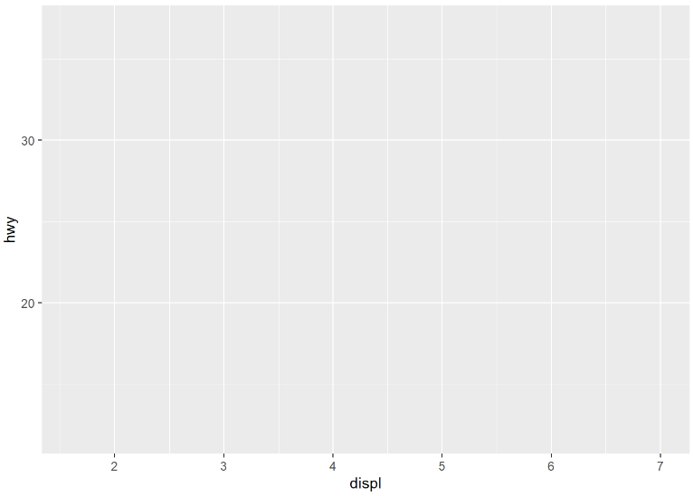

```R
ggplot(data=mpg, aes(x=displ, y=hwy)) + 
  geom_point() # 산점도
```

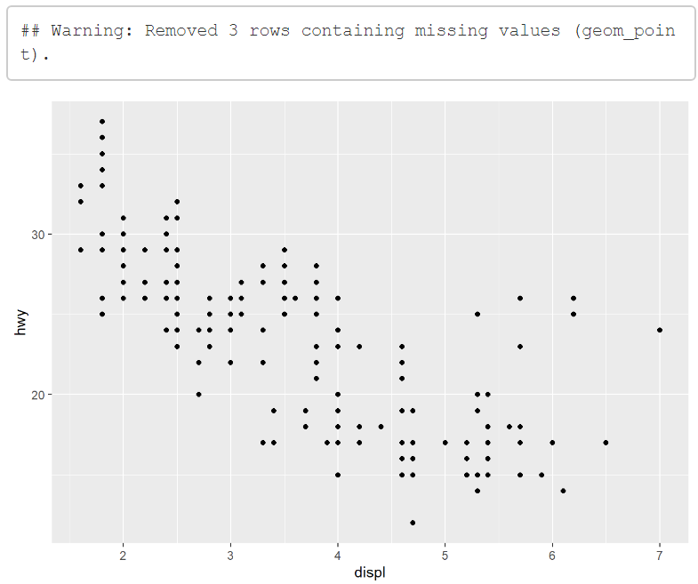

```R
ggplot(data=mpg, aes(x=displ, y=hwy)) +
  geom_point() + xlim(3,6) # x축 구간 설정
```

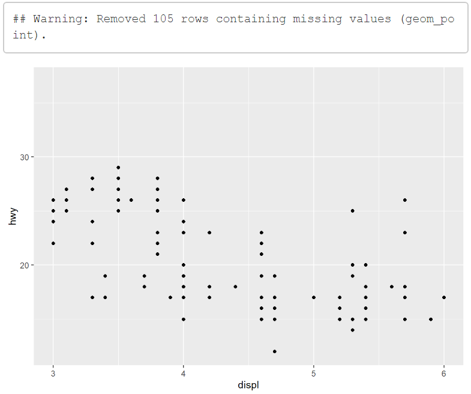

```R
ggplot(data=mpg, aes(x=displ, y=hwy)) +
  geom_point() + xlim(3,6) + ylim(10,30) # y축 설정
```

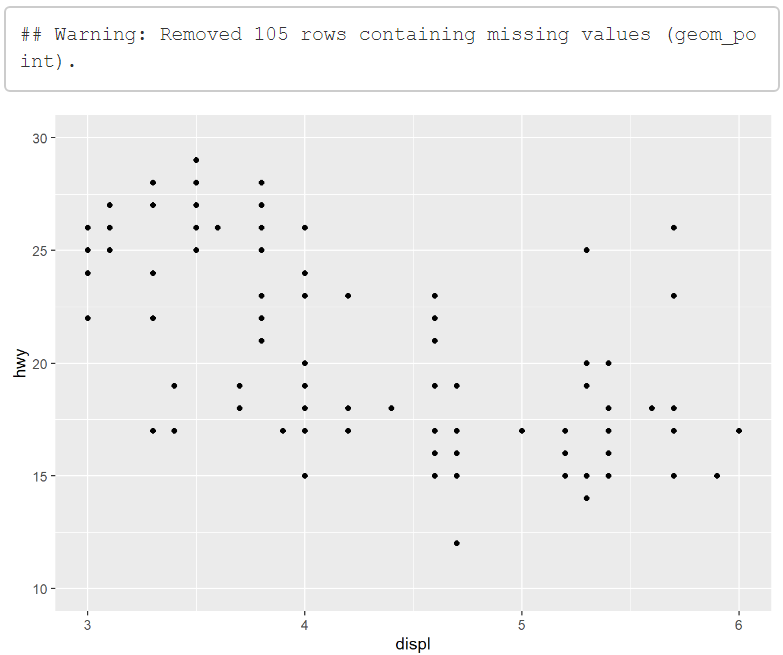

- mpg 데이터를 drv로 그룹화하여 평균 값 구하여 bar plot 그리기

```R
df_mpg = mpg %>% 
  group_by(drv) %>% 
  summarise(mean_hwy = mean(hwy))
df_mpg
## # A tibble: 3 x 2
##   drv   mean_hwy
##   <chr>    <dbl>
## 1 4         19.2
## 2 f         NA  
## 3 r         21
```

```R
ggplot(df_mpg, aes(x=drv, y=mean_hwy)) + geom_col()
```

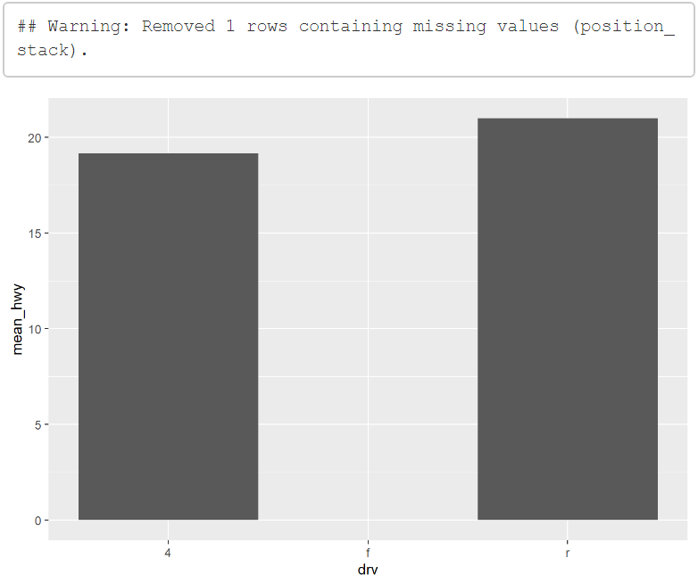

## economics 데이터(ggplot2 데이터)

```R
economics
## # A tibble: 574 x 6
##    date         pce    pop psavert uempmed unemploy
##    <date>     <dbl>  <dbl>   <dbl>   <dbl>    <dbl>
##  1 1967-07-01  507. 198712    12.6     4.5     2944
##  2 1967-08-01  510. 198911    12.6     4.7     2945
##  3 1967-09-01  516. 199113    11.9     4.6     2958
##  4 1967-10-01  512. 199311    12.9     4.9     3143
##  5 1967-11-01  517. 199498    12.8     4.7     3066
##  6 1967-12-01  525. 199657    11.8     4.8     3018
##  7 1968-01-01  531. 199808    11.7     5.1     2878
##  8 1968-02-01  534. 199920    12.3     4.5     3001
##  9 1968-03-01  544. 200056    11.7     4.1     2877
## 10 1968-04-01  544  200208    12.3     4.6     2709
## # ... with 564 more rows
```

```R
ggplot(economics, aes(x=date, y=unemploy))
```

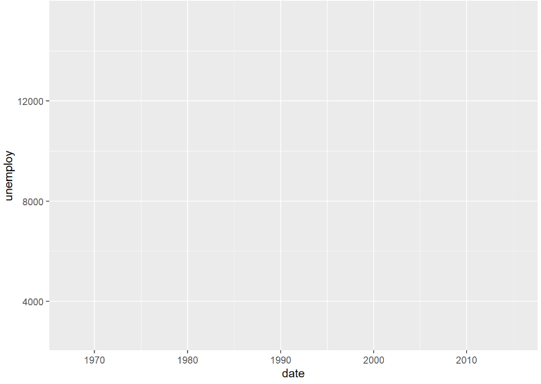

- 선 그래프

```R
ggplot(economics, aes(x=date, y=unemploy)) + geom_line()
```

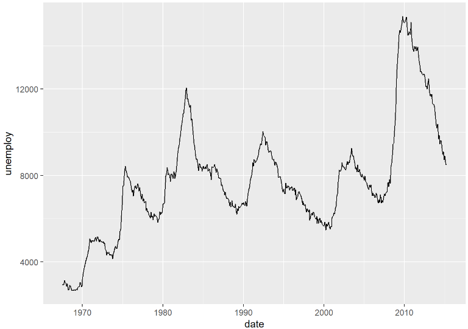


# SPSS(.sav) 파일 분석

- dplyr : 전처리 관련 패키지
- ggplot2 : 시각화 관련 패키지
- readxl : 엑셀파일 불러오는 패키지

```R
# install.packages("foreign")
library(foreign)
library(dplyr)
library(ggplot2)
library(readxl)
```

## Koweps~ : 한국복지패널에서 발행한 데이터(우리나라 7000가구가 패널)

```R
raw_welfare = read.spss("r데이터분석_Data/Data/Koweps_hpc10_2015_beta1.sav", to.data.frame = T)
## Warning in read.spss("r데이터분석_Data/Data/Koweps_hpc10_2015_beta1.sav", : r데
## 이터분석_Data/Data/Koweps_hpc10_2015_beta1.sav: Compression bias (0) is not the
## usual value of 100
```

```R
head(raw_welfare)
##   h10_id h10_ind h10_sn h10_merkey h_new h10_cobf h10_reg5 h10_reg7 h10_din
## 1      1       1      1      10101     0       NA        1        1     864
## 2      2       1      1      20101     0       NA        1        1     600
## 3      3       1      1      30101     0       NA        1        1    1571
## 4      4       1      1      40101     0       NA        1        1    3579
## 5      4       1      1      40101     0       NA        1        1    3579
## 6      6       1      1      60101     0       NA        1        1    3030 

## ...

##   h10_pers_income2 h10_pers_income3 h10_pers_income4 h10_pers_income5
## 1               NA               NA                0               NA
## 2               NA               NA                0               NA
## 3             1440               NA                0               NA
## 4             2400               NA                0               NA
## 5               NA               NA                0               NA
## 6               NA             3000                0               NA
```

- 만약을 대비해 복사본으로 분석 진행

```R
welfare = raw_welfare
```

```R
str(welfare)
## 'data.frame':    16664 obs. of  957 variables:
##  $ h10_id          : num  1 2 3 4 4 6 6 6 6 6 ...
##  $ h10_ind         : num  1 1 1 1 1 1 1 1 1 1 ...
##  $ h10_sn          : num  1 1 1 1 1 1 1 1 1 1 ...
##  $ h10_merkey      : num  10101 20101 30101 40101 40101 ...

## ...

##  $ h1006_6         : num  5000 60000 200 20000 20000 50700 50700 50700 50700 50700 ...
##  $ h1006_8         : num  1 1 1 1 1 1 1 1 1 1 ...
##  $ h1006_9         : num  88 4 88 88 88 88 88 88 88 88 ...
##   [list output truncated]
##  - attr(*, "variable.labels")= Named chr  "가구 패널 ID(h10_id)" "가구생성차수(h10_ind)" "가구분리일련번호(h10_sn)" "패널간 가구머지 키변수(h10_merkey)" ...
##   ..- attr(*, "names")= chr  "h10_id" "h10_ind" "h10_sn" "h10_merkey" ...
```

```R
dim(welfare)
## [1] 16664   957
```

```R
summary(welfare)
##      h10_id        h10_ind           h10_sn        h10_merkey      
##  Min.   :   1   Min.   : 1.000   Min.   :1.000   Min.   :   10101  
##  1st Qu.:2361   1st Qu.: 1.000   1st Qu.:1.000   1st Qu.:23612601  
##  Median :4503   Median : 1.000   Median :1.000   Median :45030401  
##  Mean   :4669   Mean   : 2.612   Mean   :1.003   Mean   :46689252  
##  3rd Qu.:6613   3rd Qu.: 5.000   3rd Qu.:1.000   3rd Qu.:66130501  
##  Max.   :9800   Max.   :10.000   Max.   :9.000   Max.   :98000701  
##   

## ...

##   h10_pers_income2 h10_pers_income3 h10_pers_income4 h10_pers_income5
## 1               NA               NA                0               NA
## 2               NA               NA                0               NA
## 3             1440               NA                0               NA
## 4             2400               NA                0               NA
## 5               NA               NA                0               NA
## 6               NA             3000                0               NA
```

```R
class(welfare$sex)
## [1] "numeric"

table(welfare$sex)
## 
##    1    2 
## 7578 9086
```

### sex

- 이상치를 결측값 처리

```R
welfare$sex = ifelse(welfare$sex == 9, 
                     NA, welfare$sex)
table(is.na(welfare$sex))
## 
## FALSE 
## 16664
```

- 1 => “male”, 2 => “female”

```R
welfare$sex = ifelse(welfare$sex == 1, "male", "female")
table(welfare$sex)
## 
## female   male 
##   9086   7578
```

```R
qplot(welfare$sex)
```

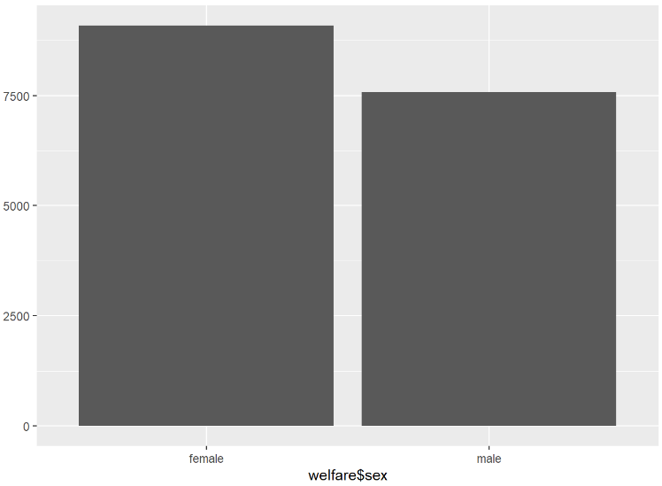

### income

```R
class(welfare$income)
## [1] "numeric"
```

```R
summary(welfare$income)
##    Min. 1st Qu.  Median    Mean 3rd Qu.    Max.    NA's 
##     0.0   122.0   192.5   241.6   316.6  2400.0   12030
```

- Median과 Mean의 값을 통해 조사대상에서 월수입이 극단적으로 큰사람들이 있다고 생각할 수 있다.
- 일을 했음에도 불구하고 Min이 0이라는 것은 이상하다.

```R
qplot(welfare$income)
```

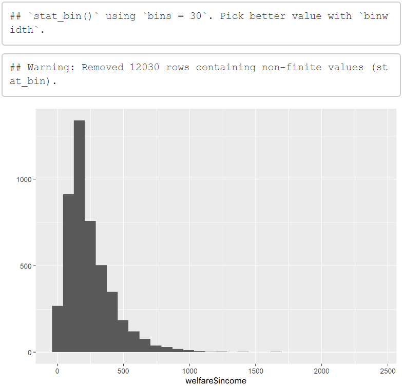

```R
qplot(welfare$income) + xlim(0, 1000)
```

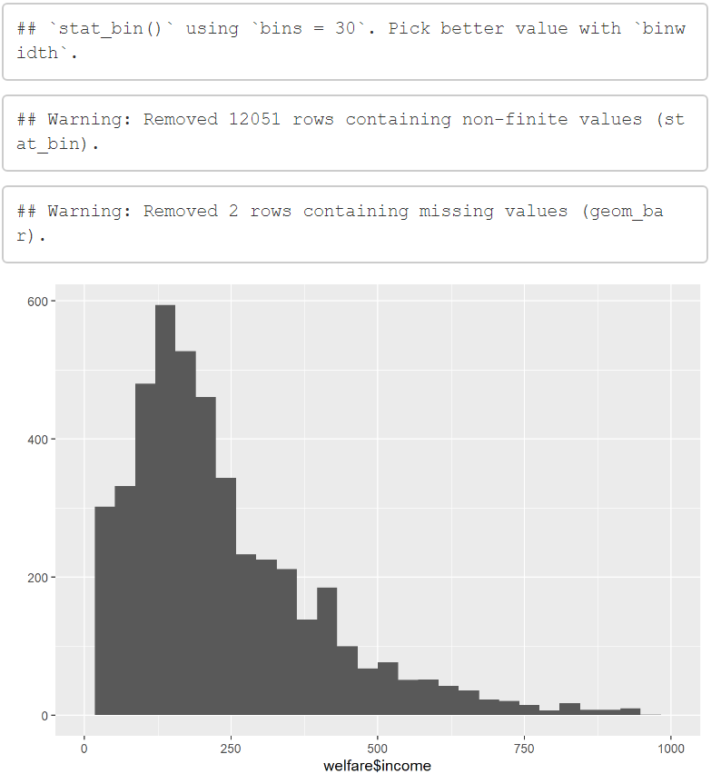

- 결측값 처리

```R
welfare$income = ifelse(welfare$income %in% c(0,9999),
                        NA, welfare$income)
table(is.na(welfare$income))
## 
## FALSE  TRUE 
##  4620 12044
```

### income, group_by(sex)

```R
welfare %>% 
  filter(!is.na(income))
##     h10_id h10_ind h10_sn h10_merkey h_new h10_cobf h10_reg5 code_region
## 1        3       1      1      30101     0       NA        1           1
## 2        4       1      1      40101     0       NA        1

## ...

## 103                0               NA
## 104                0               NA
##  [ reached 'max' / getOption("max.print") -- omitted 4516 rows ]
```

```R
welfare %>% 
  filter(!is.na(income)) %>% 
  group_by(sex)
## # A tibble: 4,620 x 957
## # Groups:   sex [2]
##    h10_id h10_ind h10_sn h10_merkey h_new h10_cobf h10_reg5 code_region h10_din
##     <dbl>   <dbl>  <dbl>      <dbl> <dbl>    <dbl>    <dbl>       <dbl>   <dbl>
##  1      3       1      1      30101     0       NA        1           1    1571
##  2      4       1      1      40101     0       NA        1           1    3579

## ...

## #   h1006_12 <dbl>, h1006_13 <dbl>, h1006_14 <dbl>, h1006_21 <dbl>,
## #   h1006_22 <dbl>, h1006_23 <dbl>, ...
```

```R
sex_income = welfare %>% 
  filter(!is.na(income)) %>% 
  group_by(sex) %>% 
  summarise(mi = mean(income))
sex_income
## # A tibble: 2 x 2
##   sex       mi
##   <chr>  <dbl>
## 1 female  163.
## 2 male    312.
```

```R
ggplot(data=sex_income, aes(x=sex, y=mi))
```


```R
ggplot(data=sex_income, aes(x=sex, y=mi)) + 
  geom_col()
```

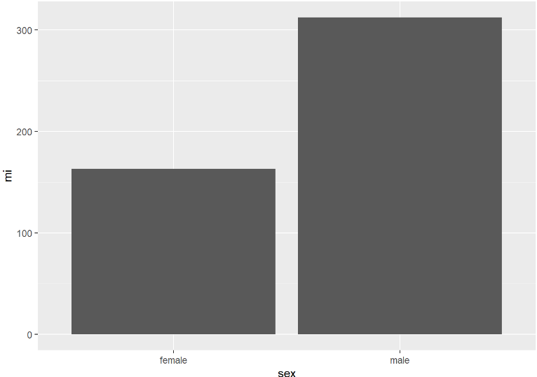

### birth

- birth에 대하여 분석

```R
summary(welfare$birth)
##    Min. 1st Qu.  Median    Mean 3rd Qu.    Max. 
##    1907    1946    1966    1968    1988    2014
```

```R
table(is.na(welfare$birth))
## 
## FALSE 
## 16664
```

- 9999인 결측치 NA로 바꿔주기

```R
welfare$birth = ifelse(welfare$birth == c(9999), 
                       NA, welfare$birth)
table(is.na(welfare$birth))
## 
## FALSE 
## 16664
```

- birth를 이용해 age 구하여 변수로 만들어 주기

```R
welfare$age = 2015 - welfare$birth + 1
summary(welfare$age)
##    Min. 1st Qu.  Median    Mean 3rd Qu.    Max. 
##    2.00   28.00   50.00   48.43   70.00  109.00
```

```R
qplot(welfare$age)
```

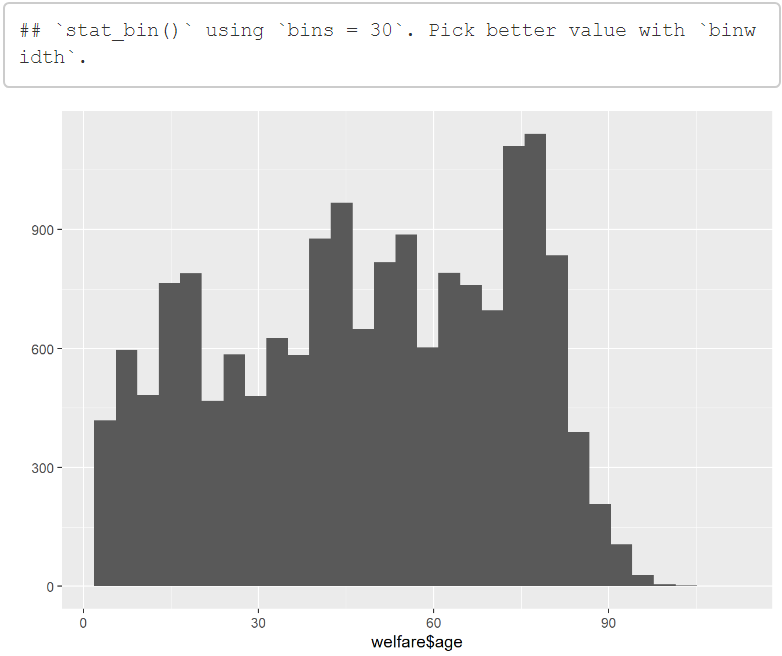

### income, group_by(age)

```R
age_income = welfare %>% 
  filter(!is.na(income)) %>% 
  group_by(age) %>% 
  summarise(mi = mean(income))
head(age_income)
## # A tibble: 6 x 2
##     age    mi
##   <dbl> <dbl>
## 1    20  121.
## 2    21  106.
## 3    22  130.
## 4    23  142.
## 5    24  134.
## 6    25  145.

tail(age_income)
## # A tibble: 6 x 2
##     age    mi
##   <dbl> <dbl>
## 1    83  28.3
## 2    84  21.7
## 3    85  20  
## 4    87  20  
## 5    88  15  
## 6    89  20
```

```R
ggplot(data = age_income, 
       aes(x = age, y = mi)) + geom_line()
```

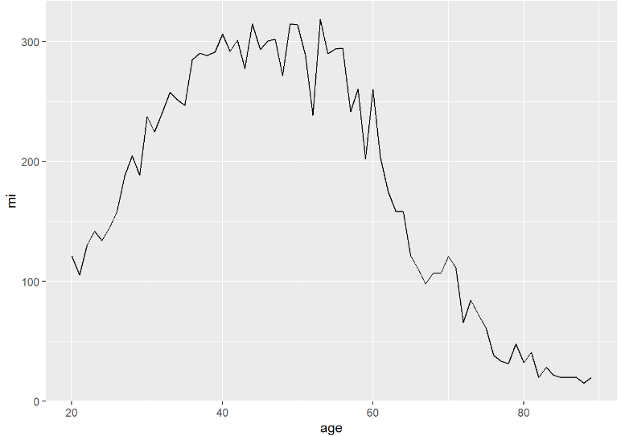

#### ageg : age를 3개의 그룹으로 분류

- 나이를 3개의 그룹으로 나누기

```R
welfare = welfare %>% 
  mutate(ageg = ifelse(age < 30, "young", 
                       ifelse(age <= 59, "middle",
                              "old")))
head(welfare$ageg)
## [1] "old"    "old"    "old"    "old"    "old"    "middle"

table(welfare$ageg)
## 
## middle    old  young 
##   6049   6281   4334
```

```R
qplot(welfare$ageg)
```

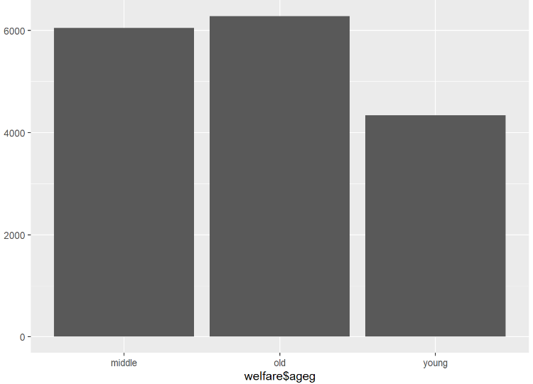

- ageg의 구간 별 월수입 평균 출력

```R
welfare %>% 
  group_by(ageg) %>% 
  summarise(ai = mean(income, na.rm = T))
## # A tibble: 3 x 2
##   ageg      ai
##   <chr>  <dbl>
## 1 middle  282.
## 2 old     125.
## 3 young   164.
```

```R
ageg_income = welfare %>% 
  filter(!is.na(income)) %>% 
  group_by(ageg) %>% 
  summarise(mi = mean(income))
ageg_income
## # A tibble: 3 x 2
##   ageg      mi
##   <chr>  <dbl>
## 1 middle  282.
## 2 old     125.
## 3 young   164.
```

```R
ggplot(data = ageg_income,
       aes(x=ageg, y=mi)) +
  geom_col()
```

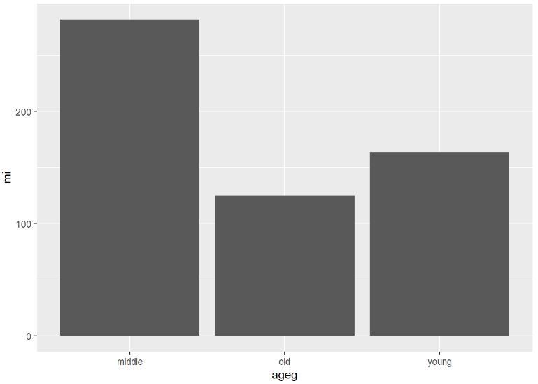

- scale_x_discreate : x축의 설정하는 함수
  - limits : x축 범위, 순서 지정

```R
ggplot(data = ageg_income,
       aes(x=ageg, y=mi)) +
  geom_col() +
  scale_x_discrete(limits = c("young", "middle", "old"))
```

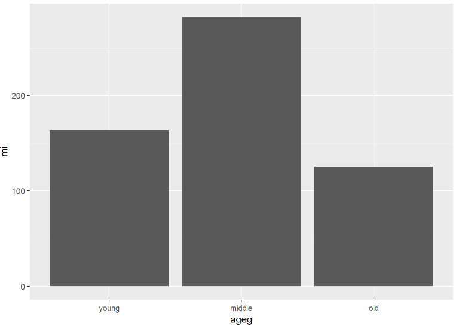

### income, group_by(ageg, sex)

- 성별, 연령대별 월급 차이 분석

```R
sex_income = welfare %>% 
  filter(!is.na(income)) %>% 
  group_by(ageg, sex) %>% 
  summarise(mi = mean(income))
sex_income
## # A tibble: 6 x 3
## # Groups:   ageg [3]
##   ageg   sex       mi
##   <chr>  <chr>  <dbl>
## 1 middle female 188. 
## 2 middle male   353. 
## 3 old    female  81.5
## 4 old    male   174. 
## 5 young  female 160. 
## 6 young  male   171.
```

```R
ggplot(data=sex_income, aes(x=ageg, y=mi)) +
  geom_col()
```

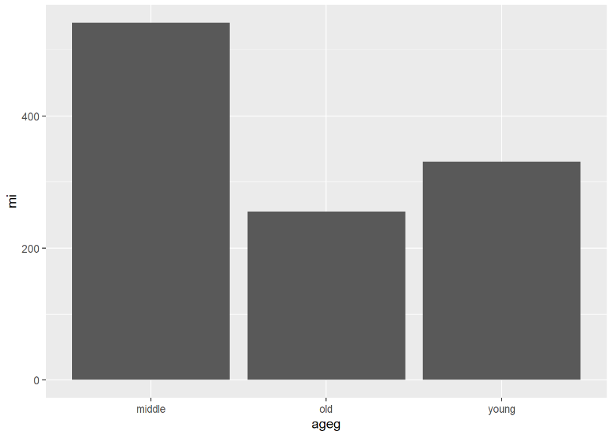

- 위의 그래프틑 남녀의 평균수입이 합쳐져서 그려진다.
- 따라서 `fill`옵션을 이용하여 성별에 따라 크기를 표시

```R
ggplot(data=sex_income, aes(x=ageg, y=mi, fill=sex)) +
  geom_col()
```

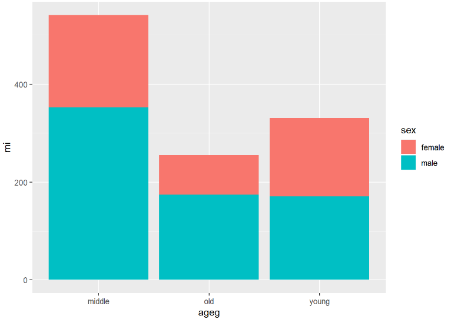

- 연령대별 순서 지정하기

```R
ggplot(data=sex_income, aes(x=ageg, y=mi, fill=sex)) +
  geom_col() +
  scale_x_discrete(limits = c("young", "middle", "old"))
```

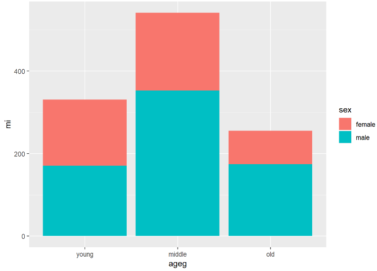

- male, female 분리해서 막대그래프 그리기

```R
ggplot(data=sex_income, aes(x=ageg, y=mi, fill=sex)) +
  geom_col(position = "dodge") +
  scale_x_discrete(limits = c("young", "middle", "old"))
```

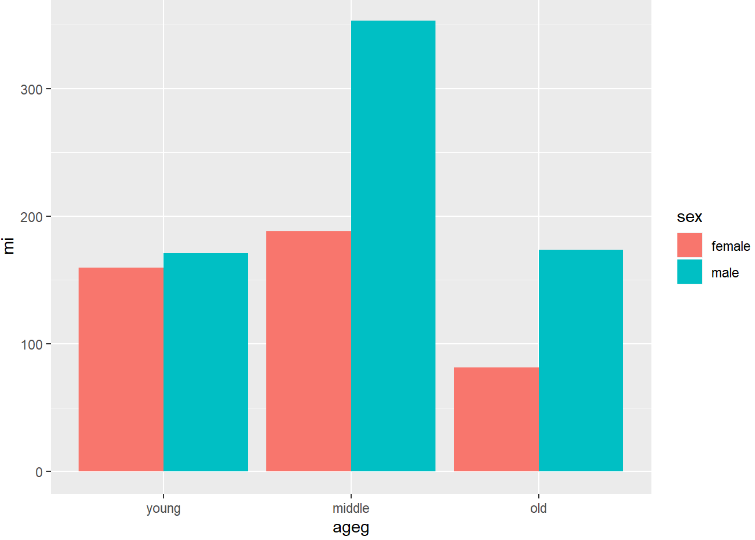

### income, group_by(age, sex)

```R
welfare %>% 
  filter(!is.na(age) & age >= 20 & age <= 90) %>% 
  group_by(sex, age) %>% 
  summarise(mi = mean(income, na.rm = T))
## # A tibble: 142 x 3
## # Groups:   sex [2]
##    sex      age    mi
##    <chr>  <dbl> <dbl>
##  1 female    20  147.
##  2 female    21  107.
##  3 female    22  140.
##  4 female    23  139.
##  5 female    24  126.
##  6 female    25  147.
##  7 female    26  163.
##  8 female    27  185.
##  9 female    28  191.
## 10 female    29  192.
## # ... with 132 more rows
```

- income이 0인 경우에 NA로 처리해줬기 때문에 income으로 filter를 하면 코드가 더 깔끔하다.

```R
sex_age = welfare %>% 
  filter(!is.na(income)) %>%
  group_by(sex, age) %>% 
  summarise(mi = mean(income))
sex_age
## # A tibble: 134 x 3
## # Groups:   sex [2]
##    sex      age    mi
##    <chr>  <dbl> <dbl>
##  1 female    20  147.
##  2 female    21  107.
##  3 female    22  140.
##  4 female    23  139.
##  5 female    24  126.
##  6 female    25  147.
##  7 female    26  163.
##  8 female    27  185.
##  9 female    28  191.
## 10 female    29  192.
## # ... with 124 more rows
```

```R
ggplot(sex_age, aes(x=age, y=mi, col=sex)) +
  geom_line()
```

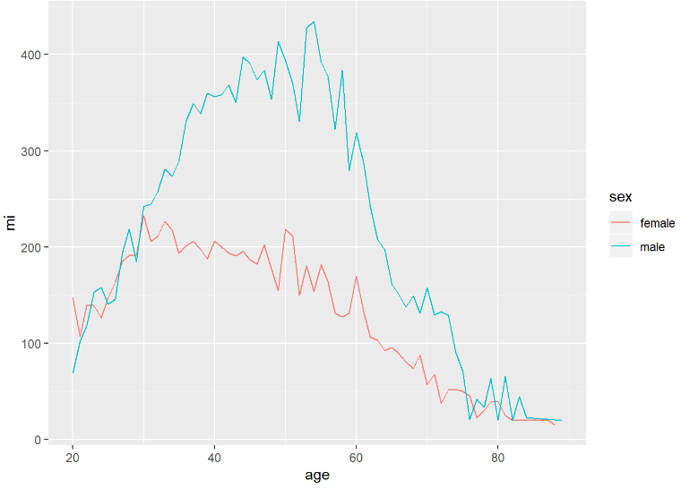

### code_job

- code_job에 따른 월급 평균

```R
head(welfare$code_job, 10)
##  [1]  NA  NA 942 762  NA 530  NA  NA  NA  NA
```

- 직업 코드별 인원수 확인

```R
table(welfare$code_job)
## 
##  111  120  131  132  133  134  135  139  141  149  151  152  153  159  211  212 
##    2   16   10   11    9    3    7   10   35   20   26   18   15   16    8    4 
##  213  221  222  223  224  231  232  233  234  235  236  237  239  241  242  243 
##    3   17   31   12    4   41    5    3    6   48   14    2   29   12    4   63 
##  244  245  246  247  248  251  252  253  254  259  261  271  272  273  274  281 
##    4   33   59   77   38   14  111   24   67  109    4   15   11    4   36   17 
##  283  284  285  286  289  311  312  313  314  320  330  391  392  399  411  412 
##    8   10   26   16    5  140  260  220   84   75   15    4   13   87   47   12 
##  421  422  423  429  431  432  441  442  510  521  522  530  611  612  613  620 
##  124   71    5   14   20   33  154  197  192  353    5  106 1320   11   40    2 
##  630  710  721  722  730  741  742  743  751  752  753  761  762  771  772  773 
##   20   29   30   22   16   27    3   34   34    5   49   69   27   11   61   86 
##  774  780  791  792  799  811  812  819  821  822  823  831  832  841  842  843 
##    7   17    5   21   45   16    1    6    9    9   23    5   17   32   10    4 
##  851  852  853  854  855  861  862  863  864  871  873  874  875  876  881  882 
##   19   13    7   33    9    3   14   17   31    2  257   34   37    2    2    3 
##  891  892  899  910  921  922  930  941  942  951  952  953  991  992  999 1011 
##    8   19   16  102   31   74  289  325   99  125  122   73   45   12  141    2 
## 1012 
##   17
```

- code_job의 설명을 알기 위하여 데이터 불러오기
  - 필요한 데이터가 엑셀파일의 두번째 sheet에 있으므로
  - 옵션 값 설정을 통하여 불러야 함

```R
library(readxl)
list_job = read_excel("r데이터분석_Data/Data/Koweps_Codebook.xlsx", sheet=2)
head(list_job)
## # A tibble: 6 x 2
##   code_job job                                
##      <dbl> <chr>                              
## 1      111 의회의원 고위공무원 및 공공단체임원
## 2      112 기업고위임원                       
## 3      120 행정 및 경영지원 관리자            
## 4      131 연구 교육 및 법률 관련 관리자      
## 5      132 보험 및 금융 관리자                
## 6      133 보건 및 사회복지 관련 관리자
```

```R
str(list_job)
## Classes 'tbl_df', 'tbl' and 'data.frame':    149 obs. of  2 variables:
##  $ code_job: num  111 112 120 131 132 133 134 135 139 141 ...
##  $ job     : chr  "의회의원 고위공무원 및 공공단체임원" "기업고위임원" "행정 및 경영지원 관리자" "연구 교육 및 법률 관련 관리자" ...
```

#### job : job_code에 따른 job 할당

```R
welfare <- left_join(welfare, list_job, id="code_job")
## Joining, by = "code_job"

head(welfare)
##   h10_id h10_ind h10_sn h10_merkey h_new h10_cobf h10_reg5 code_region h10_din
## 1      1       1      1      10101     0       NA        1           1     864
## 2      2       1      1      20101     0       NA        1           1     600

## ...

## 4    old                             전기공
## 5    old                               <NA>
## 6 middle 방문 노점 및 통신 판매 관련 종사자
```

- welfare에서 code_job이 na가 아닌
- 데이터에 대해 code_job, job 열을 추출

```R
welfare %>% 
  filter(!is.na(code_job)) %>% 
  select(code_job, job) %>% 
  head(20)
##    code_job                                job
## 1       942                   경비원 및 검표원
## 2       762                             전기공
## 3       530 방문 노점 및 통신 판매 관련 종사자
## 4       999        기타 서비스관련 단순 종사원
## 5       312                    경영관련 사무원
## 6       254             문리 기술 및 예능 강사
## 7       510                        영업 종사자
## 8       530 방문 노점 및 통신 판매 관련 종사자
## 9       286   스포츠 및 레크레이션 관련 전문가
## 10      521                   매장 판매 종사자
## 11      773           건축마감관련 기능 종사자
## 12      314                비서 및 사무 보조원
## 13      941              청소원 및 환경 미화원
## 14      314                비서 및 사무 보조원
## 15      773           건축마감관련 기능 종사자
## 16      951                가사 및 육아 도우미
## 17      274       기술영업 및 중개 관련 종사자
## 18      873                      자동차 운전원
## 19      320       금융 및 보험관련 사무 종사자
## 20      952               음식관련 단순 종사원
```

### income, group_by(job)

```R
job_income = welfare %>% 
  filter(!is.na(job) & !is.na(income)) %>% 
  group_by(job) %>% 
  summarise(mi = mean(income))
head(job_income)
## # A tibble: 6 x 2
##   job                              mi
##   <chr>                         <dbl>
## 1 가사 및 육아 도우미            80.2
## 2 간호사                        241. 
## 3 건설 및 광업 단순 종사원      190. 
## 4 건설 및 채굴 기계운전원       358. 
## 5 건설 전기 및 생산 관련 관리자 536. 
## 6 건설관련 기능 종사자          247.
```

- 상위 10개 직업 추출

```R
top10 = job_income %>% 
  arrange(desc(mi)) %>% 
  head(10)
top10
## # A tibble: 10 x 2
##    job                                     mi
##    <chr>                                <dbl>
##  1 금속 재료 공학 기술자 및 시험원       845.
##  2 의료진료 전문가                       844.
##  3 의회의원 고위공무원 및 공공단체임원   750 
##  4 보험 및 금융 관리자                   726.
##  5 제관원 및 판금원                      572.
##  6 행정 및 경영지원 관리자               564.
##  7 문화 예술 디자인 및 영상 관련 관리자  557.
##  8 연구 교육 및 법률 관련 관리자         550.
##  9 건설 전기 및 생산 관련 관리자         536.
## 10 석유 및 화학물 가공장치 조작원        532.
```

```R
ggplot(data=top10, aes(x=job, y=mi)) + geom_col()
```

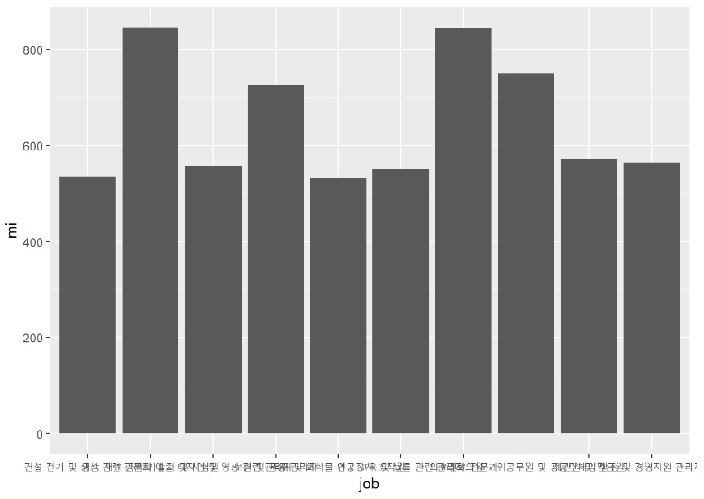

- 그래프 회전하기

```R
ggplot(data=top10, aes(x=job, y=mi)) + 
  geom_col() +
  coord_flip()
```

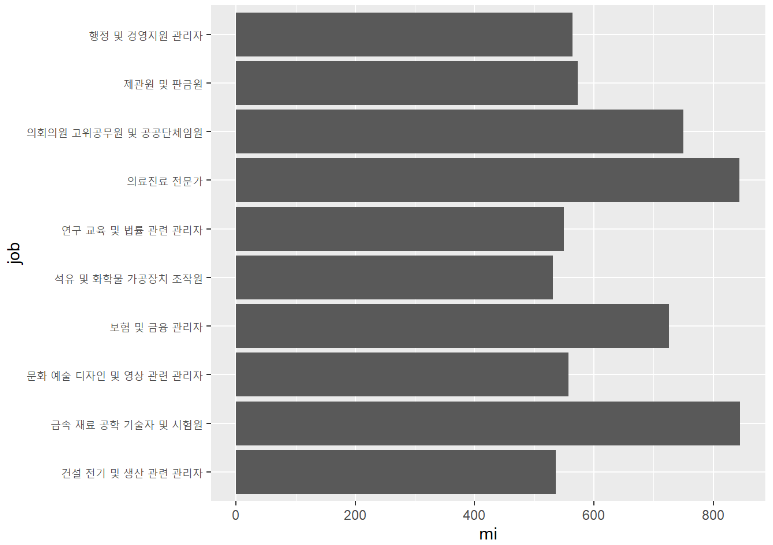

- 그래프 정렬하기

```R
ggplot(data=top10, aes(x=reorder(job, mi), y=mi)) + 
  geom_col() +
  coord_flip()
```

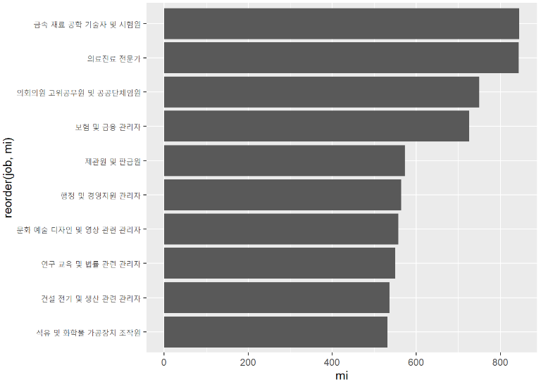

```R
ggplot(data=top10, aes(x=reorder(job, -mi), y=mi)) + 
  geom_col() +
  coord_flip()
```

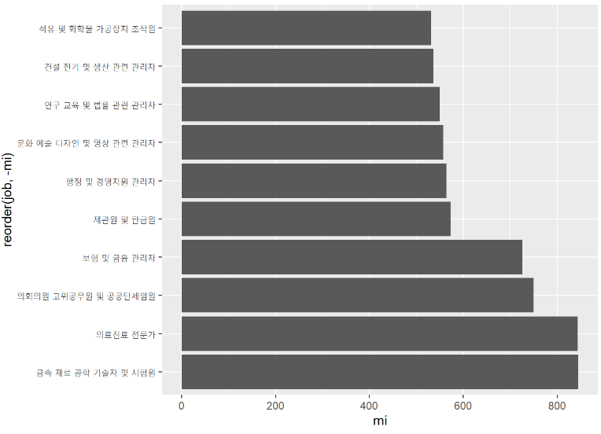

- 하위 10개 직업 추출

```R
job_income %>% 
  arrange(mi) %>% 
  head(10)
## # A tibble: 10 x 2
##    job                             mi
##    <chr>                        <dbl>
##  1 가사 및 육아 도우미           80.2
##  2 임업관련 종사자               83.3
##  3 기타 서비스관련 단순 종사원   88.2
##  4 청소원 및 환경 미화원         88.8
##  5 약사 및 한약사                89  
##  6 작물재배 종사자               92  
##  7 농립어업관련 단순 종사원     102. 
##  8 의료 복지 관련 서비스 종사자 104. 
##  9 음식관련 단순 종사원         108. 
## 10 판매관련 단순 종사원         117.
```


# 연습문제

## 1.

- 카카오톡 게임별의 하반기 신규 서비스로 다트 게임을 출시하기로 했다. 다트 게임은 다트판에 다트를 세 차례 던져 그 점수의 합계로 실력을 겨루는 게임으로, 모두가 간단히 즐길 수 있다. 갓 입사한 무지는 코딩 실력을 인정받아 게임의 핵심 부분인 점수 계산 로직을 맡게 되었다. 다트 게임의 점수 계산 로직은 아래와 같다.

- 다트 게임은 총 3번의 기회로 구성된다.
- 각 기회마다 얻을 수 있는 점수는 0점에서 10점까지이다.
- 점수와 함께 Single(S), Double(D), Triple(T) 영역이 존재하고 각 영역 당첨 시 점수에서 1제곱, 2제곱, 3제곱 (점수^1 , 점수^2 , 점수^3 )으로 계산된다.
- 옵션으로 스타상(\*) , 아차상(#)이 존재하며 스타상(\*) 당첨 시 해당 점수와 바로 전에 얻은 점수를 각 2배로 만든다. 아차상(#) 당첨 시 해당 점수는 마이너스된다.
- 스타상(\*)은 첫 번째 기회에서도 나올 수 있다. 이 경우 첫 번째 스타상(\*)의 점수만 2배가 된다. (예제 4번 참고)
- 스타상(\*)의 효과는 다른 스타상(\*)의 효과와 중첩될 수 있다. 이 경우 중첩된 스타상(\*) 점수는 4배가 된다. (예제 4번 참고)
- 스타상(\*)의 효과는 아차상(#)의 효과와 중첩될 수 있다. 이 경우 중첩된 아차상(#)의 점수는 -2배가 된다. (예제 5번 참고)
- Single(S), Double(D), Triple(T)은 점수마다 하나씩 존재한다.
- 스타상(\*), 아차상(#)은 점수마다 둘 중 하나만 존재할 수 있으며, 존재하지 않을 수도 있다.
- 0~10의 정수와 문자 S, D, T, \*, #로 구성된 문자열이 입력될 시 총점수를 반환하는 함수를 작성하라.

- 입력 형식
  - “점수|보너스|[옵션]”으로 이루어진 문자열 3세트.
  - 예) 1S2D*3T
  - 점수는 0에서 10 사이의 정수이다.
  - 보너스는 S, D, T 중 하나이다.
  - 옵선은 *이나 # 중 하나이며, 없을 수도 있다.

- 출력 형식
  - 3번의 기회에서 얻은 점수 합계에 해당하는 정수값을 출력한다.
  - 예) 37

- 입출력 예제

  - | 예제 | dartResult | answer | 설명                           |
    | ---- | ---------- | ------ | ------------------------------ |
    | 1    | 1S2D*3T    | 37     | 1^1 * 2 + 2^2 * 2 + 3^3        |
    | 2    | 1D2S#10S   | 9      | 1^2 + 2^1 * (-1) + 10^1        |
    | 3    | 1D2S0T     | 3      | 1^2 + 2^1 + 0^3                |
    | 4    | 1S*2T*3S   | 23     | 1^1 * 2 * 2 + 2^3 * 2 + 3^1    |
    | 5    | 1D#2S*3S   | 5      | 1^2 * (-1) * 2 + 2^1 * 2 + 3^1 |
    | 6    | 1T2D3D#    | -4     | 1^3 + 2^2 + 3^2 * (-1)         |
    | 7    | 1D2S3T*    | 59     | 1^2 + 2^1 * 2 + 3^3 * 2        |

### A.

```python
# 1.
import re

def dartCompute(result) :
    game = re.compile("[0-9]{1,2}[SDT][#*]{0,1}")
    score = game.findall(result)
    
    point = 0
    prior_point = 0
    
    num = re.compile("[0-9]{1,2}")
    chrac = re.compile("[SDT]")
    specific = re.compile("[#*]")
    trans = {"S":1, "D":2, "T":3}
    
    for p in score :
        a = int(splt.findall(p)[0])
        b = trans[chrac.findall(p)[0]]
        if specific.findall(p) :
            c = specific.findall(p)[0]
            if c == '*' :
                point = point + prior_point + a**b*2
                prior_point = a**b*2
            else : 
                point = point + a**b*(-1)
                prior_point = a**b*(-1)
        else :
            point = point + a**b
            prior_point = a**b
    return point


dartResult = ["1S2D*3T", "1D2S#10S", "1D2S0T", "1S*2T*3S",
              "1D#2S*3S", "1T2D3D#", "1D2S3T*"]

for game in dartResult:
    print(dartCompute(game))
```

## 2.

- 성별에 따라 어떤 직업이 가장 많은지 조사

```R
sex_job = welfare %>% 
  filter(!is.na(job)) %>% 
  group_by(sex, job) %>% 
  summarise(count = n())
sex_job
## # A tibble: 245 x 3
## # Groups:   sex [2]
##    sex    job                                count
##    <chr>  <chr>                              <int>
##  1 female 가사 및 육아 도우미                  125
##  2 female 간호사                                58
##  3 female 건설 및 광업 단순 종사원               7
##  4 female 건설구조관련 기능 종사자               1
##  5 female 건축 및 토목 공학 기술자 및 시험원     2
##  6 female 건축마감관련 기능 종사자               5
##  7 female 경비원 및 검표원                       4
##  8 female 경영관련 사무원                       47
##  9 female 경찰 소방 및 교도 관련 종사자          2
## 10 female 경호 및 보안 관련 종사자               1
## # ... with 235 more rows
```


```R
sex_job %>% 
  filter(sex == "female") %>% 
  arrange(desc(count)) %>% 
  head(1)
## # A tibble: 1 x 3
## # Groups:   sex [1]
##   sex    job             count
##   <chr>  <chr>           <int>
## 1 female 작물재배 종사자   680
```

```R
sex_job %>% 
  filter(sex == "male") %>% 
  arrange(desc(count)) %>% 
  head(1)
## # A tibble: 1 x 3
## # Groups:   sex [1]
##   sex   job             count
##   <chr> <chr>           <int>
## 1 male  작물재배 종사자   640
```

```R
sex_job %>% 
  arrange(desc(count)) %>% 
  head(2)
## # A tibble: 2 x 3
## # Groups:   sex [2]
##   sex    job             count
##   <chr>  <chr>           <int>
## 1 female 작물재배 종사자   680
## 2 male   작물재배 종사자   640
```

