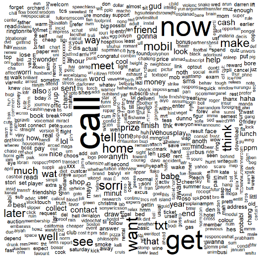

[toc]

# Day37 딥러닝을 위한 빅데이터 기초 - R(7)

# 조건부 확률

1. 서로 영향을 끼치지 않는 경우
   - A : 녹색 t-shirt -> B : 잭팟 <=> A와 B가 서로 영향을 주지 않음
   - P(A and B) = P(A) * P(B)
   - => P(B|A) = P(B)
2. 서로 영향을 주는 경우
   - 비가 오는 날(A), 우산 판매(B)
   - P(A and B) = P(A) * P(B|A)
   - => P(B|A) = P(A and B) / P(A)

- P(A|B)
- = B가 주어졌을 때 A의 조건부 확률
- = B 확률 대비 A의 확률
- = P(A and B) / P(B)

# Naive Bayes

- 어떤 데이터가 주어졌을 때, 어떠한 상황이 발생할 확률
- 겉보기 날씨, 습도 => 테니스를 칠 확률
- 날씨, 습도 -> 테니스를 친다 or 테니스를 안친다

1. 테니스를 많이 친다. => 날씨가 좋고, 습도가 좋을 때 테니스를 치는 경우가 많다.
2. 날씨가 맑고, 습도가 좋은 조건이 자주 발생하면 => 테니스를 칠 경우가 많다.

- 설명변수(날씨, 습도) 간에 독립을 가정
- => 테니스 쳤을 때, 날씨와 습도는 서로 상관관계가 없다고 가정
  - => 독립이라고 가정
- => 계산 간단, data가 적은 경우에도 적용 가능


## 베이즈 정리

- 조건부 확률에서 특정 상황이 만족되면 다른 식으로 계산가능하다.
- P(A_i|B) = P(B|A_i)P(A_i) / [P(B|A_1)P(A_1) + ... + P(B|A_4)P(A_4)]
  - P(A_i|B) = P(A_i and B) / P(B)
    - = P(A_i and B) / [P(A_1 and B) + ... + P(A_4 and B)]
    - = P(A_i)P(B|A_i) / [P(A_1)P(B|A_1) + ... + P(A_4)P(B|A_4)]
- 특정 상황
  1. A_1 ~ A_4가 배반 사건 => 교집합이 없음
  2. A_1 ~ A_4의 합집합이 전체집합

- P(y=c | X_1 = x_1, ..., X_j = x_j)
  - 데이터가 주어졌을 때 범주가 c일 확률
  - = P(y=c)P(X_1 = x_1, ... , X_j = x_j | y=c) / P(X_1 = x_1, ... , X_j = x_j)
  - => P(X_1 = x_1, ... , X_j = x_j)P(y=c) => c?
- y의 추정확률 : P(x_1| c) \* ... \* P(x_j | c) \* P(c)
- 라플라스 추정량 : P(x_i | c) = 0 일 때를 고려한 보정

# sms_spam_ansi.txt 파일 분석

```R
sms_raw = read.csv("dataset_for_ml/sms_spam_ansi.txt",
                   stringsAsFactors = FALSE)
str(sms_raw)
## 'data.frame':    5559 obs. of  2 variables:
##  $ type: chr  "ham" "ham" "ham" "spam" ...
##  $ text: chr  "Hope you are having a good week. Just checking in" "K..give back my thanks." "Am also doing in cbe only. But have to pay." "complimentary 4 STAR Ibiza Holiday or ￡10,000 cash needs your URGENT collection. 09066364349 NOW from Landline"| __truncated__ ...
```

> 맥킨토시 운영체제의 경우 아래와 같은 옵션을 read.csv함수에 추가할 것
>
> fileEncoding = “CP949”, encoding = “utf-8”

```R
sms_raw$type = factor(sms_raw$type)
str(sms_raw$type)
##  Factor w/ 2 levels "ham","spam": 1 1 1 2 2 1 1 1 2 1 ...

table(sms_raw$type)
## 
##  ham spam 
## 4812  747
```

## 텍스트 데이터 정리, 표준화

- tm 패키지 : 텍스트 마이닝 패키지

```R
install.packages("tm")
library(tm)
```

- 코퍼스 : 단어 집합 생성 -> VCorpus() ; 메모리에 저장
- 데이터 소스 객체 생성 -> VectorSource()

```R
sms_corpus = VCorpus(VectorSource(sms_raw$text))
sms_corpus
## <<VCorpus>>
## Metadata:  corpus specific: 0, document level (indexed): 0
## Content:  documents: 5559
```

```R
inspect(sms_corpus[1:2])
## <<VCorpus>>
## Metadata:  corpus specific: 0, document level (indexed): 0
## Content:  documents: 2
## 
## [[1]]
## <<PlainTextDocument>>
## Metadata:  7
## Content:  chars: 49
## 
## [[2]]
## <<PlainTextDocument>>
## Metadata:  7
## Content:  chars: 23
```

```R
sms_corpus[1]
## <<VCorpus>>
## Metadata:  corpus specific: 0, document level (indexed): 0
## Content:  documents: 1

sms_corpus[[1]]
## <<PlainTextDocument>>
## Metadata:  7
## Content:  chars: 49

as.character(sms_corpus[[1]])
## [1] "Hope you are having a good week. Just checking in"
```

- 1번 부터 5번 까지 문서 내용 출력(lapply함수 이용)

```R
lapply(sms_corpus[1:5], FUN = as.character)
## $`1`
## [1] "Hope you are having a good week. Just checking in"
## 
## $`2`
## [1] "K..give back my thanks."
## 
## $`3`
## [1] "Am also doing in cbe only. But have to pay."
## 
## $`4`
## [1] "complimentary 4 STAR Ibiza Holiday or ￡10,000 cash needs your URGENT collection. 09066364349 NOW from Landline not to lose out! Box434SK38WP150PPM18+"
## 
## $`5`
## [1] "okmail: Dear Dave this is your final notice to collect your 4* Tenerife Holiday or #5000 CASH award! Call 09061743806 from landline. TCs SAE Box326 CW25WX 150ppm"
```

### 소문자로 통일

- tm 패키지의 tm_map 를 이용하여 다양하게 표현된 단어들을 하나의 형식으로 통일

```R
sms_corpus_clean = tm_map(sms_corpus, content_transformer(tolower))
sms_corpus_clean
## <<VCorpus>>
## Metadata:  corpus specific: 0, document level (indexed): 0
## Content:  documents: 5559
```

```R
as.character(sms_corpus_clean[[1]])
## [1] "hope you are having a good week. just checking in"
```

```R
class(sms_corpus_clean)
## [1] "VCorpus" "Corpus"

class(as.character(sms_corpus_clean[[1]]))
## [1] "character"
```

### 숫자 제거

```R
inspect(sms_corpus_clean[1:5])
## <<VCorpus>>
## Metadata:  corpus specific: 0, document level (indexed): 0
## Content:  documents: 5
## 
## [[1]]
## <<PlainTextDocument>>
## Metadata:  7
## Content:  chars: 49
## 
## [[2]]
## <<PlainTextDocument>>
## Metadata:  7
## Content:  chars: 23
## 
## [[3]]
## <<PlainTextDocument>>
## Metadata:  7
## Content:  chars: 43
## 
## [[4]]
## <<PlainTextDocument>>
## Metadata:  7
## Content:  chars: 149
## 
## [[5]]
## <<PlainTextDocument>>
## Metadata:  7
## Content:  chars: 161
```

```R
lapply(sms_corpus_clean[1:5], as.character)
## $`1`
## [1] "hope you are having a good week. just checking in"
## 
## $`2`
## [1] "k..give back my thanks."
## 
## $`3`
## [1] "am also doing in cbe only. but have to pay."
## 
## $`4`
## [1] "complimentary 4 star ibiza holiday or ￡10,000 cash needs your urgent collection. 09066364349 now from landline not to lose out! box434sk38wp150ppm18+"
## 
## $`5`
## [1] "okmail: dear dave this is your final notice to collect your 4* tenerife holiday or #5000 cash award! call 09061743806 from landline. tcs sae box326 cw25wx 150ppm"
```

```R
sms_corpus_clean = tm_map(sms_corpus_clean, removeNumbers)
lapply(sms_corpus_clean[1:5], as.character)
## $`1`
## [1] "hope you are having a good week. just checking in"
## 
## $`2`
## [1] "k..give back my thanks."
## 
## $`3`
## [1] "am also doing in cbe only. but have to pay."
## 
## $`4`
## [1] "complimentary  star ibiza holiday or ￡, cash needs your urgent collection.  now from landline not to lose out! boxskwpppm+"
## 
## $`5`
## [1] "okmail: dear dave this is your final notice to collect your * tenerife holiday or # cash award! call  from landline. tcs sae box cwwx ppm"
```

### 구두점 제거

```R
removePunctuation("hi......hello.....bye")
## [1] "hihellobye"
```

```R
sms_corpus_clean = tm_map(sms_corpus_clean, removePunctuation)
lapply(sms_corpus_clean[1:5], as.character)
## $`1`
## [1] "hope you are having a good week just checking in"
## 
## $`2`
## [1] "kgive back my thanks"
## 
## $`3`
## [1] "am also doing in cbe only but have to pay"
## 
## $`4`
## [1] "complimentary  star ibiza holiday or ￡ cash needs your urgent collection  now from landline not to lose out boxskwpppm"
## 
## $`5`
## [1] "okmail dear dave this is your final notice to collect your  tenerife holiday or  cash award call  from landline tcs sae box cwwx ppm"
```

### 불용어(stop words) 제거

- to, and, but, or, …
- 내용에 중요할 수도 있어서 불용어를 제거할지는 스스로 생각해 보아야 한다.

```R
stopwords()
##   [1] "i"          "me"         "my"         "myself"     "we"        
##   [6] "our"        "ours"       "ourselves"  "you"        "your"      
##  [11] "yours"      "yourself"   "yourselves" "he"         "him"       
##  [16] "his"        "himself"    "she"        "her"        "hers"      
##  [21] "herself"    "it"         "its"        "itself"     "they"      
##  [26] "them"       "their"      "theirs"     "themselves" "what"      
##  [31] "which"      "who"        "whom"       "this"       "that"      
##  [36] "these"      "those"      "am"         "is"         "are"       
##  [41] "was"        "were"       "be"         "been"       "being"     
##  [46] "have"       "has"        "had"        "having"     "do"        
##  [51] "does"       "did"        "doing"      "would"      "should"    
##  [56] "could"      "ought"      "i'm"        "you're"     "he's"      
##  [61] "she's"      "it's"       "we're"      "they're"    "i've"      
##  [66] "you've"     "we've"      "they've"    "i'd"        "you'd"     
##  [71] "he'd"       "she'd"      "we'd"       "they'd"     "i'll"      
##  [76] "you'll"     "he'll"      "she'll"     "we'll"      "they'll"   
##  [81] "isn't"      "aren't"     "wasn't"     "weren't"    "hasn't"    
##  [86] "haven't"    "hadn't"     "doesn't"    "don't"      "didn't"    
##  [91] "won't"      "wouldn't"   "shan't"     "shouldn't"  "can't"     
##  [96] "cannot"     "couldn't"   "mustn't"    "let's"      "that's"    
## [101] "who's"      "what's"     "here's"     "there's"    "when's"    
## [106] "where's"    "why's"      "how's"      "a"          "an"        
## [111] "the"        "and"        "but"        "if"         "or"        
## [116] "because"    "as"         "until"      "while"      "of"        
## [121] "at"         "by"         "for"        "with"       "about"     
## [126] "against"    "between"    "into"       "through"    "during"    
## [131] "before"     "after"      "above"      "below"      "to"        
## [136] "from"       "up"         "down"       "in"         "out"       
## [141] "on"         "off"        "over"       "under"      "again"     
## [146] "further"    "then"       "once"       "here"       "there"     
## [151] "when"       "where"      "why"        "how"        "all"       
## [156] "any"        "both"       "each"       "few"        "more"      
## [161] "most"       "other"      "some"       "such"       "no"        
## [166] "nor"        "not"        "only"       "own"        "same"      
## [171] "so"         "than"       "too"        "very"
```

```R
sms_corpus_clean = tm_map(sms_corpus_clean, removeWords, stopwords())
lapply(sms_corpus_clean[1:5], as.character)
## $`1`
## [1] "hope     good week just checking "
## 
## $`2`
## [1] "kgive back  thanks"
## 
## $`3`
## [1] " also   cbe     pay"
## 
## $`4`
## [1] "complimentary  star ibiza holiday  ￡ cash needs  urgent collection  now  landline   lose  boxskwpppm"
## 
## $`5`
## [1] "okmail dear dave    final notice  collect   tenerife holiday   cash award call   landline tcs sae box cwwx ppm"
```

### 특수 문자 제거

- 정규표현식을 이용한 제거

```R
replacePunctuation = function(x){
  gsub("[[:punct:]]+", " ", x)
} # x에 전달된 문자열에 대해 punctuation을 " "으로 변경

replacePunctuation("hi+.{hello<;")
## [1] "hi hello "
```

```R
x = "대한민국 조선 우리나라 민국 대한민국"

gsub("대한민국", "코리아", x)
## [1] "코리아 조선 우리나라 민국 코리아"

gsub("한국", "코리아", x)
## [1] "대한민국 조선 우리나라 민국 대한민국"

gsub("우리나라", "코리아", x)
## [1] "대한민국 조선 코리아 민국 대한민국"

gsub("조선", "코리아", x)
## [1] "대한민국 코리아 우리나라 민국 대한민국"
```

### 형태소 분석

```R
install.packages("SnowballC")
library(SnowballC)
```

- wordStem() : 단어의 어근을 추출

```R
wordStem(c("learn", "learned", "learning", "learns")) 
## [1] "learn" "learn" "learn" "learn"
```

- stemDocument()
- 텍스트 문서의 전체 코퍼스에 wordStem 적용

```R
sms_corpus_clean = tm_map(sms_corpus_clean, stemDocument)
lapply(sms_corpus_clean[1:5], as.character)
## $`1`
## [1] "hope good week just check"
## 
## $`2`
## [1] "kgive back thank"
## 
## $`3`
## [1] "also cbe pay"
## 
## $`4`
## [1] "complimentari star ibiza holiday ￡ cash need urgent collect now landlin lose boxskwpppm"
## 
## $`5`
## [1] "okmail dear dave final notic collect tenerif holiday cash award call landlin tcs sae box cwwx ppm"
```

### 추가 여백 제거

```R
sms_corpus_clean = tm_map(sms_corpus_clean, stripWhitespace)
lapply(sms_corpus_clean[1:5], as.character)
## $`1`
## [1] "hope good week just check"
## 
## $`2`
## [1] "kgive back thank"
## 
## $`3`
## [1] "also cbe pay"
## 
## $`4`
## [1] "complimentari star ibiza holiday ￡ cash need urgent collect now landlin lose boxskwpppm"
## 
## $`5`
## [1] "okmail dear dave final notic collect tenerif holiday cash award call landlin tcs sae box cwwx ppm"
```

```R
sms_corpus_clean[1:3]
## <<VCorpus>>
## Metadata:  corpus specific: 0, document level (indexed): 0
## Content:  documents: 3
```

```R
lapply(sms_corpus[1:3], as.character)
## $`1`
## [1] "Hope you are having a good week. Just checking in"
## 
## $`2`
## [1] "K..give back my thanks."
## 
## $`3`
## [1] "Am also doing in cbe only. But have to pay."
```

```R
inspect(sms_corpus_clean[1:3])
## <<VCorpus>>
## Metadata:  corpus specific: 0, document level (indexed): 0
## Content:  documents: 3
## 
## [[1]]
## <<PlainTextDocument>>
## Metadata:  7
## Content:  chars: 25
## 
## [[2]]
## <<PlainTextDocument>>
## Metadata:  7
## Content:  chars: 16
## 
## [[3]]
## <<PlainTextDocument>>
## Metadata:  7
## Content:  chars: 12
```

## 토큰화(단어)

- DocumentTermMatrix() : sms 메세지 코퍼스 -> 토큰화
- 행 : sms 메세지(문서), 열 : 단어
- DTM행렬, TDM행렬
- 위의 전처리 과정을 좀 더 간단히 진행할 수 있다.

```R
sms_dtm = DocumentTermMatrix(sms_corpus_clean)
sms_dtm
## <<DocumentTermMatrix (documents: 5559, terms: 6906)>>
## Non-/sparse entries: 43256/38347198
## Sparsity           : 100%
## Maximal term length: 40
## Weighting          : term frequency (tf)
```

```R
sms_dtm2 = DocumentTermMatrix(sms_corpus, 
                   control = list(tolower = TRUE,
                                  removeNumbers = TRUE,
                                  stopwords = TRUE,
                                  removePunctuation = TRUE,
                                  stemming = TRUE))
sms_dtm2
## <<DocumentTermMatrix (documents: 5559, terms: 6961)>>
## Non-/sparse entries: 43221/38652978
## Sparsity           : 100%
## Maximal term length: 40
## Weighting          : term frequency (tf)
```

> Maximal term length : 최장 단어의 길이

```R
sms_dtm_train = sms_dtm2[1:4169, ]
sms_dtm_test = sms_dtm2[4170:5559, ]

sms_dtm_train
## <<DocumentTermMatrix (documents: 4169, terms: 6961)>>
## Non-/sparse entries: 32430/28987979
## Sparsity           : 100%
## Maximal term length: 40
## Weighting          : term frequency (tf)
```

```R
sms_train_labels = sms_raw[1:4169, 1]
sms_test_labels = sms_raw[4170:5559, 1]
```

## word cloud

```R
install.packages("wordcloud")
library(wordcloud)
```

```R
wordcloud(sms_corpus_clean)
```



```R
wordcloud(sms_corpus_clean, min.freq = 50, # 최소 50번 이상
          random.order = FALSE) # 단어 배치 순서 random False
```


```R
wordcloud(sms_corpus_clean, min.freq = 50, max.words = 100,
          random.order = FALSE) # max 단어 갯수, 100 이하
```


```R
wordcloud(sms_corpus_clean, min.freq = 50,
          random.order = FALSE, random.color = TRUE,
          colors = brewer.pal(10, "Paired")) # 10가지 색상 옵션
```


```R
wordcloud(sms_corpus_clean, min.freq = 50,
          random.order = FALSE, random.color = TRUE,
          colors = brewer.pal(10, "Paired"),
          rot.per = 0.1) # 90도 회전해서 출력할 비율
```


```R
wordcloud(sms_corpus_clean, min.freq = 50,
          random.order = FALSE, random.color = TRUE,
          colors = brewer.pal(10, "Paired"),
          rot.per = 0.1, scale = c(5, 0.2)) # 글자사이즈 설정
```


- 부분집합 만들기

```R
spam = subset(sms_raw, type == "spam")
ham = subset(sms_raw, type == "ham")
```

```R
wordcloud(spam$text, max.words = 40, scale = c(3, .5))
```


```R
wordcloud(ham$text, max.words = 40, scale = c(3, .5))
```


## Navie Bayes 데이터 생성

```R
# 최소 5번 이상 등장한 단어
sms_freq_words = findFreqTerms(sms_dtm_train, 5)
head(sms_freq_words)
## [1] "￡wk"   "abiola" "abl"    "about"  "abt"    "accept"
```

```R
str(sms_freq_words)
##  chr [1:1164] "￡wk" "abiola" "abl" "about" "abt" "accept" "access" ...
```

- 범주형으로 변환

```R
convert_counts = function(x){
  x = ifelse(x>0, "Yes", "NO")
}
```

- 5번 이상 등장한 단어만 추출

```R
sms_dtm_freq_train = sms_dtm_train[,sms_freq_words]
sms_dtm_freq_test = sms_dtm_test[,sms_freq_words]
```

- 행렬의 열/행 단위로 전달(apply, MARGIN=1(행), =2(열))

```R
sms_train = apply(sms_dtm_freq_train, MARGIN = 2, convert_counts)
sms_test = apply(sms_dtm_freq_test, MARGIN = 2, convert_counts)

dim(sms_train)
## [1] 4169 1164
```

## 나이브 베이지안 필터기 생성(모델)

```R
install.packages("e1071")
library(e1071)
```

```R
sms_classifier = naiveBayes(sms_train, sms_train_labels)
sms_test_pred = predict(sms_classifier, sms_test)

head(sms_test_pred, 20)
##  [1] ham  ham  ham  ham  spam ham  ham  ham  ham  spam ham  ham  ham  spam spam
## [16] ham  ham  ham  ham  ham 
## Levels: ham spam
```

```R
library(gmodels)
CrossTable(sms_test_pred, sms_test_labels,
           prop.c = F, prop.r = F, 
           dnn = c("predicted", "actual"))
## 
##  
##    Cell Contents
## |-------------------------|
## |                       N |
## | Chi-square contribution |
## |         N / Table Total |
## |-------------------------|
## 
##  
## Total Observations in Table:  1390 
## 
##  
##              | actual 
##    predicted |       ham |      spam | Row Total | 
## -------------|-----------|-----------|-----------|
##          ham |      1202 |        30 |      1232 | 
##              |    16.336 |   107.747 |           | 
##              |     0.865 |     0.022 |           | 
## -------------|-----------|-----------|-----------|
##         spam |         5 |       153 |       158 | 
##              |   127.381 |   840.156 |           | 
##              |     0.004 |     0.110 |           | 
## -------------|-----------|-----------|-----------|
## Column Total |      1207 |       183 |      1390 | 
## -------------|-----------|-----------|-----------|
## 
## 
```

```R
sms_classifier2 = naiveBayes(sms_train, sms_train_labels,
                             laplace = 1)
sms_test_pred2 = predict(sms_classifier2, sms_test)
CrossTable(sms_test_pred2, sms_test_labels,
           prop.c = F, prop.r = F, 
           dnn = c("predicted", "actual"))
## 
##  
##    Cell Contents
## |-------------------------|
## |                       N |
## | Chi-square contribution |
## |         N / Table Total |
## |-------------------------|
## 
##  
## Total Observations in Table:  1390 
## 
##  
##              | actual 
##    predicted |       ham |      spam | Row Total | 
## -------------|-----------|-----------|-----------|
##          ham |      1202 |        29 |      1231 | 
##              |    16.565 |   109.256 |           | 
##              |     0.865 |     0.021 |           | 
## -------------|-----------|-----------|-----------|
##         spam |         5 |       154 |       159 | 
##              |   128.248 |   845.876 |           | 
##              |     0.004 |     0.111 |           | 
## -------------|-----------|-----------|-----------|
## Column Total |      1207 |       183 |      1390 | 
## -------------|-----------|-----------|-----------|
## 
## 
```

# 연습문제(mushrooms.csv)

```R
mushrooms = read.csv("dataset_for_ml/mushrooms.csv", 
                     stringsAsFactors = FALSE)
str(mushrooms)
## 'data.frame':    8124 obs. of  23 variables:
##  $ type                    : chr  "poisonous" "edible" "edible" "poisonous" ...
##  $ cap_shape               : chr  "convex" "convex" "bell" "convex" ...
##  $ cap_surface             : chr  "smooth" "smooth" "smooth" "scaly" ...
##  $ cap_color               : chr  "brown" "yellow" "white" "white" ...
##  $ bruises                 : chr  "yes" "yes" "yes" "yes" ...
##  $ odor                    : chr  "pungent" "almond" "anise" "pungent" ...
##  $ gill_attachment         : chr  "free" "free" "free" "free" ...
##  $ gill_spacing            : chr  "close" "close" "close" "close" ...
##  $ gill_size               : chr  "narrow" "broad" "broad" "narrow" ...
##  $ gill_color              : chr  "black" "black" "brown" "brown" ...
##  $ stalk_shape             : chr  "enlarging" "enlarging" "enlarging" "enlarging" ...
##  $ stalk_root              : chr  "equal" "club" "club" "equal" ...
##  $ stalk_surface_above_ring: chr  "smooth" "smooth" "smooth" "smooth" ...
##  $ stalk_surface_below_ring: chr  "smooth" "smooth" "smooth" "smooth" ...
##  $ stalk_color_above_ring  : chr  "white" "white" "white" "white" ...
##  $ stalk_color_below_ring  : chr  "white" "white" "white" "white" ...
##  $ veil_type               : chr  "partial" "partial" "partial" "partial" ...
##  $ veil_color              : chr  "white" "white" "white" "white" ...
##  $ ring_number             : chr  "one" "one" "one" "one" ...
##  $ ring_type               : chr  "pendant" "pendant" "pendant" "pendant" ...
##  $ spore_print_color       : chr  "black" "brown" "brown" "black" ...
##  $ population              : chr  "scattered" "numerous" "numerous" "scattered" ...
##  $ habitat                 : chr  "urban" "grasses" "meadows" "urban" ...
```

```R
mushrooms$type = factor(mushrooms$type)
str(mushrooms$type)
##  Factor w/ 2 levels "edible","poisonous": 2 1 1 2 1 1 1 1 2 1 ...
```

```R
table(mushrooms$type)
## 
##    edible poisonous 
##      4208      3916
```

```R
library(e1071)

nrow(mushrooms)
## [1] 8124

nrow(mushrooms)*0.7
## [1] 5686.8

mushroom_train = mushrooms[c(1:5687), ]
mushroom_test = mushrooms[c(5688:8124), ]
nrow(mushroom_train)
## [1] 5687
```

```R
mushroom_classifier = naiveBayes(mushroom_train[-1], mushroom_train$type)
mushroom_test_pred = predict(mushroom_classifier, mushroom_test[-1])
```
```R
length(mushroom_test_pred)
## [1] 2437

length(mushroom_test$type)
## [1] 2437
```
```R
table(mushroom_test_pred, mushroom_test$type)
##                   
## mushroom_test_pred edible poisonous
##          edible       488        76
##          poisonous    121      1752
```


