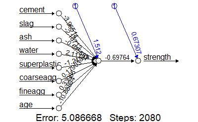
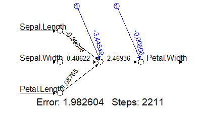
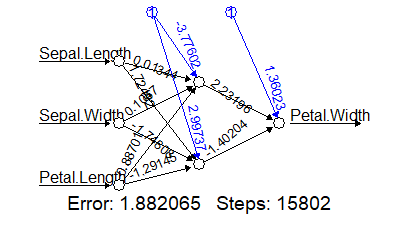
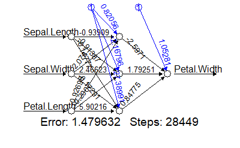
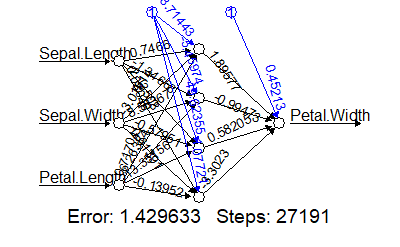
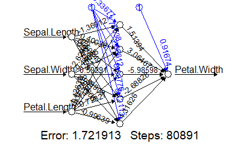

[toc]

# Day41 딥러닝을 위한 빅데이터 기초 - R(10)

# 말뭉치 구성

```R
library(tm)
```

```R
my.text.location = "C:/Users/student/Desktop/R_script/논문data/ymbaek_papers"

# 경로로 파일을 지정시 DirSource 함수 사용
mypaper = VCorpus(DirSource(my.text.location))
mypaper
## <<VCorpus>>
## Metadata:  corpus specific: 0, document level (indexed): 0
## Content:  documents: 24
```

```R
summary(mypaper)
##            Length Class             Mode
## p2009a.txt 2      PlainTextDocument list
## p2009b.txt 2      PlainTextDocument list
## p2010a.txt 2      PlainTextDocument list
## p2010b.txt 2      PlainTextDocument list
## p2010c.txt 2      PlainTextDocument list
## p2011a.txt 2      PlainTextDocument list
## p2011b.txt 2      PlainTextDocument list
## p2012a.txt 2      PlainTextDocument list
## p2012b.txt 2      PlainTextDocument list
## p2013a.txt 2      PlainTextDocument list
## p2014a.txt 2      PlainTextDocument list
## p2014b.txt 2      PlainTextDocument list
## p2014c.txt 2      PlainTextDocument list
## p2014d.txt 2      PlainTextDocument list
## p2014e.txt 2      PlainTextDocument list
## p2014f.txt 2      PlainTextDocument list
## p2014g.txt 2      PlainTextDocument list
## p2014h.txt 2      PlainTextDocument list
## p2014i.txt 2      PlainTextDocument list
## p2014k.txt 2      PlainTextDocument list
## p2015a.txt 2      PlainTextDocument list
## p2015b.txt 2      PlainTextDocument list
## p2015c.txt 2      PlainTextDocument list
## p2015d.txt 2      PlainTextDocument list
```

- 두번째 문서

```R
mypaper[[2]]
## <<PlainTextDocument>>
## Metadata:  7
## Content:  chars: 990
```

- 내용 확인

```R
mypaper[[2]]$content
## [1] "The debate on late night comedy has been inconclusive, with some scholars arguing that this genre increases political knowledge, and others seeing late night comedy as harmful to effective citizenry. We add to the debate and to the research on media effects more generally, by proposing a model that measures political knowledge. The model utilizes item response theory (IRT) to account for individual characteristics, knowledge item difficulty, and response format that influences the likelihood of providing a correct response. Drawing on the 2004 National Annenberg Election Study, we employ this model to test knowledge gain from late night comedy. Using a meta-analysis across 35 political knowledge items, we show that late night comedy increases knowledge, but primarily on easy political items that have fewer correct response options, and mainly among the inattentive citizens. We discuss theoretical implications and provide practical suggestions for scholarship on media effects."
```

- 데이터에 관련된 정보

```R
mypaper[[2]]$meta
##   author       : character(0)
##   datetimestamp: 2020-02-18 08:18:47
##   description  : character(0)
##   heading      : character(0)
##   id           : p2009b.txt
##   language     : en
##   origin       : character(0)
```

- meta() : 메타데이터 구성

```R
meta(mypaper[[2]], tag = "author") = "g.d.hong"
mypaper[[2]]$meta
##   author       : g.d.hong
##   datetimestamp: 2020-02-18 08:18:47
##   description  : character(0)
##   heading      : character(0)
##   id           : p2009b.txt
##   language     : en
##   origin       : character(0)
```

- tm_map(코퍼스, 사전처리함수)

```R
library(stringr)

myfunc = function(x){
  # 특수기호 전후에 있는 단어 확인
  str_extract_all(x, "[[:alnum:]]{1,}[[:punct:]]{1}[[:alnum:]]{1,}")
}
mypuncts = lapply(mypaper, myfunc)
table(unlist(mypuncts))
## 
##              and/or  anxious-ambivalent         blue-collar       co-activation 
##                   2                   1                   1                   1 
##       co-constraint        co-emergence        co-existence     content-analyze 
##                   1                   1                   1                   1 
##      cross-cultural    cross-culturally         cross-party    culture-specific 
##                   6                   1                   1                   1 
##         data-driven dismissive-avoidant                 e.g       export/import 
##                   1                   1                   3                   1 
##        eye-oriented             face-to    fearful-avoidant    five-dimensional 
##                   1                   6                   1                   1 
##           follow-up         Gudykunst's             his/her          Hofstede's 
##                   3                   1                   1                   2 
##                 i.e               ICD-9  inter-disciplinary               ISP's 
##                   5                   1                   1                   1 
##               K-pop         large-scale  lifestyle-oriented         main-effect 
##                   3                   2                   1                   1 
##    mediation-effect          message’s       meta-analysis      mouth-oriented 
##                   2                   1                   1                   1 
##        news/opinion       news/opinions          notice-and          open-ended 
##                   2                   1                   1                   3 
##              opt-in             opt-out             other's     over-represents 
##                   2                   1                   1                   1 
##            people's           people’s       policy-making       post-material 
##                   3                   1                   1                   1 
##  privacy-protective         self-esteem   self-presentation         SNS-related 
##                   2                   3                   2                   1 
##     socio-political         within-bloc      within-subject 
##                   1                   1                   1
```

```R
myfunc = function(x){
  # 수치자료 추출 확인
  str_extract_all(x, "[[:digit:]]{1,}")
}
mydigits = lapply(mypaper, myfunc)
table(unlist(mydigits))
## 
##    1   11 1973    2 2002 2003 2004 2007 2008 2012 2028    3   35    4  712  756 
##    9    1    1    9    1    1    1    1    2    2    1    7    1    2    1    1 
##   78   82    9 
##    1    1    1
```

```R
myfunc = function(x){
  # 고유명사 추출 확인
  str_extract_all(x, "[[:upper:]]{1}[[:alpha:]]{1,}")
}
myuppers = lapply(mypaper, myfunc)
table(unlist(myuppers))
## 
##      Abstract        Action  Additionally     Affective   Affirmative 
##             1             1             1             3             1 
##       African          AIMS      Although   Ambivalence      American 
##             1             1             2             1             1 
##     Americans            An           AND         Anger     Annenberg 
##             2             1             1             1             1 
##   Application Approximately           Are            As        Asians 
##             1             1             1             1             1 
##            At    BACKGROUND          Bank        Barack         Based 
##             1             1             1             1             5 
##        Benoit         Black          Both            By   CONCLUSIONS 
##             1             4             1             5             1 
##           CVC          Data    Democratic     Democrats    Depression 
##             1             1             1             4             2 
##       Despite          Does       Drawing      Election   Expenditure 
##             2             1             5             3             1 
##      Findings         First      Focusing   Furthermore         Garry 
##             4             2             1             1             1 
##       General         Given     Gudykunst     Hispanics      Hofstede 
##             1             1             1             1             2 
##       However           ICD  Implications            In  Independents 
##             2             1             4             2             1 
##     Interface      Internet    Intonation           IRT           ISP 
##             1             5             3             1             2 
##          ISPs            It          John       Kingdom         Korea 
##             1             1             1             1             2 
##        Korean         Laver        Little        McCain       Medical 
##            13             1             1             1             1 
##          MEPS       METHODS          Most      National         Obama 
##             1             1             1             2             1 
##            On           Our         Panel         Party     Political 
##             1             4             1             1             1 
##           Pop  Presidential   Programming        Racial        Rather 
##             1             1             1             2             1 
##        Recent     Regarding      Relative       Relying       Results 
##             1             1             1             5             3 
##       RESULTS       Sadness           SEM         Sewol           SNA 
##             1             1             3             1             1 
##           SNS          SNSs          Some         South       Studies 
##            23             8             1             5             2 
##         Study        Survey           The   Theoretical         These 
##             1             1            11             5             2 
##          This         Three       Twitter        United        Unlike 
##            12             1             1             1             1 
##         Using        Voting            We          Weak         While 
##             5             1            13             1             2 
##         White          With    Wordscores         World       YouTube 
##             6             3             3             1             2
```

## 텍스트 전처리

```R
mytempfunc = function(myobject, oldexp, newexp){
  newobject = tm_map(myobject, content_transformer(
    function(x, pattern) gsub(pattern, newexp, x)
    # x : mypaper, pattern : -collar, newexp : collar
  ), oldexp)
  newobject
}

mycorpus = mytempfunc(mypaper, "-collar", "collar")
mycorpus = mytempfunc(mycorpus, "e\\.g\\.", "for example")
mycorpus = mytempfunc(mycorpus, "and/or", "and or")

mycorpus = tm_map(mycorpus, removePunctuation)
mycorpus = tm_map(mycorpus, stripWhitespace)
mycorpus = tm_map(mycorpus, content_transformer(tolower))
mycorpus = tm_map(mycorpus, removeWords, 
                  words = stopwords("SMART"))
mycorpus = tm_map(mycorpus, stemDocument, language = "en")
```

- 문자 갯수 계산 함수

```R
mycharfunc = function(x){
  str_extract_all(x, ".")
}

mychar = lapply(mypaper, mycharfunc)

length(table(unlist(mychar)))
## [1] 79

sum(table(unlist(mychar)))
## [1] 24765

myuniquechar0 = length(table(unlist(mychar)))
mytotalchar0 = sum(table(unlist(mychar)))
```

- 단어 갯수 계산 함수

```R
mywordfunc = function(x){
  str_extract_all(x, boundary("word"))
}

myword = lapply(mypaper, mywordfunc)

length(table(unlist(myword)))
## [1] 1151

sum(table(unlist(myword)))
## [1] 3504

myuniqueword0 = length(table(unlist(myword)))
mytotalword0 = sum(table(unlist(myword)))
```

- 전처리 이후

```R
mychar1 = lapply(mycorpus, mycharfunc)
myuniquechar1 = length(table(unlist(mychar1)))
mytotalchar1 = sum(table(unlist(mychar1)))

myword1 = lapply(mycorpus, mywordfunc)
myuniqueword1 = length(table(unlist(myword1)))
mytotalword1 = sum(table(unlist(myword1)))
```

```R
c(myuniquechar0, myuniquechar1)
## [1] 79 41

c(mytotalchar0, mytotalchar1)
## [1] 24765 14693

c(myuniqueword0, myuniqueword1)
## [1] 1151  710

c(mytotalword0, mytotalword1)
## [1] 3504 2060
```

- rbind로 연결

```R
results.comparing = rbind(c(myuniquechar0, myuniquechar1),
                          c(mytotalchar0, mytotalchar1),
                          c(myuniqueword0, myuniqueword1),
                          c(mytotalword0, mytotalword1))
results.comparing
##       [,1]  [,2]
## [1,]    79    41
## [2,] 24765 14693
## [3,]  1151   710
## [4,]  3504  2060
```

```r
colnames(results.comparing) = c("before", "after")
row.names(results.comparing) = c("고유문자수", "총문자수",
                                 "고유단어수", "총단어수")
results.comparing
##            before after
## 고유문자수     79    41
## 총문자수    24765 14693
## 고유단어수   1151   710
## 총단어수     3504  2060
```

- 문서 단어 행렬

```R
dtm.e = DocumentTermMatrix(mycorpus)
dtm.e
## <<DocumentTermMatrix (documents: 24, terms: 703)>>
## Non-/sparse entries: 1380/15492
## Sparsity           : 92%
## Maximal term length: 18
## Weighting          : term frequency (tf)
```

```R
row.names(dtm.e[,])
##  [1] "p2009a.txt" "p2009b.txt" "p2010a.txt" "p2010b.txt" "p2010c.txt"
##  [6] "p2011a.txt" "p2011b.txt" "p2012a.txt" "p2012b.txt" "p2013a.txt"
## [11] "p2014a.txt" "p2014b.txt" "p2014c.txt" "p2014d.txt" "p2014e.txt"
## [16] "p2014f.txt" "p2014g.txt" "p2014h.txt" "p2014i.txt" "p2014k.txt"
## [21] "p2015a.txt" "p2015b.txt" "p2015c.txt" "p2015d.txt"
```

```R
head(colnames(dtm.e[,]), 20)
##  [1] "‘buycotting’"       "‘optin’"            "‘optout’"          
##  [4] "“noticeandconsent”" "1973"                 "2002"                
##  [7] "2003"                 "2004"                 "2007"                
## [10] "2008"                 "2012"                 "2028"                
## [13] "712"                  "756"                  "abstract"            
## [16] "academ"               "access"               "accid"               
## [19] "account"              "achiev"
```

- 행렬의 내용 참조

```R
inspect(dtm.e)
## <<DocumentTermMatrix (documents: 24, terms: 703)>>
## Non-/sparse entries: 1380/15492
## Sparsity           : 92%
## Maximal term length: 18
## Weighting          : term frequency (tf)
## Sample             :
##             Terms
## Docs         cultur effect find influenc onlin polit privaci sns social studi
##   p2009b.txt      0      3    0        1     0     4       0   0      0     1
##   p2011a.txt      0      0    0        1     0     6       0   0      0     2
##   p2012b.txt      0      1    2        1     0     0       0   0      0     4
##   p2013a.txt      0      1    1        0     1     0       0   6     10     2
##   p2014a.txt      0      0    2        2     6     0       4   0      0     2
##   p2014c.txt      0      5    1        0     0     0       0   0      0     2
##   p2014d.txt      0      1    2        0     5     0       5   0      0     2
##   p2014f.txt      0      2    0        0     2     0       8   0      0     1
##   p2015a.txt     15      0    1        0     2     0       0   0      1     5
##   p2015c.txt      0      3    1        1     0     1       0   0      1     1
```

```R
inspect(dtm.e[1:3, 50:55])
## <<DocumentTermMatrix (documents: 3, terms: 6)>>
## Non-/sparse entries: 1/17
## Sparsity           : 94%
## Maximal term length: 14
## Weighting          : term frequency (tf)
## Sample             :
##             Terms
## Docs         anger annenberg anteced anxiousambival applic approach
##   p2009a.txt     0         0       0              0      0        0
##   p2009b.txt     0         1       0              0      0        0
##   p2010a.txt     0         0       0              0      0        0
```

# TF-IDF(토픽모델링, Term Frequency - Inverse Document Frequency)

- wiki : 텍스트마이닝에서 이용하는 가중치로, 여러 문서로 이루어진 문서군이 있을 때 어떤 단어가 특정 문서 내에서 얼마나 중요한 것인지를 나타내는 통계적 수치
- Bag of Words(BoW)
  - 단어의 순서에 상관없이 단어의 출현빈도에 관심
  - TF 기반으로 dtm구성
  - 모든 문서에 고르게 등장한 단어보다, 한 문서에만 등장한 단어를 더 중요하다고 판단
  - 문장을 대표하는 단어(토픽)
- TF-IDF(단어 빈도- 역 문서 빈도)는 DTM내의 각 단어들마다 중요한 정도를 가중치로 주로 방법
- DTM 생성 -> TF-IDF 생성
- TF-IDF 활용? 문서 유사도(예. 기사 분야 분류), 검색 결과의 중요도를 정할 때
- TF-IDF : TF\*IDF
  - 문서 : d
  - 단어 : t
  - 문서의 총 개수 : n
  - TF(d,t) : 특정 문서 d에서 특정 단어 t의 등장 횟수
    - => DTM 구성결과와 동일
  - IDF(d,t) : log( n/(DF(t)+1) )
    - DF(t) : 특정 단어 t가 등장한 문서의 수
      - 단어 등장 횟수에는 관심 X
    - +1 : 어떤 문서에도 특정 단어 t가 존재하지 않는 경우를 분모가 0이 되므로 이를 방지하기 위하여
    - log : 문서의 총 개수 n가 커질 때, IDF의 값이 정비례로 똑같이 커지는 것을 방지하기 위하여
- TFIDF는 모든 문서에서 자주 등장하는 단어는 중요도가 낮다.
  - 특정 문서에서 자주 등장하는 단어는 중요도가 높다.
  - => TFIDF가 크면 해당 단어의 중요도가 크다.
    - the, a : TFIDF가 낮다.
- 예. 
- TDM
| TDM  | d1   | d2   | d3   | IDF  |
| ---- | ---- | ---- | ---- | ---- |
|politics|30|30|30|log(3/4)|
|president|15|0|0|log(3/2)|
|congress|0|15|0|log(3/2)|
|court|0|0|15|log(3/2)|
- TFIDF = n/(DF + 1)
- log(3/4) = -0.3, log(3/2) = 0.4

```R
dtm.e.tfidf = DocumentTermMatrix(
  mycorpus, 
  control = list(weighting = function(x) weightTfIdf(x, normalize = FALSE)))
dtm.e.tfidf
## <<DocumentTermMatrix (documents: 24, terms: 703)>>
## Non-/sparse entries: 1380/15492
## Sparsity           : 92%
## Maximal term length: 18
## Weighting          : term frequency - inverse document frequency (tf-idf)
```

- 인공 신경망
  - 필기체 인식, 음성인식
  - 자율주행차, 드론, 스마트 장치 자동화

```R
concrete = read.csv("dataset_for_ml/concrete.csv")
str(concrete)
## 'data.frame':    1030 obs. of  9 variables:
##  $ cement      : num  141 169 250 266 155 ...
##  $ slag        : num  212 42.2 0 114 183.4 ...
##  $ ash         : num  0 124.3 95.7 0 0 ...
##  $ water       : num  204 158 187 228 193 ...
##  $ superplastic: num  0 10.8 5.5 0 9.1 0 0 6.4 0 9 ...
##  $ coarseagg   : num  972 1081 957 932 1047 ...
##  $ fineagg     : num  748 796 861 670 697 ...
##  $ age         : int  28 14 28 28 28 90 7 56 28 28 ...
##  $ strength    : num  29.9 23.5 29.2 45.9 18.3 ...
```

- 정규화

```R
normalize = function(x){
  return((x-min(x)) / (max(x)-min(x)))
}
concrete_norm = as.data.frame(lapply(concrete, normalize))
summary(concrete_norm)
##      cement            slag              ash             water       
##  Min.   :0.0000   Min.   :0.00000   Min.   :0.0000   Min.   :0.0000  
##  1st Qu.:0.2063   1st Qu.:0.00000   1st Qu.:0.0000   1st Qu.:0.3442  
##  Median :0.3902   Median :0.06121   Median :0.0000   Median :0.5048  
##  Mean   :0.4091   Mean   :0.20561   Mean   :0.2708   Mean   :0.4774  
##  3rd Qu.:0.5662   3rd Qu.:0.39775   3rd Qu.:0.5912   3rd Qu.:0.5607  
##  Max.   :1.0000   Max.   :1.00000   Max.   :1.0000   Max.   :1.0000  
##   superplastic      coarseagg         fineagg            age         
##  Min.   :0.0000   Min.   :0.0000   Min.   :0.0000   Min.   :0.00000  
##  1st Qu.:0.0000   1st Qu.:0.3808   1st Qu.:0.3436   1st Qu.:0.01648  
##  Median :0.1988   Median :0.4855   Median :0.4654   Median :0.07418  
##  Mean   :0.1927   Mean   :0.4998   Mean   :0.4505   Mean   :0.12270  
##  3rd Qu.:0.3168   3rd Qu.:0.6640   3rd Qu.:0.5770   3rd Qu.:0.15110  
##  Max.   :1.0000   Max.   :1.0000   Max.   :1.0000   Max.   :1.00000  
##     strength     
##  Min.   :0.0000  
##  1st Qu.:0.2664  
##  Median :0.4001  
##  Mean   :0.4172  
##  3rd Qu.:0.5457  
##  Max.   :1.0000
```

```R
concrete_train = concrete_norm[1:773, ]
concrete_test = concrete_norm[774:1030, ]
```

```R
install.packages("neuralnet")
library(neuralnet)
```

```R
concrete_model = neuralnet(formula = strength ~.,
                           data = concrete_train)
plot(concrete_model)
```



> hidden layer : 2개
>
> 변수 -> 가중치 , 1: bias 
>
> Error : SSE, Step : 가중치가 변경된 횟수

```R
model_results = compute(concrete_model, 
                        concrete_test[1:8])
str(model_results)
## List of 2
##  $ neurons   :List of 2
##   ..$ : num [1:257, 1:9] 1 1 1 1 1 1 1 1 1 1 ...
##   .. ..- attr(*, "dimnames")=List of 2
##   .. .. ..$ : chr [1:257] "774" "775" "776" "777" ...
##   .. .. ..$ : chr [1:9] "" "cement" "slag" "ash" ...
##   ..$ : num [1:257, 1:2] 1 1 1 1 1 1 1 1 1 1 ...
##   .. ..- attr(*, "dimnames")=List of 2
##   .. .. ..$ : chr [1:257] "774" "775" "776" "777" ...
##   .. .. ..$ : NULL
##  $ net.result: num [1:257, 1] 0.328 0.463 0.238 0.671 0.451 ...
##   ..- attr(*, "dimnames")=List of 2
##   .. ..$ : chr [1:257] "774" "775" "776" "777" ...
##   .. ..$ : NULL
```

> net.result가 예측값

```R
pre_str = model_results$net.result
head(pre_str)
##          [,1]
## 774 0.3277558
## 775 0.4629628
## 776 0.2383013
## 777 0.6711493
## 778 0.4512528
## 779 0.4776061

cor(pre_str, concrete_test$strength)
##           [,1]
## [1,] 0.8051003
```

```R
concrete_model2 = neuralnet(formula = strength ~.,
                           data = concrete_train,
                           hidden = 5)
plot(concrete_model2)
```


```R
model_results2 = compute(concrete_model2, 
                        concrete_test[1:8])
pre_str2 = model_results2$net.result
cor(pre_str2, concrete_test$strength)
##          [,1]
## [1,] 0.932904
```

> deep learning : 보통 3개 ~ 5개 사이의 hidden layer를 준다.


# 연습문제(iris)

```R
head(iris)
##   Sepal.Length Sepal.Width Petal.Length Petal.Width Species
## 1          5.1         3.5          1.4         0.2  setosa
## 2          4.9         3.0          1.4         0.2  setosa
## 3          4.7         3.2          1.3         0.2  setosa
## 4          4.6         3.1          1.5         0.2  setosa
## 5          5.0         3.6          1.4         0.2  setosa
## 6          5.4         3.9          1.7         0.4  setosa
```

- Sepal.Length, Sepal.Width, Petal.Length를 이용하여 Petal.Width 예측
- Species는 제외
- random sample, 7:3
- cor, hidden layer의 수를 변경해가면서

```R
set.seed(1)
index = sample(1:nrow(iris), nrow(iris)*0.7)
iris_train = iris[index, 1:4]
iris_test = iris[-index, 1:4]

table(iris$Species[index])
## 
##     setosa versicolor  virginica 
##         35         33         37
```

```R
iris_model1 = neuralnet(formula = Petal.Width ~.,
                        data = iris_train,
                        hidden = 1)
plot(iris_model1)
```



```R
model_results1 = compute(iris_model1, 
                         iris_test)
pre_str1 = model_results1$net.result
cor(pre_str1, iris_test$Petal.Width)
##           [,1]
## [1,] 0.9779201
```

```R
iris_model2 = neuralnet(formula = Petal.Width ~.,
                        data = iris_train,
                        hidden = 2)
plot(iris_model2)
```



```R
model_results2 = compute(iris_model2, 
                         iris_test)
pre_str2 = model_results2$net.result
cor(pre_str2, iris_test$Petal.Width)
##           [,1]
## [1,] 0.9807624
```

```R
iris_model3 = neuralnet(formula = Petal.Width ~.,
                        data = iris_train,
                        hidden = 3)
plot(iris_model3)
```



```R
model_results3 = compute(iris_model3, 
                         iris_test)
pre_str3 = model_results3$net.result
cor(pre_str3, iris_test$Petal.Width)
##           [,1]
## [1,] 0.9806416
```

```R
iris_model4 = neuralnet(formula = Petal.Width ~.,
                        data = iris_train,
                        hidden = 4)
plot(iris_model4)
```



```R
model_results4 = compute(iris_model4, 
                         iris_test)
pre_str4 = model_results4$net.result
cor(pre_str4, iris_test$Petal.Width)
##           [,1]
## [1,] 0.9776888
```

```R
iris_model5 = neuralnet(formula = Petal.Width ~.,
                        data = iris_train,
                        hidden = 5)
plot(iris_model5)
```



```R
model_results5 = compute(iris_model5, 
                         iris_test)
pre_str5 = model_results5$net.result
cor(pre_str5, iris_test$Petal.Width)
##           [,1]
## [1,] 0.9826702
```

