# Day71 CNN을 활용한 이미지 데이터 모델링(3)

# CNN

- CNN : 패턴(규칙)인식
  - 전에는 이미지(3차원) -> 1차원 배욜(FC)
  - => 공간 정보가 무시됨
  - 이미지의 공간 정보를 유지하면서 분석하기 위한 방법

- CNN과 기존 FC와의 차별성
  - 각 레이어의 입출력 데이터의 형상 유지
  - 이미지 공간 정보를 유지하면서 인접 이미지와 특징을 효과적으로 인식
  - 복수의 이미지의 특징을 모으고 강화하는 Pooling 레이어
  - 필터를 공유 parameter로 사용하기 때문에, 일반 인공 신경망과 비교하여 학습 parameter가 매우 적음
- CNN 구조
  - 특징 추출 영역
    - Convolution Layer와 Pooling Layer를 여러 겹 쌓는 형태로 구성
      - Convolution Layer
        - 입력 데이터에 필터를 적용 후 활성화 함수를 반영하는 필수 요소 
        - Filter크기, Stride, Padding 적용 여부, Max Pooling크기에 따라 출력 데이터의 Shape이 변경
      - Convolution Layer 다음에 위치하는 Pooling Layer는 선택적은 레이어
    - 이미지 특징을 추출하는 부분과 이미지를 분류하는 부분 사잉에 이미지 형태의 데이터를 배열 형태로 만드는 Flatten Layer가 위치
  - 클래스 분류 영역
    - 이미지 분류를 위한 FC Layer가 추가

## CNN의 주요 용어 정리

- Convolution(합성곱)
  - 위키피디아 정의
    - 합성곱 연산은 두 함수 `f`, `g` 가운데 하나의 함수를 반전(reverse), 전이(shift) 시킨 다음, 다른 하나의 함수와 곱한 결과를 적분한느 것을 의미한다.
  - 이미지에 필터를 곱하는 것을 의미
    - 이를 통해 Feature Map을 생성
- Channel(채널)
  - 색을 표현하기 위한 차원
  - 컬러 사진은 각 픽셀을 RGB 3개의 실수로 표현한 3차원 데이터로 3개의 채널로 구성
  - 흑백 사진은 2차원 데이터로 1개의 채널로 구성
  - ex.
    - 높이가 39픽셀이고, 폭이 31픽셀인 
      - 컬러 사진 데이터의 shape은 (39, 31, 3)
      - 흑백 사진 데이터의 shape은 (39, 31, 1)
  - Convolution Layer에 유입되는 입력 데이터에는 한 개 이상의 필터가 적용
    - 1개 필터는 Feature Map의 채널
    - Convolution Layer에 **n개**의 필터가 적용된다면 출력 데이터는 **n개**의 채널을 갖게 됨
- Filter(필터)
  - 이미지의 특징을 찾아내기 위한 공용 parameter
  - Kernel이라고 하기도 함
  - 일반적으로 정사각 행렬로 정의
  - 지정된 간격으로 이동하면서 전체 입력데이터와 합성곱을 수행하여 Feature Map 생성
  - 입력 데이터가 여러 채널을 갖을 경우
    - 필터는 각 채널을 순회하며 합성곱을 계산한 후, 채널 별 피처 맵 생성
    - 그리고 각 채널의 피처 맵을 합산하여 최종 피처 맴으로 반환
    - => 입력 데이터는 채널 수와 상관없이 필터 별로 1개의 피처 맵이 생성
- Stride(스트라이드)
  - 필터가 이동하도록 지정된 간격
- Padding(패딩)
  - Convolution Layer에서 Stride의 작용으로 Feature Map의 크기가 입력데이터보다 작다.
  - Convolution Layer의 출력 데이터가 줄어드는 것을 방지하는 방법
  - 입력 데이터의 외각에 지정된 픽셀만큼 특정 값으로 채워 넣는 것을 의미
    - 보통, 특정 값은 0
  - Padding을 통해서 Convolution Layer의 출력 데이터의 사이즈를 조절하는 기능 외에, 외각을 "0" 값으로 둘러싸는 특징으로 부터 인공 신경망이 이미지 외각을 인식하는 학습 효과도 존재
- Feature Map(피처 맵)
  - 합성곱 계산으로 만들어진 행렬
- Activation Map(액티베이션 맵)
  - Feature Map 행렬에 활성 함수를 적용한 결과
  - Convolution Layer의 최종 출력 결과
- Pooling Layer(풀링 레이어)
  - Convolution Layer의 출력 데이터를 입력으로 받아서 출력 데이터(Activation Map)의 크기를 줄이거나 특정 데이터를 강조하는 용도로 사용
  - Pooling Layer에 사용하는 방법으로는 Max Pooling, Average Pooling, Min Pooling
    - CNN에서는 주로 Max Pooling 사용
  - Pooling Layer와 Convolution Layer와 비교한 특징
    - 학습대상 parameter가 없음
    - Pooling Layer를 통과하면
      - 행렬의 크기 감소
      - 채널 수 유지

## Dogs vs. Cats

- [Kaggle - Dogs vs. Cats](https://www.kaggle.com/c/dogs-vs-cats/overview)

```python
import numpy as np
import pandas as pd
from keras.preprocessing.image import *
from keras.utils import to_categorical
from sklearn.model_selection import train_test_split
import matplotlib.pyplot as plt
import random
import os
```

- 데이터 형상 관련 상수 선언

```python
IMAGE_WITHD = 128
IMAGE_HEIGHT = 128
IMAGE_SIZE = (IMAGE_WITHD, IMAGE_HEIGHT)
IMAGE_CHANNEL = 3
```

### 데이터 살펴보기

- 학습 데이터 준비하기

```python
path_dvc = '../data_for_analysis/dogs-vs-cats/'
filenames = os.listdir(path_dvc + 'train')
filenames
```

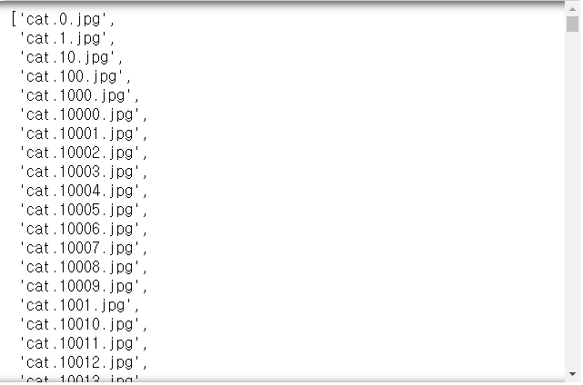

```python
categories = []
for filename in filenames :
    category = filename.split('.')[0]
    if category == 'dog' :
        categories.append(1)
    else :
        categories.append(0)

df = pd.DataFrame({'filename':filenames, 
                   'category':categories})
df
```

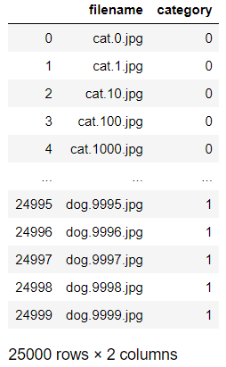

```python
df.category.value_counts()
# > 1    12500
# > 0    12500
# > Name: category, dtype: int64

df.category.value_counts().plot.bar()
```

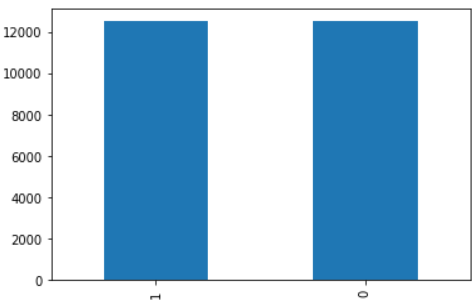

```python
sample = random.choice(filenames)
image = load_img(path_dvc + 'train/' + sample)
plt.imshow(image)
```

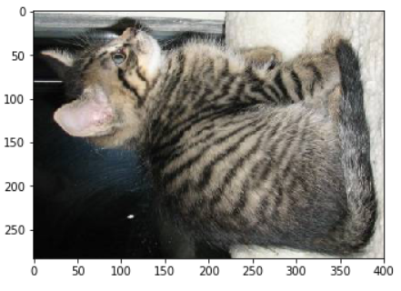

### 모델 만들기

- 배치정규화(Batch Normalization)
  - 신경망 입력 데이터를 평균0, 분산1로 정규화 해서 학습이 잘 이루어지도록 하는 것
- 모델 순서
  - 데이터 - 레이어1(Conv, BatchNorm, Pool, DropOut) - 레이어2(레이어1과 동일) - 레이어3(레이어1과 동일) - FC(Flatten, Dense, BatchNorm, DropOut) - 분류 결과

```python
from keras.models import Sequential
from keras.layers import *
```

```python
model = Sequential()

model.add(Conv2D(32, (3, 3), activation='relu', 
                 input_shape=(IMAGE_WITHD, IMAGE_HEIGHT,
                              IMAGE_CHANNEL)))
model.add(BatchNormalization())
model.add(MaxPooling2D(pool_size=(2, 2)))
model.add(Dropout(0.25))

model.add(Conv2D(64, (3, 3), activation='relu'))
model.add(BatchNormalization())
model.add(MaxPooling2D(pool_size=(2, 2)))
model.add(Dropout(0.25))

model.add(Conv2D(128, (3, 3), activation='relu'))
model.add(BatchNormalization())
model.add(MaxPooling2D(pool_size=(2, 2)))
model.add(Dropout(0.25))

model.add(Flatten())
model.add(Dense(512, activation='relu'))
model.add(BatchNormalization())
model.add(Dropout(0.5))

model.add(Dense(2, activation='softmax'))
```

```python
model.compile(loss='categorical_crossentropy',
              optimizer='rmsprop', 
              metrics=['accuracy'])
model.summary()
```

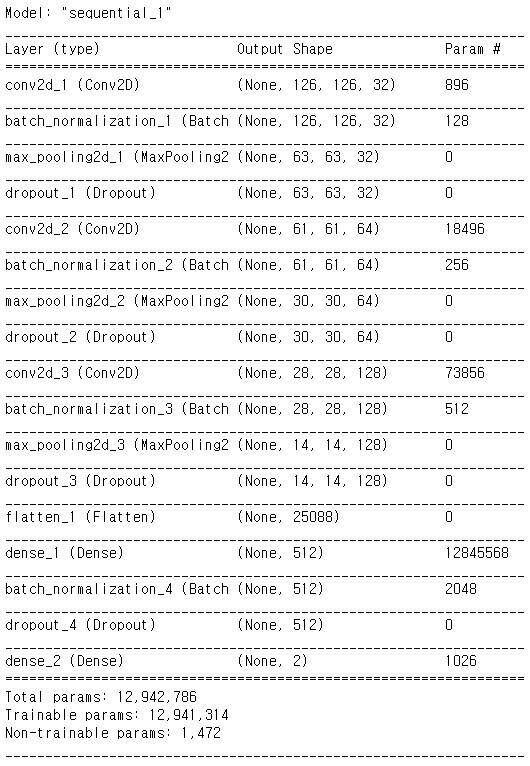

- ReduceLROnPlateau(callback 함수 중 하나)
  - loss가 더 이상 개선되지 않으면 lr을 감소시켜라
  - local minimum 문제에 효과가 존재

```python
from keras.callbacks import EarlyStopping, ReduceLROnPlateau
```

```python
earlystop = EarlyStopping(patience=10)

learning_rate_reduction = ReduceLROnPlateau(
    monitor='val_accuracy', 
    patience=2, factor=0.5, 
    min_lr=0.00001, verbose=1)

callbacks = [earlystop, learning_rate_reduction]
```

- 이미지 제너레이터에서 class_mode='categorical'로 지정하기 위해 컬럼을 string으로 변경함

  ```python
  df['category'] = df['category'].replace({0:'cat', 1:'dog'})
  ```

### train set, validation set 분할하기 

```python
train_df, validate_df = train_test_split(df,
                                         test_size=0.2,
                                         random_state=42)
```

```python
train_df.shape, validate_df.shape
# > ((20000, 2), (5000, 2))

train_df
```

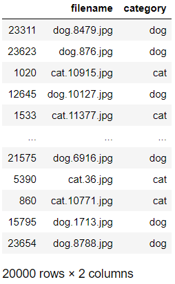

```python
train_df = train_df.reset_index(drop=True)
train_df
```


```python
validate_df = validate_df.reset_index(drop=True)
validate_df
```

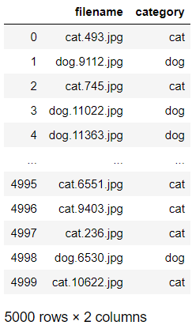

```python
train_df.category.value_counts()
# > dog    10015
# > cat     9985
# > Name: category, dtype: int64

train_df.category.value_counts().plot.bar()
```

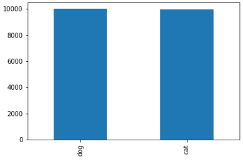

```python
validate_df.category.value_counts().plot.bar()
```

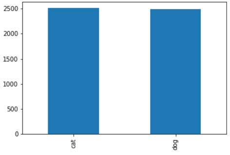

- 변수 선언

  ```python
  total_train = train_df.shape[0]
  total_validate = validate_df.shape[0]
  batch_size = 15
  ```

### 제너레이터 설정하기

- 트레이닝 데이터 제너레이터 설정

```python
train_datagen = ImageDataGenerator(
    rotation_range=15,
    rescale=1./255,
    shear_range=0.1,
    zoom_range=0.2,
    horizontal_flip=True,
    width_shift_range=0.1,
    height_shift_range=0.1
)

train_generator = train_datagen.flow_from_dataframe(
    train_df,
    path_dvc + 'train/',
    x_col='filename',
    y_col='category',
    target_size=IMAGE_SIZE,
    class_mode='categorical',
    batch_size=batch_size
)
# > Found 20000 validated image filenames belonging to 2 classes.
```

- validation data generator 설정

```python
validation_datagen = ImageDataGenerator(rescale=1./255)

validation_generator = validation_datagen.flow_from_dataframe(
    validate_df,
    path_dvc + 'train/',
    x_col='filename',
    y_col='category',
    target_size=IMAGE_SIZE,
    class_mode='categorical',
    batch_size=batch_size
)
# > Found 5000 validated image filenames belonging to 2 classes.
```

- train data generator 생성 살펴보기

```python
example_df = train_df.sample(n=1).reset_index(drop=True)
example_df
```


```python
example_generator = train_datagen.flow_from_dataframe(
    example_df, 
    path_dvc + 'train/',
    x_col='filename',
    y_col='category',
    target_size=IMAGE_SIZE,
    class_mode='categorical'
)
# > Found 1 validated image filenames belonging to 1 classes.

plt.figure(figsize=(12, 12))
for i in range(0, 15) :
    plt.subplot(5, 3, i+1)
    for xBatch, yBatch in example_generator :
        image = xBatch[0]
        plt.imshow(image)
        break
plt.tight_layout()
plt.show()
```

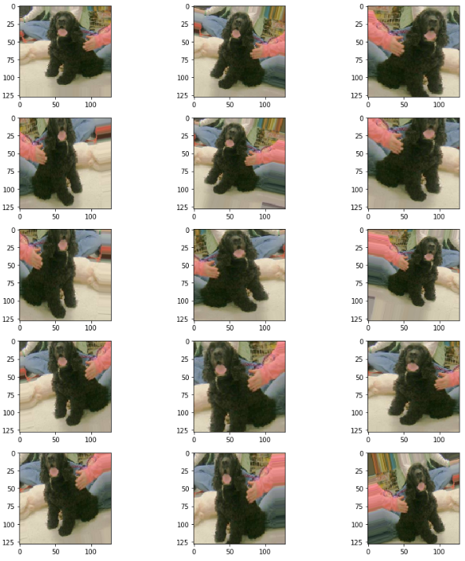

### 모델 적용하기

```python
FAST_RUN = True
epochs = 3 if FAST_RUN else 50 # 이런 방법으로 epoch를 조정할 수 도 있다.
```

```python
history = model.fit_generator(
    train_generator,
    epochs=epochs,
    steps_per_epoch=total_train//batch_size,
    validation_data=validation_generator,
    validation_steps=total_validate//batch_size,
    callbacks=callbacks
)
# > Epoch 1/3
# > 1333/1333 [==============================] - 1016s 762ms/step - loss: 0.7071 - accuracy: 0.6393 - val_loss: 0.7314 - val_accuracy: 0.6781
# > Epoch 2/3
# > 1333/1333 [==============================] - 1000s 750ms/step - loss: 0.5507 - accuracy: 0.7255 - val_loss: 0.7457 - val_accuracy: 0.6712
# > Epoch 3/3
# > 1333/1333 [==============================] - 950s 712ms/step - loss: 0.5022 - accuracy: 0.7576 - val_loss: 0.3206 - val_accuracy: 0.8058
```

### 모델 저장하기

```python
model.save(path_dvc + 'model.h5') # 전체정보 저장
model.save_weight() # 가중치만 저장 가능
```


# 연습문제

1. 위의 Dog vs. Cats 이어서 분석
   1. 시각화
   2. test generator 생성
   3. 예측
   4. argmax
2. `fashion_mnist` 분석
   - keras.io => 검색어 : fashion_mnist
   - 레이블 0~9(티셔츠, 신발, 가방, ...)
   - 테스트 데이터로 테스트 정확도 출력

## 1.

1. 시각화

   ```python
   plt.plot(range(1,4), history.history['loss'])
   plt.plot(range(1,4), history.history['val_loss'])
   plt.plot(range(1,4), history.history['accuracy'])
   plt.plot(range(1,4), history.history['val_accuracy'])
   plt.legend(labels=['loss', 'val_loss', 'accuracy', 'val_accuracy'])
   ```

   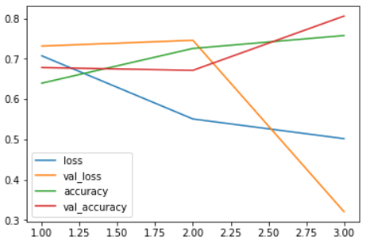

2. test generator 생성

   ```python
   test_filenames = os.listdir(path_dvc + 'test1')
   test_df = pd.DataFrame({'filename':test_filenames})
   total_test = test_df.shape[0]
   
   test_datagen = ImageDataGenerator(rescale=1./255)
   
   test_generator = test_datagen.flow_from_dataframe(
       test_df,
       path_dvc + 'test1/',
       x_col='filename',
       y_col=None,
       target_size=IMAGE_SIZE,
       class_mode=None,
       batch_size=batch_size,
       shuffle=False
   )
   # > Found 12500 validated image filenames.
   ```

3. 예측

   ```python
   predict = model.predict_generator(
       test_generator,
       steps=total_test//batch_size
   )
   predict
   # > array([[0.04406601, 0.95593405],
   # >        [0.5848554 , 0.41514453],
   # >        [0.27039266, 0.72960734],
   # >        ...,
   # >        [0.0324836 , 0.96751636],
   # >        [0.9794068 , 0.02059331],
   # >        [0.22676457, 0.7732354 ]], dtype=float32)
   ```

4. argmax

   ```python
   test_df['category'] = np.argmax(predict, axis=1)
   test_df
   ```

   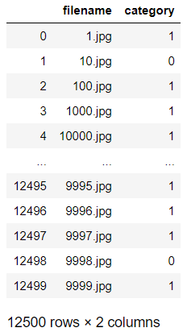

## 2.

- 데이터 불러오기

```python
import keras
fm = keras.datasets.fashion_mnist
(trainImage, trainLabel), (testImage, testLabel) = fm.load_data()
```

- 데이터 살펴보기

```python
plt.imshow(trainImage[0])
plt.show()
```

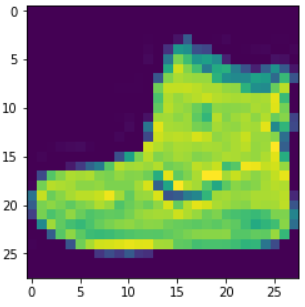

```python
trainImage.shape
# > (60000, 28, 28, 1)
```

- 데이터 전처리

```python
trainImage = trainImage.reshape(
    trainImage.shape[0], 28, 28, 1).astype('float32')/255
testImage = testImage.reshape(
    testImage.shape[0], 28, 28, 1).astype('float32')/255

# 원핫인코딩
trainLabel = to_categorical(trainLabel)
testLabel = to_categorical(testLabel)
```

- 모델 생성

```python
IMAGE_WITHD = 28
IMAGE_HEIGHT = 28
IMAGE_CHANNEL = 1
IMAGE_SIZE = (IMAGE_WITHD, IMAGE_HEIGHT)
```

```python
model = Sequential()

model.add(Conv2D(32, (3, 3), activation='relu', 
                 input_shape=(IMAGE_WITHD, IMAGE_HEIGHT,
                              IMAGE_CHANNEL)))
model.add(BatchNormalization())
model.add(MaxPooling2D(pool_size=(2, 2)))
model.add(Dropout(0.2))

model.add(Conv2D(64, (3, 3), activation='relu'))
model.add(BatchNormalization())
model.add(MaxPooling2D(pool_size=(2, 2)))
model.add(Dropout(0.2))

model.add(Conv2D(128, (3, 3), activation='relu'))
model.add(BatchNormalization())
model.add(MaxPooling2D(pool_size=(2, 2)))
model.add(Dropout(0.2))

model.add(Flatten())
model.add(Dense(64, activation='relu'))
model.add(BatchNormalization())
model.add(Dropout(0.5))

model.add(Dense(10, activation='softmax'))

model.compile(loss='categorical_crossentropy',
              optimizer='adam', metrics=['accuracy'])
  
model.summary()
```


- 과적합 방지를 위한 설정

```python
es = EarlyStopping(patience=10)

learning_rate_reduction = ReduceLROnPlateau(
    monitor='val_accuracy',
    patience=2, factor=0.5,
    min_lr=1e-5, verbose=1
)

callback = [es, learning_rate_reduction]
```

- 모델 적용

```python
history = model.fit(trainImage, trainLabel,
                    validation_data=(testImage, testLabel), 
                    epochs=30, batch_size=200, 
                    callbacks=callback)
# > Train on 60000 samples, validate on 10000 samples
# > Epoch 1/100
# > 60000/60000 [==============================] - 74s 1ms/step - loss: 0.2439 - accuracy: 0.9128 - val_loss: 0.2602 - val_accuracy: 0.9060
# > ...
# > Epoch 23/100
# > 60000/60000 [==============================] - 73s 1ms/step - loss: 0.2324 - accuracy: 0.9178 - val_loss: 0.2596 - val_accuracy: 0.9064
```

- 시각화

```python
plt.plot(range(1,24), history.history['accuracy'])
plt.plot(range(1,24), history.history['val_accuracy'])
plt.legend(labels=['accuracy', 'val_accuracy'])
```


```python
plt.plot(range(1,24), history.history['loss'])
plt.plot(range(1,24), history.history['val_loss'])
plt.legend(labels=['loss', 'val_loss'])
```

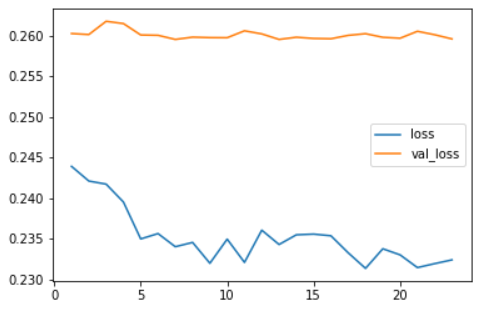

- 평가

```python
model.evaluate(testImage, testLabel)
# > 10000/10000 [==============================] - 7s 678us/step
# > [0.25957579489946364, 0.9064000248908997]
```

- train data 분할하여 모델 적용


```python
history = model.fit(trainImage, trainLabel,
                    validation_split=0.3, 
                    epochs=100, batch_size=200, 
                    callbacks=callback)
# > Train on 42000 samples, validate on 18000 samples
# > Epoch 1/100
# > 42000/42000 [==============================] - 62s 1ms/step - loss: 0.2222 - accuracy: 0.9208 - val_loss: 0.1419 - val_accuracy: 0.9487
# > ...
# > Epoch 12/100
# > 42000/42000 [==============================] - 58s 1ms/step - loss: 0.2228 - accuracy: 0.9199 - val_loss: 0.1436 - val_accuracy: 0.9478
```

```python
model.evaluate(testImage, testLabel)
# > 10000/10000 [==============================] - 6s 619us/step
# > [0.25860359507799147, 0.907800018787384]
```


