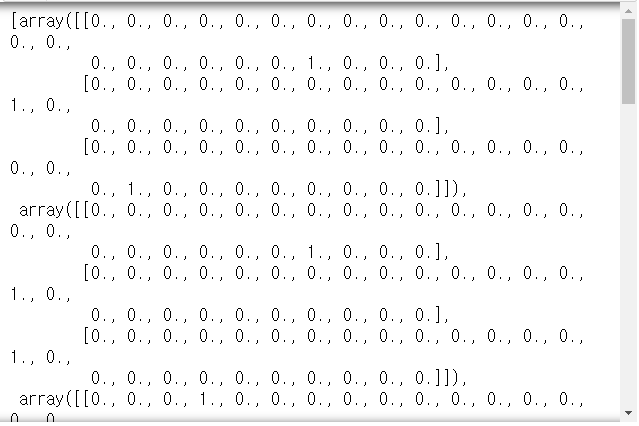
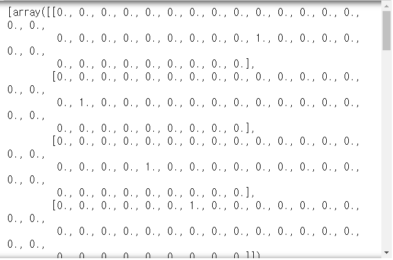
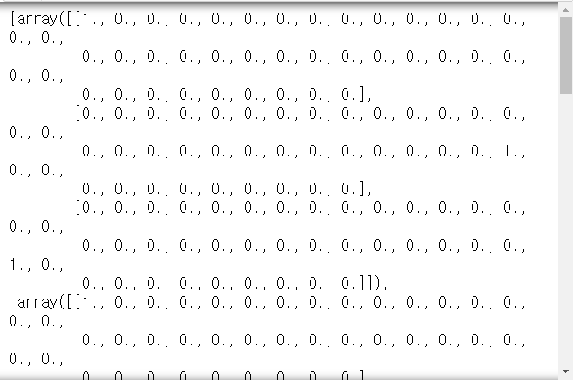

# Day75 TensorFlow와 Keras 라이브러리를 활용한 딥러닝(13)

# np.transpose()

```python
ct = np.arange(7*5*2).reshape(7, 5, 2)
ct
```


```python
np.transpose(ct).shape
# > (2, 5, 7)
```

- m\*n -> transpose -> n\*m
- i\*j\*k -> transpose -> ikj, jik, jki, kij, kji 가능(default:kji)
    - 원하는 구성으로 하기 위해서는 지정 필요

```python
np.transpose(ct, [1, 2, 0]).shape
# > (5, 2, 7)
```

# tf.reshape()[-1]

```python
t = [i for i in range(1, 25)]
t = tf.reshape(t, [2, 3, 4])
sess = tf.Session()
print(sess.run(t))
# > [[[ 1  2  3  4]
# >   [ 5  6  7  8]
# >   [ 9 10 11 12]]
# > 
# >  [[13 14 15 16]
# >   [17 18 19 20]
# >   [21 22 23 24]]]

t = t[-1]
print(sess.run(t))
# > [[13 14 15 16]
# >  [17 18 19 20]
# >  [21 22 23 24]]
```

----

# LSTM

- case study 1. (자동완성 기능)
    - 4글자로 구성된 단어를 학습하여 생성된 모델을 바탕으로
    - 3글자 입력했을 때 마지막 글자를 예측하여 출력
    - ex. wood -> 학습 -> 모델 -> woo 입력 -> d 예측
        - 일반적인 if 문으로 생성할 경우 오타를 입력하면 오류발생 가능
        - LSTM으로 만들 경우 wop를 입력하더라도 d 예측가능

- case study 2. (한영사전)

## 자동완성 기능

```python
char_arr = [chr(i) for i in range(97, 123)]
print(char_arr)
# > ['a', 'b', 'c', 'd', 'e', 'f', 'g', 'h', 'i', 'j', 'k', 'l', 'm', 'n', 'o', 'p', 'q', 'r', 's', 't', 'u', 'v', 'w', 'x', 'y', 'z']

num_dic = {char_arr[i]:i for i in range(len(char_arr))}
# or
num_dic = {char:i for i, char in enumerate(char_arr)}
print(num_dic)
# > {'a': 0, 'b': 1, 'c': 2, 'd': 3, 'e': 4, 'f': 5, 'g': 6, 'h': 7, 'i': 8, 'j': 9, 'k': 10, 'l': 11, 'm': 12, 'n': 13, 'o': 14, 'p': 15, 'q': 16, 'r': 17, 's': 18, 't': 19, 'u': 20, 'v': 21, 'w': 22, 'x': 23, 'y': 24, 'z': 25}

dic_len = len(num_dic)
dic_len
# > 26

seq_data = ['word', 'wood', 'deep', 'dive', 'cold', 
            'cool', 'load', 'love', 'kiss', 'kind']
```

- x, y로 분할 & 원핫인코딩

```python
def make_batch(seq_data) :
    input_data = list()
    target_data = list()
    
    for seq in seq_data :
        myinput = [num_dic[char] for char in seq[:-1]]
        target = num_dic[seq[-1]]
        # 원핫인코딩
        input_data.append(np.eye(dic_len)[myinput])
        target_data.append(target)
        
    return input_data, target_data

input_batch, target_batch = make_batch(seq_data)
input_batch
```



```python
target_batch
# > [3, 3, 15, 4, 3, 11, 3, 4, 18, 3]
```

- softmax_cross_entropy_with_logits 함수
  - label값을 원핫인코딩으로 넘겨줌
- sparse_softmax_cross_entropy_with_logits 함수
  - label값이 원핫인코딩이 안된 경우에 사용

```python
lr = 0.01
n_hidden = 128 # 셀의 출력 갯수
total_epoch = 30 # 에폭
n_step = 3 # 입력 3글자
n_input = n_class = dic_len # 입력크기(n_input), 클래스 종류 개수(n_class)
# dic_len -> n_class 저장 -> n_input저장
```

- 신경망 모델 구성

```python
x = tf.placeholder(tf.float32, [None, n_step, n_input])
# None:전체 단어수, n_step:3글자 입력, n_input:26개 글자
y = tf.placeholder(tf.int32, [None])
# 원핫인코딩이 되어 있지 않으므로
# 원핫인코딩이 되어 있을 경우 [None, n_class]

w = tf.Variable(tf.random_normal([n_hidden, n_class]))
b = tf.Variable(tf.random_normal([n_class]))

cell1 = tf.nn.rnn_cell.BasicLSTMCell(n_hidden)
cell1 = tf.nn.rnn_cell.DropoutWrapper(cell1, output_keep_prob=0.5)

cell2 = tf.nn.rnn_cell.BasicLSTMCell(n_hidden)
multi_cell = tf.nn.rnn_cell.MultiRNNCell([cell1, cell2]) # cell1과 cell2 연결
outputs, states = tf.nn.dynamic_rnn(multi_cell, x, dtype=tf.float32)
# outputs은 위로 출력, states는 옆으로 전달되는 출력
```

```python
sess = tf.Session()
sess.run(tf.global_variables_initializer())
```

```python
np.shape(input_batch)
# > (10, 3, 26)
```

> 10:단어개수, 3:글자 개수, 26:26가지 종류

```python
sess.run(outputs, feed_dict={x:input_batch}).shape
# > (10, 3, 128)
```

> 10:단어개수, 3:글자(cell) 개수, 128:출력크기

```python
outputs = tf.transpose(outputs, [1, 0 ,2])
# (10, 3, 128) -> (3, 10, 128)
outputs = outputs[-1] # (10, 128)

model = tf.matmul(outputs, w) + b

cost = tf.reduce_mean(
    tf.nn.sparse_softmax_cross_entropy_with_logits(
        logits=model, labels=y
    )
)
opt = tf.train.AdamOptimizer(lr).minimize(cost)
```

- 모델 적합

```python
for epoch in range(total_epoch) :
    _, cv = sess.run([opt, cost], 
                     feed_dict={x:input_batch, y:target_batch})
    print('epoch : %02d' %(epoch+1),
          'cost : {:.5f}'.format(cv))
print('model complete')
# > epoch : 01 cost : 5.08524
# > epoch : 02 cost : 4.01956
# > epoch : 03 cost : 2.39927
# > epoch : 04 cost : 1.20621
# > epoch : 05 cost : 1.03677
# > epoch : 06 cost : 1.36852
# > epoch : 07 cost : 0.53304
# > epoch : 08 cost : 0.41560
# > epoch : 09 cost : 0.78655
# > epoch : 10 cost : 0.47665
# > epoch : 11 cost : 0.29050
# > epoch : 12 cost : 0.21955
# > epoch : 13 cost : 0.29669
# > epoch : 14 cost : 0.51946
# > epoch : 15 cost : 0.12800
# > epoch : 16 cost : 0.16176
# > epoch : 17 cost : 0.33691
# > epoch : 18 cost : 0.10836
# > epoch : 19 cost : 0.08720
# > epoch : 20 cost : 0.09926
# > epoch : 21 cost : 0.07080
# > epoch : 22 cost : 0.05549
# > epoch : 23 cost : 0.04111
# > epoch : 24 cost : 0.03972
# > epoch : 25 cost : 0.01432
# > epoch : 26 cost : 0.05675
# > epoch : 27 cost : 0.17666
# > epoch : 28 cost : 0.05183
# > epoch : 29 cost : 0.01956
# > epoch : 30 cost : 0.00552
# > model complete
```

```python
pred = tf.cast(tf.argmax(model, 1), tf.int32)
pred_check = tf.equal(pred, y)
accuracy = tf.reduce_mean(tf.cast(pred_check, tf.float32))

input_batch, target_batch = make_batch(seq_data)
pv, av = sess.run([pred, accuracy],
                  feed_dict={x:input_batch, y:target_batch})
```

```python
predict_words = list()
for i, v in enumerate(seq_data) :
    last_char = char_arr[pv[i]]
    predict_words.append(v[:3]+last_char)
print('prediction result\n')
print('input value :', [w[:3] for w in seq_data])
print('predcition value :', predict_words)
print('accuracy :', av)
# > prediction result
# > 
# > input value : ['wor', 'woo', 'dee', 'div', 'col', 'coo', 'loa', 'lov', 'kis', 'kin']
# > predcition value : ['word', 'wood', 'deep', 'dive', 'coll', 'cool', 'load', 'love', 'kiss', 'kind']
# > accuracy : 0.9
```

- [dea, luv] 입력시 출력값 [p, e]

```python
input_data, target_data = make_batch(['deap', 'luve'])
pv = sess.run(pred, feed_dict={x:input_data})
prediction = [char_arr[n] for n in pv]
print('prediciton result :', prediction)
# > prediciton result : ['p', 'e']
```

## 기계번역

- seq2seq : 기계번역 알고리즘
    - 입력신경망(인코더)/출력신경망(디코더)
    - 챗봇, 번역, 이미지 캡셔닝에 사용
    - ex. 나는 학교에 간다 -> I go to school


- Symbol
  - S : 디코딩 입력의 시작
  - E : 디코딩 출력의 끝
  - P : 현재 배치되는 데이터의 time step 크기보다 작은 경우 빈 시퀀스를 채우는 심볼
    - ex. 배치 데이터의 최대 크기 4인 경우
      - word => ['w', 'o', 'r', 'd']
      - to => ['t', 'o', 'P', 'P']
- 영어 단어 -> 한국어 단어 번역기

```python
char_arr = [c for c in 'SEPabcdefghijklmnopqrstuvwxyz단어나무놀이소녀키스사랑']
print(char_arr)
# > ['S', 'E', 'P', 'a', 'b', 'c', 'd', 'e', 'f', 'g', 'h', 'i', 'j', 'k', 'l', 'm', 'n', 'o', 'p', 'q', 'r', 's', 't', 'u', 'v', 'w', 'x', 'y', 'z', '단', '어', '나', '무', '놀', '이', '소', '녀', '키', '스', '사', '랑']

num_dic = {char:i for i, char in enumerate(char_arr)}
print(num_dic)
# > {'S': 0, 'E': 1, 'P': 2, 'a': 3, 'b': 4, 'c': 5, 'd': 6, 'e': 7, 'f': 8, 'g': 9, 'h': 10, 'i': 11, 'j': 12, 'k': 13, 'l': 14, 'm': 15, 'n': 16, 'o': 17, 'p': 18, 'q': 19, 'r': 20, 's': 21, 't': 22, 'u': 23, 'v': 24, 'w': 25, 'x': 26, 'y': 27, 'z': 28, '단': 29, '어': 30, '나': 31, '무': 32, '놀': 33, '이': 34, '소': 35, '녀': 36, '키': 37, '스': 38, '사': 39, '랑': 40}

dic_len = len(num_dic)
dic_len
# > 41

seq_data = [['word', '단어'], ['wood', '나무'], 
            ['game', '놀이'], ['girl', '소녀'], 
            ['kiss', '키스'], ['love', '사랑']]
```

- 데이터 전처리

```python
def make_batch(seq_data) :
    input_batch = list()
    output_batch = list()
    target_batch = list()
    
    for seq in seq_data :
        input_data = [num_dic[char] for char in seq[0]]
        output_data = [num_dic[char] for char in ('S'+seq[1])]
        target_data = [num_dic[char] for char in (seq[1]+'E')]
        
        input_batch.append(np.eye(dic_len)[input_data])
        output_batch.append(np.eye(dic_len)[output_data])
        target_batch.append(target_data) # 출력값만 원핫아님
        
    return input_batch, output_batch, target_batch
```

```python
input_batch, output_batch, target_batch = make_batch(seq_data)
input_batch
```



```python
output_batch
```



```python
traget_batch
# > [[29, 30, 1], [31, 32, 1], [33, 34, 1], [35, 36, 1], [37, 38, 1], [39, 40, 1]]
```

- 모델 옵션 설정

```python
lr = 0.01
n_hidden = 128
total_epoch = 100
n_class = n_input = dic_len # 41
```

```python
tf.reset_default_graph()
```

- 신경망 구성 = [배치사이즈, 단계, 입력크기]

```python
en_input =  tf.placeholder(tf.float32, [None, None, n_input]) # word
# 두번째 None : 단어의 길이가 고정되어 있지 않을 때
de_input =  tf.placeholder(tf.float32, [None, None, n_input]) # <S>단어
target = tf.placeholder(tf.int64, [None, None]) # 단어<E>
```

- Encoder 셀 구성

```python
with tf.variable_scope('encode') :
    en_cell = tf.nn.rnn_cell.BasicRNNCell(n_hidden)
    en_cell = tf.nn.rnn_cell.DropoutWrapper(
        en_cell,
        output_keep_prob=0.5
    )
    outputs, en_states = tf.nn.dynamic_rnn(en_cell, en_input,
                                           dtype=tf.float32)
```

- Decoder 셀 구성

```python
with tf.variable_scope('decode') :
    de_cell = tf.nn.rnn_cell.BasicRNNCell(n_hidden)
    de_cell = tf.nn.rnn_cell.DropoutWrapper(
        de_cell,
        output_keep_prob=0.5
    )
    outputs, de_states = tf.nn.dynamic_rnn(
        de_cell, de_input, 
        initial_state=en_states, dtype=tf.float32
    )
```

- output layer 구성

```python
model = tf.layers.dense(outputs, n_class, activation=None)
cost = tf.reduce_mean(
    tf.nn.sparse_softmax_cross_entropy_with_logits(
        logits=model, labels=target
    )
)
opt = tf.train.AdamOptimizer(lr).minimize(cost)
```

- 모델 적합

```python
sess = tf.Session()
sess.run(tf.global_variables_initializer())

for epoch in range(total_epoch) :
    _, cv = sess.run([opt, cost], 
                     feed_dict={en_input:input_batch,
                                de_input:output_batch,
                                target:target_batch})
    print('epoch : %03d' %(epoch+1), 
          'cost : {:.5f}'.format(cv))
# > epoch : 001 cost : 3.81307
# > epoch : 002 cost : 2.60170
# > epoch : 003 cost : 1.41858
# > epoch : 004 cost : 1.17071
# > epoch : 005 cost : 0.62555
# > epoch : 006 cost : 0.42751
# > epoch : 007 cost : 0.34037
# > epoch : 008 cost : 0.37312
# > epoch : 009 cost : 0.17174
# > epoch : 010 cost : 0.21711
# > epoch : 011 cost : 0.05862
# > epoch : 012 cost : 0.12105
# > epoch : 013 cost : 0.09245
# > epoch : 014 cost : 0.22529
# > epoch : 015 cost : 0.06105
# > epoch : 016 cost : 0.04653
# > epoch : 017 cost : 0.04823
# > epoch : 018 cost : 0.05880
# > epoch : 019 cost : 0.02425
# > epoch : 020 cost : 0.04122
# > epoch : 021 cost : 0.00743
# > epoch : 022 cost : 0.01060
# > epoch : 023 cost : 0.00477
# > epoch : 024 cost : 0.01123
# > epoch : 025 cost : 0.01247
# > epoch : 026 cost : 0.01109
# > epoch : 027 cost : 0.01277
# > epoch : 028 cost : 0.00504
# > epoch : 029 cost : 0.00837
# > epoch : 030 cost : 0.01205
# > epoch : 031 cost : 0.00400
# > epoch : 032 cost : 0.00555
# > epoch : 033 cost : 0.00466
# > epoch : 034 cost : 0.00361
# > epoch : 035 cost : 0.00960
# > epoch : 036 cost : 0.01038
# > epoch : 037 cost : 0.00633
# > epoch : 038 cost : 0.00206
# > epoch : 039 cost : 0.00802
# > epoch : 040 cost : 0.00415
# > epoch : 041 cost : 0.00294
# > epoch : 042 cost : 0.00157
# > epoch : 043 cost : 0.00216
# > epoch : 044 cost : 0.00139
# > epoch : 045 cost : 0.00147
# > epoch : 046 cost : 0.00432
# > epoch : 047 cost : 0.01190
# > epoch : 048 cost : 0.00146
# > epoch : 049 cost : 0.00081
# > epoch : 050 cost : 0.00124
# > epoch : 051 cost : 0.00373
# > epoch : 052 cost : 0.00477
# > epoch : 053 cost : 0.00208
# > epoch : 054 cost : 0.00088
# > epoch : 055 cost : 0.00133
# > epoch : 056 cost : 0.00133
# > epoch : 057 cost : 0.00218
# > epoch : 058 cost : 0.00078
# > epoch : 059 cost : 0.00311
# > epoch : 060 cost : 0.00284
# > epoch : 061 cost : 0.00038
# > epoch : 062 cost : 0.00056
# > epoch : 063 cost : 0.00069
# > epoch : 064 cost : 0.00101
# > epoch : 065 cost : 0.00105
# > epoch : 066 cost : 0.00120
# > epoch : 067 cost : 0.00015
# > epoch : 068 cost : 0.00048
# > epoch : 069 cost : 0.00052
# > epoch : 070 cost : 0.00035
# > epoch : 071 cost : 0.00142
# > epoch : 072 cost : 0.00034
# > epoch : 073 cost : 0.00057
# > epoch : 074 cost : 0.00030
# > epoch : 075 cost : 0.00036
# > epoch : 076 cost : 0.00028
# > epoch : 077 cost : 0.00026
# > epoch : 078 cost : 0.00018
# > epoch : 079 cost : 0.00061
# > epoch : 080 cost : 0.00144
# > epoch : 081 cost : 0.00403
# > epoch : 082 cost : 0.00139
# > epoch : 083 cost : 0.00217
# > epoch : 084 cost : 0.00047
# > epoch : 085 cost : 0.00063
# > epoch : 086 cost : 0.00040
# > epoch : 087 cost : 0.00036
# > epoch : 088 cost : 0.00159
# > epoch : 089 cost : 0.00146
# > epoch : 090 cost : 0.00026
# > epoch : 091 cost : 0.00015
# > epoch : 092 cost : 0.00057
# > epoch : 093 cost : 0.00043
# > epoch : 094 cost : 0.00038
# > epoch : 095 cost : 0.00096
# > epoch : 096 cost : 0.00056
# > epoch : 097 cost : 0.00029
# > epoch : 098 cost : 0.00096
# > epoch : 099 cost : 0.00030
# > epoch : 100 cost : 0.00014
```

- 영한 변환

```python
def translate(w) :
    seq_data = [w, 'P'*len(w)] # ['word', 'PPPP']
    input_batch, output_batch, target_batch = make_batch([seq_data])
    # input_batch = ['w', 'o', 'r', 'd']
    # output_batch = ['P', 'P', 'P', 'P']
    # target_batch = [2, 2, 2, 2]
    
    # model 실행결과 : [배치사이즈. 스텝, 입력크기]
    # 2번째 차원인 입력 차원을 argmax 적용
    # => 확률이 가장 높은 글자 예측
    
    prediction = tf.argmax(model, 2)
    # [[[0, 0, 0.9, 0.5, ..., 0.1], ...]]
    # => [[[2], [3], ...]]
    # [2], [3], ... : 글자 인덱스
    # ['단', '어', 'E', 'E']
    
    res = sess.run(prediction, 
                   feed_dict={en_input:input_batch, 
                              de_input:output_batch, 
                              target:target_batch})
    # res에는 숫자 인덱스
    decoded = [char_arr[i] for i in res[0]]
    end = decoded.index('E')
    translated = ''.join(decoded[:end])
    
    return translated
```

```python
print('word?', translate('word'))
print('wodr?', translate('wodr')) # 오타
print('love?', translate('love'))
print('loev?', translate('love')) # 오타
print('like?', translate('like')) # 학습X
# > word? 단어
# > wodr? 나무
# > love? 사랑
# > loev? 사랑
# > like? 사랑
```


