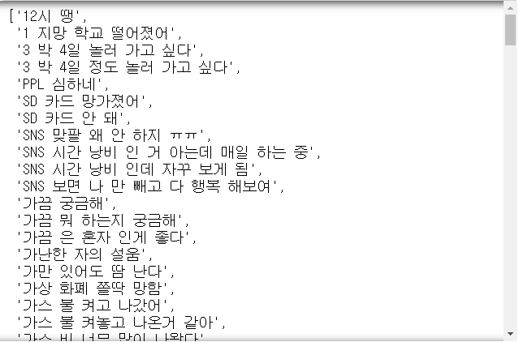
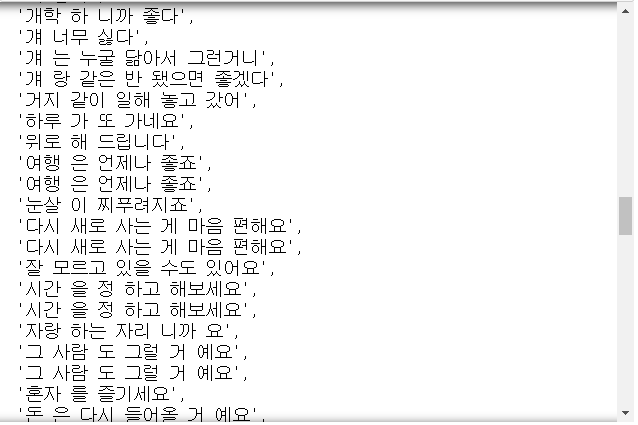
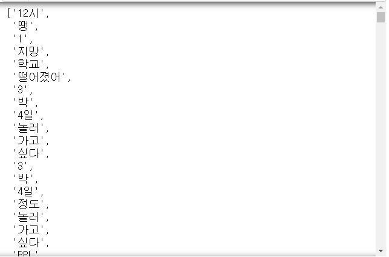
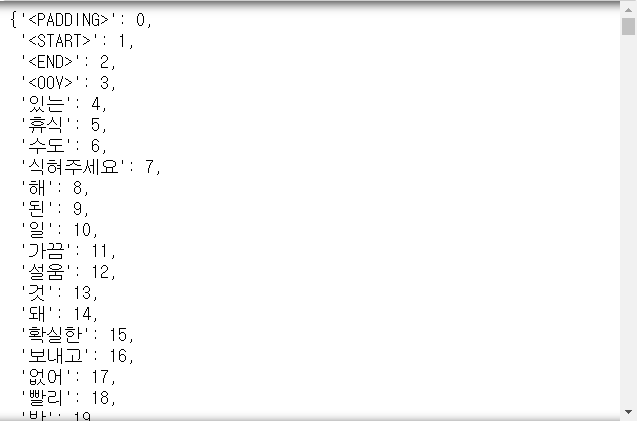
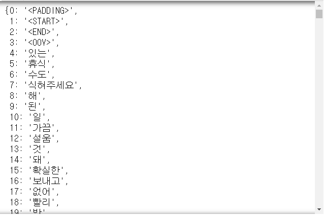

# Day82 TensorFlow와 Keras 라이브러리를 활용한 딥러닝(20)

# ChatBot

```python
import re
import matplotlib.pyplot as plt
import pandas as pd
import numpy as np
import os
from konlpy.tag import Okt
from keras import models, layers, optimizers, metrics, preprocessing
```

```python
path = '../data_for_analysis/'
chatbot_data = pd.read_csv(path + 'ChatData.csv', encoding='utf-8')
chatbot_data
```


```python
question = list(chatbot_data['Q'])
answer = list(chatbot_data['A'])

len(answer)
# > 11823
```

- 각 100개의 데이터만 사용

```python
question = question[:100]
answer = answer[:100]
```

```python
for i in range(10) :
    print('질문 :' + question[i])
    print('답변 :' + answer[i])
    print('')
# > 질문 :12시 땡!
# > 답변 :하루가 또 가네요.
# > 
# > 질문 :1지망 학교 떨어졌어
# > 답변 :위로해 드립니다.
# > 
# > 질문 :3박4일 놀러가고 싶다
# > 답변 :여행은 언제나 좋죠.
# > 
# > 질문 :3박4일 정도 놀러가고 싶다
# > 답변 :여행은 언제나 좋죠.
# > 
# > 질문 :PPL 심하네
# > 답변 :눈살이 찌푸려지죠.
# > 
# > 질문 :SD카드 망가졌어
# > 답변 :다시 새로 사는 게 마음 편해요.
# > 
# > 질문 :SD카드 안돼
# > 답변 :다시 새로 사는 게 마음 편해요.
# > 
# > 질문 :SNS 맞팔 왜 안하지ㅠㅠ
# > 답변 :잘 모르고 있을 수도 있어요.
# > 
# > 질문 :SNS 시간낭비인 거 아는데 매일 하는 중
# > 답변 :시간을 정하고 해보세요.
# > 
# > 질문 :SNS 시간낭비인데 자꾸 보게됨
# > 답변 :시간을 정하고 해보세요.
# > 
```

## 태그 단어

```python
PAD = '<PADDING>' # 패딩
STA = '<START>' # 시작
END = '<END>' # 끝
OOV = '<OOV>' # out of vocabulary(만들어 놓은 사전에 없는 단어)

PAD_INDEX = 0
STA_INDEX = 1
END_INDEX = 2
OOV_INDEX = 3

ENCODER_INPUT = 0
DECODER_INPUT = 1
DECODER_TARGET = 2

# 한 문장에서 단어 시퀀스의 최대 개수
max_sequences = 30
# 임베딩 벡터 차원
embedding_dim = 100
# LSTM 출력 차원
lstm_hidden_dim = 128
# 정규표현식 필터
RE_FILTER = re.compile("[.,?!\"':;~()]")
```

## 형태소 분석기

```python
def pos_tag(sentences) :
    tagger = Okt()
    sentencePos = []
    for sentence in sentences :
        # 특수문자 제거
        sentence = re.sub(RE_FILTER, '', sentence)
        sentence = ' '.join(tagger.morphs(sentence))
        sentencePos.append(sentence)
    return sentencePos
```

```python
question = pos_tag(question)
answer = pos_tag(answer)

# 질문 + 대답 문장을 하나로 합치기
sentences = []
sentences.extend(question)
sentences.extend(answer)
sentences
```





```python
len(sentences)
# > 200
```

## 단어 사전 만들기

### 단어 배열 생성

```python
words = []
for sentence in sentences :
    for word in sentence.split() :
        words.append(word)
words
```



```python
len(words) # 전체 단어의 개수
# > 966
```

- words에서 길이가 0인 단어를 삭제

```python
words = [word for word in words if len(word)>0]
```

- 중복 단어 삭제

```python
words = list(set(words))
```

```python
len(words)
# > 450
```

- 태그 단어 추가
```python
words[:0] = [PAD, STA, END, OOV]
words[0]
# > '<PADDING>'

words[:20]
# > ['<PADDING>',
# >  '<START>',
# >  '<END>',
# >  '<OOV>',
# >  '있는',
# >  '휴식',
# >  '수도',
# >  '식혀주세요',
# >  '해',
# >  '된',
# >  '일',
# >  '가끔',
# >  '설움',
# >  '것',
# >  '돼',
# >  '확실한',
# >  '보내고',
# >  '없어',
# >  '빨리',
# >  '박']
```

### 단어에 대한 인덱스 부여 -> 딕셔너라

```python
word_to_index = {word:index for index, word in enumerate(words)}
index_to_word = {index:word for index, word in enumerate(words)}

word_to_index
```



```python
index_to_word
```



- RNN : 출력에 있어, 전체 문장 반영X
- LSTM : 출력에 있어, 전체 문장 반영O

## 전처리

### 문장 -> 인덱스로 변환

```python
def convert_text_to_index(sentences, voc, mytype) :
    sentences_index = []
    for sentence in sentences :
        sentence_index = []
        if mytype == DECODER_INPUT :
            sentence_index.extend([voc[STA]]) #1
        
        for word in sentence.split() :
            if voc.get(word) is not None :
                sentence_index.extend([voc[word]])
                # 단어에 해당하는 인덱스 추가
            else : # 사전에 없는 단어의 경우
                sentence_index.extend([voc[OOV]])
        
        if mytype == DECODER_TARGET :
            # 디코더 출력은 맨 마지막에 end 추가
            if max_sequences <= len(sentence_index) :
                sentence_index = sentence_index[:max_sequences-1] + [voc[END]]
            else :
                sentence_index += [voc[END]]
        else :
            if len(sentence_index) > max_sequences :
                sentence_index = sentence_index[:max_sequences]
        
        # 0으로 채움
        sentence_index += [word_to_index[PAD]] * (max_sequences - len(sentence_index))
        
        sentences_index.append(sentence_index)
    
    return np.asarray(sentences_index)
```

- 인코더 입력, 디코더 입력, 디코더 출력 -> 인덱스 변환

```python
x_encoder = convert_text_to_index(
    question, word_to_index, ENCODER_INPUT)
x_decoder = convert_text_to_index(
    answer, word_to_index, DECODER_INPUT)
y_decoder = convert_text_to_index(
    answer, word_to_index, DECODER_TARGET)
```

```python
word_to_index[END]
# > 2

x_encoder
# > array([[ 37, 350,   0, ...,   0,   0,   0],
# >        [298, 175, 272, ...,   0,   0,   0],
# >        [325,  19, 126, ...,   0,   0,   0],
# >        ...,
# >        [ 62, 306, 273, ...,   0,   0,   0],
# >        [ 62, 416, 190, ...,   0,   0,   0],
# >        [143, 117,  52, ...,   0,   0,   0]])

x_decoder
# > array([[  1, 178, 436, ...,   0,   0,   0],
# >        [  1,  64,   8, ...,   0,   0,   0],
# >        [  1, 400, 146, ...,   0,   0,   0],
# >        ...,
# >        [  1, 299,  57, ...,   0,   0,   0],
# >        [  1, 299, 261, ...,   0,   0,   0],
# >        [  1,  10, 387, ...,   0,   0,   0]])

y_decoder
# > array([[178, 436, 289, ...,   0,   0,   0],
# >        [ 64,   8,  31, ...,   0,   0,   0],
# >        [400, 146, 170, ...,   0,   0,   0],
# >        ...,
# >        [299,  57, 426, ...,   0,   0,   0],
# >        [299, 261, 363, ...,   0,   0,   0],
# >        [ 10, 387, 353, ...,   0,   0,   0]])
```

- ex.
  - 인코더 입력 : 12시 땡
  - 디코더 입력 : `<START>` 하루 가 또 가네요
  - 디코더 출력 : 하루 가 또 가네요 `<END>`

```python
np.zeros((2, 3, 4))
# > array([[[0., 0., 0., 0.],
# >         [0., 0., 0., 0.],
# >         [0., 0., 0., 0.]],
# > 
# >        [[0., 0., 0., 0.],
# >         [0., 0., 0., 0.],
# >         [0., 0., 0., 0.]]])

len(y_decoder) # 답변 개수
# > 100

max_sequences # 문장을 구성하는 최대 단어 개수
# > 30

len(words) # 단어 집합을 구성하는 단어의 개수
# > 454
```

```python
one_hot_data = np.zeros((
    len(y_decoder), max_sequences, len(words)))
one_hot_data.shape # 디코더 출력
# > (100, 30, 454)

for i,seq in enumerate(y_decoder) :
    for j, index in enumerate(seq) :
        one_hot_data[i, j, index] = 1
y_decoder = one_hot_data

y_decoder[0].shape # 첫번째 답변 내용의 shape
# > (30, 454)
```

## 훈련 모델 생성

### 인코더 정의

```python
# 입력 문장의 인덱스 sequence를 입력
encoder_inputs = layers.Input(shape=(None, ))
# 임베딩 계층
encoder_out = layers.Embedding(len(words), 
                               embedding_dim)(encoder_inputs)

encoder_outputs, state_h, state_c = layers.LSTM(
    lstm_hidden_dim, 
    return_state=True, 
    dropout=0.2, recurrent_dropout=0.5)(encoder_out)
# return_state = True => 상태값 리턴
# LSTM은 2개 상태 존재(셀, 히든 스테이트)

encoder_states = [state_h, state_c]
```

### 디코더 정의

```python
# 출력 문장의 인덱스 sequence를 입력
decoder_inputs = layers.Input(shape=(None, ))
# 임베딩 계층
decoder_embedding = layers.Embedding(len(words), embedding_dim)
decoder_out = decoder_embedding(decoder_inputs)

decoder_LSTM = layers.LSTM(
    lstm_hidden_dim, 
    return_state=True, return_sequences=True, 
    dropout=0.2, recurrent_dropout=0.5)
decoder_outputs, _, _ = decoder_LSTM(
    decoder_out, 
    initial_state=encoder_states)

decoder_dense = layers.Dense(len(words), activation='softmax')

decoder_outputs = decoder_dense(decoder_outputs)
```

### 모델 생성 및 컴파일

```python
model = models.Model([encoder_inputs, decoder_inputs],
                     decoder_outputs)

model.compile(optimizer='rmsprop', 
              loss='categorical_crossentropy', 
              metrics=['accuracy'])
```

### 예측 모델 인코더 정의

```python
encoder_model = models.Model(encoder_inputs, encoder_states)
```

### 예측 모델 디코더 정의

```python
# 바로 앞에 있는 디코더의 출력(상태)를 입력 받아서 예측을 해야 함
decoder_state_input_h = layers.Input(shape=(lstm_hidden_dim, ))
decoder_state_input_c = layers.Input(shape=(lstm_hidden_dim, ))
decoder_states_inputs = [decoder_state_input_h, decoder_state_input_c]

# 임베딩 계층
decoder_outputs = decoder_embedding(decoder_inputs)
# LSTM 계층
decoder_outputs, state_h, state_c = decoder_LSTM(
    decoder_outputs, 
    initial_state=decoder_states_inputs)
decoder_states = [state_h, state_c]

# Dense계층을 통해 원핫 형식으로 예측 단어 인덱스를 추출
decoder_outputs = decoder_dense(decoder_outputs)

# 예측 모델 디코더 설정
decoder_model = models.Model(
    [decoder_inputs] + decoder_states_inputs, 
    [decoder_outputs] + decoder_states)
```

## 모델 훈련

### 인덱스를 문장으로 변환 함수

```python
def convert_index_to_text(indexs, voc) :
    sentence = ''
    for i in indexs :
        if i == END_INDEX :
            break
        if voc.get(i) is not None :
            sentence += voc[i]
        else :
            sentence.extend([voc[OOV_INDEX]])
        sentence += ' '
    
    return sentence
```

### 훈련

```python
for epoch in range(20) :
    print('total epoch :', epoch+1)
    history = model.fit([x_encoder, x_decoder], 
                        y_decoder, 
                        epochs=100, batch_size=64, verbose=0)
    print('accuracy :', np.mean(history.history['accuracy']))
    print('loss :', np.mean(history.history['loss']))
    
    # 문장 예측
    # 3박 4일 놀러 가고 싶다 -> 여행 은 언제나 좋죠
    
    input_encoder = x_encoder[2].reshape(1, x_encoder[2].shape[0]) # (30, ) -> (1, 30)
    input_decoder = x_decoder[2].reshape(1, x_decoder[2].shape[0])
    
    results = model.predict([input_encoder, input_decoder])
    
    # 결과값에 대해서 가장 큰 값의 위치를 구함
    index = np.argmax(results[0], 1)
    # 인덱스 -> 문장으로 변환
    sentence = convert_index_to_text(index, index_to_word)
    print(sentence)
    print()
# > 
```

## test

### 문장 입력 함수

```python
def make_predict_input(sentence) :
    sentences = []
    sentences.append(sentence)
    sentences = pos_tag(sentences)
    
    input_seq = convert_text_to_index(
        sentences, word_to_index, ENCODER_INPUT)
    return input_seq
```

### 예측 답변 생성 함수

```python
def generate_text(inputSeq) :
    # 입력을 인코더에 넣고, 마지막 상태 구함.
    states = encoder_model.predict(inputSeq)
    
    # 목표 시퀀스 초기화
    target_seq = np.zeros((1, 1))
    # <START> 시그널을 추가
    target_seq[0, 0] = STA_INDEX
    # 인덱스 초기화
    indexs = []
    
    # 디코더 반복
    while 1 :
        decoder_outputs, state_h, state_c = decoder_model.predict(
            [target_seq] + states)
        # 결과를 원핫인코딩 형식으로 변환
        index = np.argmax(decoder_outputs[0, 0, :]) # 예측 단어
        indexs.append(index)
        
        # 종료 체크
        if index == END_INDEX or len(indexs) >= max_sequences :
            break
        
        # target_seq를 이전 출력으로 설정
        target_seq = np.zeros((1, 1))
        target_seq[0, 0] = index 
        
        # 디코더의 이전 상태를 다음 디코더로 예측에 사용
        states = [state_h, state_c]
    
    # 인덱스를 문장으로 변환
    sentence = convert_index_to_text(indexs, index_to_word)
    
    return sentence
```

### 확인하기

```python
# 입력문장 -> 인덱스
input_seq = make_predict_input('3박4일 놀러가고 싶다')
# [[320, 157, ..., 19, 0, 0, 0, 0, ..., 0]]
input_seq
# > array([[325,  19, 126, 282,  60, 129,   0,   0,   0,   0,   0,   0,   0,
# >           0,   0,   0,   0,   0,   0,   0,   0,   0,   0,   0,   0,   0,
# >           0,   0,   0,   0]])

sentence = generate_text(input_seq)
sentence # 여행은 언제나 좋죠
# > '여행 은 언제나 좋죠 '
```

```python
input_seq = make_predict_input('3박4일 같이 놀러가고 싶다')
sentence = generate_text(input_seq)
sentence
# > '여행 은 언제나 좋죠 '

input_seq = make_predict_input('3박4일 동해로 놀러가고 싶다')
sentence = generate_text(input_seq)
sentence
# > '여행 은 언제나 좋죠 '

input_seq = make_predict_input('4박5일 동해로 놀러가고 싶다')
sentence = generate_text(input_seq)
sentence
# > '여행 은 언제나 좋죠 '

input_seq = make_predict_input('3박4일 멀티캠퍼스로 놀러가고 싶다')
sentence = generate_text(input_seq)
sentence
# > '여행 은 언제나 좋죠 '

input_seq = make_predict_input('3박4일 멀티캠퍼스에서 공부하고 싶다')
sentence = generate_text(input_seq)
sentence
# > '여행 은 언제나 좋죠 '

input_seq = make_predict_input('놀러가려고')
sentence = generate_text(input_seq)
sentence
# > '저 를 만들어 준 사람 을 부모님 저 랑 이야기 해 주는 사람 을 친구 로 생각 하고 있어요 '
```

